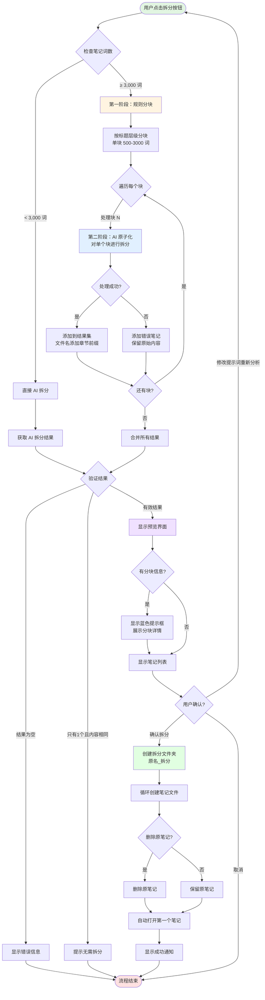

# 笔记拆分流程说明

## 概述

笔记拆分功能采用两阶段处理策略，能够智能处理从短笔记到超长文档（如整本书的OCR结果）的各种场景。

## 核心特性

- **自适应处理**：根据笔记词数自动选择最优处理方式
- **智能分块**：按 Markdown 标题层级切分，保持章节完整性
- **AI 原子化**：将内容拆分为独立的知识点笔记
- **词数统计**：兼容中英文混合，准确计量文章长度
- **错误容错**：单块处理失败不影响其他块
- **透明提示**：UI 清晰显示处理进度和分块信息

## 处理流程



## 两阶段处理详解

### 第一阶段：规则分块

**触发条件**：笔记词数 ≥ 3,000 词

**分块规则**：
- 识别 Markdown 标题（`#` 到 `######`）
- 按标题层级切分内容
- 单块最小 500 词，最大 3,000 词
- 保持章节完整性，不在段落中间切分
- 自动提取章节标题作为块名称

**词数统计规则**：
- 中文字符：每个汉字算一个词
- 英文单词：按空格分隔统计
- 数字：连续数字算一个词

**示例**：
```
整本书 (30k 词)
    ↓
第一章 概述 (2.8k 词)
第二章 基础 (3.5k 词 → 拆分为 2k + 1.5k)
第三章 进阶 (2k 词)
...
```

### 第二阶段：AI 原子化

**处理方式**：
1. 逐个处理每个块（短笔记则处理整体）
2. 调用 AI 服务分析知识点
3. 生成原子化笔记（单一概念）
4. 添加章节前缀避免重名

**输出格式**：
```
第一章_知识点A.md
第一章_知识点B.md
第二章_知识点C.md
...
```

## 容错机制

| 错误类型 | 处理方式 |
|---------|---------|
| 单块 AI 调用失败 | 保存原始内容，标记为"处理失败"，继续处理其他块 |
| AI 返回空结果 | 显示友好错误提示，允许用户重试 |
| 文件名冲突 | 自动添加时间戳后缀 |
| 创建文件夹失败 | 中断流程，显示具体错误信息 |
| 删除原笔记失败 | 显示警告，但不影响拆分结果 |

## 性能参考

| 笔记词数 | 分块数量 | AI 调用次数 | 预计耗时* |
|---------|---------|------------|----------|
| < 3k    | 0（直接处理） | 1 次 | 5-10 秒 |
| 3k-10k  | 2-4 块 | 2-4 次 | 10-30 秒 |
| 10k-30k | 4-10 块 | 4-10 次 | 30-90 秒 |
| 30k+ (整本书) | 10+ 块 | 10+ 次 | 90+ 秒 |

*耗时取决于 AI 服务响应速度

**词数参考**：
- 短篇论文：~3k-5k 词
- 长篇论文：~10k-15k 词
- 小说章节：~3k-8k 词
- 整本书：~50k-100k 词

## UI 交互流程

### 1. 初始状态（Idle）
- 显示笔记当前长度
- 根据长度显示建议（太短/可选/建议拆分）
- 提供"拆分当前笔记"按钮

### 2. 分析中（Analyzing）
- 显示加载动画
- 提示"AI 分析中，请稍候..."

### 3. 预览状态（Preview）
- **分块信息提示**（如有）：
  - 蓝色提示框显示分块数量
  - 列出每个块的标题和大小
- **拆分结果列表**：
  - 显示将生成的笔记数量
  - 每个笔记的文件名和知识点
  - 内容长度预览
- **自定义选项**：
  - 可修改拆分提示词
  - 可选择是否删除原笔记
- **操作按钮**：
  - 确认拆分
  - 重新分析（修改提示词后）
  - 取消

### 4. 执行中（Splitting）
- 显示加载动画
- 提示"正在创建拆分笔记..."

### 5. 完成状态（Completed）
- 显示成功信息
- 列出已创建的笔记文件名
- 显示存放位置
- 自动打开第一个笔记
- 提供"知道了"按钮重置状态

## 文件组织结构

```
原笔记位置/
├── 原笔记.md (可选保留)
└── 原笔记_拆分/
    ├── 章节A_知识点1.md
    ├── 章节A_知识点2.md
    ├── 章节B_知识点1.md
    └── ...
```

## 代码位置

主要实现文件：`views/assistant/organizer/split-note-section.tsx`

**核心函数**：
- `countWords()`: 词数统计（兼容中英文） (line 41-58)
- `chunkByHeaders()`: 规则分块逻辑 (line 67-120)
- `splitLargeNote()`: 两阶段处理主函数 (line 130-185)
- `handleSplitClick()`: 拆分按钮点击处理 (line 233-279)

## 配置选项

可在插件设置中配置：
- `atomicSplitPrompt`: AI 拆分提示词
- `minNoteLength`: 最小笔记词数（默认 50 词）

**注意**：词数统计规则固化在代码中：
- 中文：每字算一词
- 英文：每个单词算一词
- 数字：连续数字算一词

## 最佳实践

1. **OCR 文档**：建议先清理 OCR 错误，再进行拆分
2. **长文档**：确保有清晰的 Markdown 标题结构
3. **提示词**：根据内容类型自定义拆分提示词
4. **预览检查**：确认前仔细检查预览结果
5. **备份原文**：首次使用建议保留原笔记

## 常见问题

**Q: 拆分后的文件名太长怎么办？**
A: 系统会自动清理非法字符，但建议使用简短的章节标题。

**Q: 某个块处理失败会影响其他块吗？**
A: 不会。失败的块会保存原始内容，并标记为"处理失败"，其他块继续处理。

**Q: 可以拆分没有标题的纯文本吗？**
A: 可以。如果文本 < 3k 词，会直接 AI 拆分；如果 > 3k 词，建议先手动添加标题以获得更好的分块效果。

**Q: 拆分后可以再次拆分吗？**
A: 可以。每个拆分后的笔记都可以再次拆分。

**Q: 中英文混合文档的词数如何计算？**
A: 中文每字算一词，英文按空格分隔的单词统计，数字连续视为一词。例如 "Hello世界123" 算 3 词。

**Q: 为什么使用词数而不是字符数？**
A: 词数更能准确反映内容量，尤其对于英文文档。同样 3000 个字符，纯英文约 500 词，纯中文约 3000 词，使用词数作为单位更加公平和准确。
