# File Organizer 2000 - 知识管理增强方案

## 方案概述

本方案旨在在保留 File Organizer 2000 现有自动化和多媒体处理优势的基础上，逐步融入知识管理功能，实现从"文件组织工具"到"知识管理系统"的升级。

### 设计原则

1. **向后兼容** - 所有新功能可选启用，不影响现有用户
2. **渐进增强** - 分阶段实施，每个阶段独立可用
3. **复用优化** - 最大化复用现有代码和架构
4. **灵活配置** - 通过开关控制新旧功能
5. **性能优先** - 避免显著降低处理速度

---

## 核心改造点

### 现有管线步骤

```
1. 启动处理
2. 文件验证
3. 容器创建
4. 移动附件
5. 内容提取
6. 内容清理
7. 文档分类
8. 文件夹推荐
9. 文件重命名
10. 内容格式化
11. 附加附件
12. 标签推荐
13. 完成处理
```

### 新的管线步骤（原子化优先架构）

```
主管线流程：
1. 启动处理
2. 文件验证
3. 容器创建
4. 移动附件
5. 内容提取
6. 知识点原子化拆分 🆕 (核心)
7. 按最大字数拆分 🆕 (核心)
8. 删除原笔记 🆕 (核心)

拆分后每个笔记的处理流程：
1. 内容优化和格式化 ⭐️ (改造+合并)
2. 文件重命名
3. 元数据扩展 🆕 (新增) - 包含标签推荐
4. 附加附件
5. 智能文件夹推荐和移动 ⭐️ (增强)
6. Roadmap关联 🆕 (新增)
7. 完成处理

```

**图例：**

- ⭐️ 改造现有步骤
- 🆕 新增步骤
- **架构特点：** 从线性处理改为递归处理，原子化拆分成为核心能力


---

## 详细设计

### 步骤 6：知识点原子化拆分（新增核心）

#### 功能描述

- 使用 AI 智能识别内容中的独立知识点
- 按语义边界拆分内容，确保每个片段主题单一
- 为每个知识点生成清晰的标题和摘要
- 准备后续的字数级拆分

#### 实现代码

```typescript
async function knowledgeAtomicSplitStep(context: ProcessingContext): Promise<SplitNote[]> {
  logger.info("Starting knowledge atomic split...");

  // 使用 AI 识别知识点边界
  const knowledgeBoundaries = await context.plugin.aiService.identifyKnowledgeBoundaries({
    content: context.content,
    strategy: 'semantic' // 优先按语义拆分
  });

  logger.info(`Identified ${knowledgeBoundaries.length} knowledge points`);

  // 根据知识点边界拆分内容
  const splitNotes: SplitNote[] = [];

  for (const boundary of knowledgeBoundaries) {
    const segment = context.content.substring(boundary.startIndex, boundary.endIndex);

    // 生成原子化笔记
    const atomicNote = await context.plugin.aiService.createAtomicNote({
      content: segment,
      title: boundary.title,
      summary: boundary.summary,
      originalContext: context.containerFile.basename
    });

    splitNotes.push(atomicNote);
  }

  return splitNotes;
}
```

#### AI Service 新增方法

```typescript
interface KnowledgeBoundary {
  startIndex: number;
  endIndex: number;
  title: string;
  summary: string;
  keywords: string[];
  confidence: number;
}

interface SplitNote {
  title: string;
  content: string;
  summary: string;
  keywords: string[];
  originalSource: string;
}

class AIService {
  async identifyKnowledgeBoundaries(options: {
    content: string;
    strategy: 'semantic' | 'structural' | 'hybrid';
  }): Promise<KnowledgeBoundary[]> {
    const schema = z.object({
      boundaries: z.array(z.object({
        startIndex: z.number(),
        endIndex: z.number(),
        title: z.string(),
        summary: z.string(),
        keywords: z.array(z.string()),
        confidence: z.number().min(0).max(100),
      }))
    });

    const response = await generateObject({
      model: this.model,
      schema,
      system: `你是一个专业的知识点识别专家。
分析给定的内容，识别独立的知识点边界。

**识别原则：**
1. 主题单一性 - 每个知识点只讨论一个核心概念
2. 语义完整性 - 知识点内容可以独立理解
3. 逻辑自洽 - 内部逻辑一致，不依赖外部内容
4. 边界清晰 - 有明确的开始和结束

**输出要求：**
- 为每个知识点生成准确的边界索引
- 提供简洁明确的标题
- 生成简短的摘要（50字以内）
- 提取关键标签
- 评估识别置信度

优先考虑语义完整性，而不是简单的段落或章节划分。`,
      prompt: `请识别以下内容中的知识点边界：\n\n${options.content}`,
    });

    return response.object.boundaries;
  }

  async createAtomicNote(options: {
    content: string;
    title: string;
    summary: string;
    originalContext: string;
  }): Promise<SplitNote> {
    // 优化内容，确保独立性
    const optimizedContent = await this.optimizeAtomicContent({
      content: options.content,
      title: options.title,
      originalContext: options.originalContext
    });

    // 提取关键词
    const keywords = await this.extractKeywords({
      content: optimizedContent,
      maxKeywords: 5
    });

    return {
      title: options.title,
      content: optimizedContent,
      summary: options.summary,
      keywords: keywords,
      originalSource: options.originalContext
    };
  }

  private async optimizeAtomicContent(options: {
    content: string;
    title: string;
    originalContext: string;
  }): Promise<string> {
    const response = await generateText({
      model: this.model,
      system: `你是一个内容优化专家。
优化给定的内容片段，使其成为独立的原子化笔记。

**优化要求：**
1. 保持原意不变
2. 补充必要的上下文（如果缺失）
3. 修复明显的逻辑断点
4. 确保内容可以独立理解
5. 添加必要的引用说明（如"来源：[原文档名]"）

不要添加新的信息，只做必要的补充和优化。`,
      prompt: `标题：${options.title}\n来源：${options.originalContext}\n\n请优化以下内容：\n\n${options.content}`,
    });

    return response.text;
  }

  private async extractKeywords(options: {
    content: string;
    maxKeywords: number;
  }): Promise<string[]> {
    const response = await generateText({
      model: this.model,
      system: `从给定内容中提取${options.maxKeywords}个最重要的关键词。
关键词应该：
1. 代表内容的核心概念
2. 简洁明确
3. 便于搜索和分类

只返回关键词列表，每行一个，不加其他说明。`,
      prompt: options.content.slice(0, 1000), // 只处理前1000字符
    });

    return response.text
      .split('\n')
      .map(line => line.trim())
      .filter(line => line.length > 0)
      .slice(0, options.maxKeywords);
  }
}
```

---

### 步骤 7：按最大字数拆分（新增核心）

#### 功能描述

- 对原子化后的知识点进行长度检查
- 超过最大长度的笔记进一步拆分
- 确保每个最终笔记都符合长度要求
- 保持内容语义完整性

#### 实现代码

```typescript
async function lengthBasedSplitStep(
  atomicNotes: SplitNote[],
  maxLength: number
): Promise<SplitNote[]> {
  logger.info(`Checking length for ${atomicNotes.length} atomic notes...`);

  const finalNotes: SplitNote[] = [];

  for (const atomicNote of atomicNotes) {
    const wordCount = getWordCount(atomicNote.content);

    if (wordCount <= maxLength) {
      // 长度合适，直接添加
      finalNotes.push(atomicNote);
      logger.info(`Note "${atomicNote.title}" is within limit (${wordCount} words)`);
    } else {
      // 超长，需要进一步拆分
      logger.info(`Note "${atomicNote.title}" exceeds limit (${wordCount} > ${maxLength}), splitting...`);

      const splitNotes = await splitLongNote(atomicNote, maxLength);
      finalNotes.push(...splitNotes);
    }
  }

  logger.info(`Final count: ${finalNotes.length} notes`);
  return finalNotes;
}

async function splitLongNote(note: SplitNote, maxLength: number): Promise<SplitNote[]> {
  // 使用 AI 进行智能拆分，保持语义完整性
  const splitPoints = await aiService.identifySplitPoints({
    content: note.content,
    maxLength: maxLength,
    preserveContext: true
  });

  const splitNotes: SplitNote[] = [];

  for (let i = 0; i < splitPoints.length; i++) {
    const point = splitPoints[i];
    const segment = note.content.substring(
      point.startIndex,
      point.endIndex
    );

    const splitNote: SplitNote = {
      title: point.title || `${note.title} (${i + 1}/${splitPoints.length})`,
      content: segment,
      summary: point.summary || note.summary,
      keywords: [...note.keywords], // 继承原关键词
      originalSource: note.originalSource
    };

    splitNotes.push(splitNote);
  }

  return splitNotes;
}
```

---

### 步骤 8：删除原笔记（新增核心）

#### 实现代码

```typescript
async function deleteOriginalNoteStep(context: ProcessingContext): Promise<void> {
  if (!context.containerFile) {
    logger.warn("No original file to delete");
    return;
  }

  const originalPath = context.containerFile.path;
  logger.info(`Deleting original file: ${originalPath}`);

  try {
    await context.plugin.app.vault.delete(context.containerFile);
    logger.info(`Successfully deleted original file: ${originalPath}`);

    // 记录删除操作
    context.recordManager.addAction(context.hash, Action.ORIGINAL_DELETED);

  } catch (error) {
    logger.error(`Failed to delete original file ${originalPath}:`, error);
    throw new Error(`Failed to delete original file: ${error.message}`);
  }
}
```

---

### 递归处理架构

#### 主管线函数

```typescript
async function processFile(file: TFile): Promise<void> {
  logger.info(`Processing file: ${file.path}`);

  const context = await createProcessingContext(file);

  try {
    // 步骤1-5：标准前置流程
    await startProcessingStep(context);
    await fileValidationStep(context);
    await containerCreationStep(context);
    await moveAttachmentsStep(context);
    await contentExtractionStep(context);

    // 步骤6-8：原子化拆分（核心变化）
    const atomicNotes = await knowledgeAtomicSplitStep(context);
    const finalNotes = await lengthBasedSplitStep(atomicNotes, context.plugin.settings.maxNoteLength);

    if (finalNotes.length > 1 || finalNotes[0].content !== context.content) {
      // 发生了拆分，删除原文件并递归处理
      await deleteOriginalNoteStep(context);

      // 批量处理拆分后的笔记
      await processSplitNotesBatch(finalNotes, context);
      return;
    }

    // 没有拆分，使用优化后的内容继续标准流程
    context.content = finalNotes[0].content;
    context.metadata.title = finalNotes[0].title;
    context.metadata.summary = finalNotes[0].summary;
    context.metadata.keywords = finalNotes[0].keywords;

    await processStandardWorkflow(context);

  } catch (error) {
    logger.error(`Failed to process file ${file.path}:`, error);
    await handleProcessingError(context, error);
  }
}

async function processSplitNotesBatch(
  splitNotes: SplitNote[],
  parentContext: ProcessingContext
): Promise<void> {
  logger.info(`Processing ${splitNotes.length} split notes...`);

  // 创建拆分文件的文件夹
  const targetFolder = await determineTargetFolder(parentContext);
  await ensureFolderExists(parentContext.plugin.app, targetFolder);

  const processingPromises: Promise<void>[] = [];

  for (const splitNote of splitNotes) {
    const promise = processSingleSplitNote(splitNote, targetFolder, parentContext);
    processingPromises.push(promise);
  }

  // 并发处理，但限制并发数
  const concurrencyLimit = parentContext.plugin.settings.concurrencyLimit || 3;
  await processWithConcurrencyLimit(processingPromises, concurrencyLimit);

  logger.info(`Completed processing ${splitNotes.length} split notes`);
}

async function processSingleSplitNote(
  splitNote: SplitNote,
  targetFolder: string,
  parentContext: ProcessingContext
): Promise<void> {
  try {
    // 创建拆分文件
    const fileName = sanitizeFileName(splitNote.title) + '.md';
    const filePath = `${targetFolder}/${fileName}`;

    const file = await parentContext.plugin.app.vault.create(filePath, splitNote.content);
    logger.info(`Created split note: ${filePath}`);

    // 创建专门的处理上下文
    const context = await createSplitProcessingContext(file, parentContext, splitNote);

    // 标记为拆分文件，避免重复拆分
    context.isSplitFile = true;

    // 执行完整的工作流程
    await contentOptimizationStep(context);
    await fileRenamingStep(context);
    await metadataEnhancementStep(context);
    await contentFormattingStep(context);
    await attachmentStep(context);
    await paraClassificationStep(context);
    await paraFolderRecommendationStep(context);
    await roadmapIntegrationStep(context);
    await tagRecommendationStep(context);
    await completeProcessingStep(context);

    logger.info(`Successfully processed split note: ${filePath}`);

  } catch (error) {
    logger.error(`Failed to process split note "${splitNote.title}":`, error);
    // 继续处理其他笔记，不因单个失败而中断
  }
}
```

#### 辅助函数

```typescript
async function createSplitProcessingContext(
  file: TFile,
  parentContext: ProcessingContext,
  splitNote: SplitNote
): Promise<ProcessingContext> {
  const context = new ProcessingContext(file, parentContext.plugin);

  // 继承父级上下文信息
  context.parentHash = parentContext.hash;
  context.originalFile = parentContext.containerFile;

  // 设置拆分特有信息
  context.metadata = {
    ...context.metadata,
    title: splitNote.title,
    summary: splitNote.summary,
    keywords: splitNote.keywords,
    originalSource: splitNote.originalSource,
    splitFrom: parentContext.containerFile.path
  };

  // 生成新的哈希
  context.hash = await generateFileHash(file);

  return context;
}

async function processWithConcurrencyLimit(
  promises: Promise<void>[],
  limit: number
): Promise<void> {
  for (let i = 0; i < promises.length; i += limit) {
    const batch = promises.slice(i, i + limit);
    await Promise.all(batch);
  }
}

function sanitizeFileName(fileName: string): string {
  return fileName
    .replace(/[<>:"/\\|?*]/g, '') // 移除不允许的字符
    .replace(/\s+/g, ' ') // 多个空格替换为单个
    .trim()
    .substring(0, 100); // 限制长度
}
```

---

### 步骤 1：内容优化和格式化（改造+合并）

#### 当前实现

```typescript
async function cleanupStep(context: ProcessingContext): Promise<ProcessingContext> {
  // 移除 frontmatter
  const contentWithoutFrontMatter = context.content
    .replace(/^---\n[\s\S]*?\n---\n/, '')
    .trim();

  // 检查内容长度
  if (contentWithoutFrontMatter.length < 5) {
    await handleBypass(context, "Content too short");
  }

  context.content = contentWithoutFrontMatter;
  return context;
}
```

#### 改造后实现

```typescript
async function contentOptimizationAndFormattingStep(context: ProcessingContext): Promise<ProcessingContext> {
  // 先执行原有的清理逻辑
  const contentWithoutFrontMatter = context.content
    .replace(/^---\n[\s\S]*?\n---\n/, '')
    .trim();

  if (contentWithoutFrontMatter.length < 5) {
    await handleBypass(context, "Content too short");
  }

  context.content = contentWithoutFrontMatter;

  // 如果启用内容优化，使用 AI 优化和格式化
  if (context.plugin.settings.enableContentOptimization) {
    context.content = await context.plugin.aiService.optimizeAndFormatContent({
      content: context.content,
      tasks: {
        removeIrrelevant: true,      // 去除无关信息
        fixErrors: true,              // 修复明显错误
        translateToChinese: true,     // 翻译为中文
        optimizeStructure: true,      // 优化笔记结构
        formatMarkdown: true,         // 格式化为标准 Markdown
      },
      customInstructions: context.plugin.settings.contentOptimizationInstructions
    });
  } else {
    // 即使没有启用优化，也执行基本的格式化
    context.content = await context.plugin.aiService.formatMarkdown({
      content: context.content
    });
  }

  return context;
}
```

#### 配置项

```typescript
interface Settings {
  enableContentOptimization: boolean;           // 默认 false
  contentOptimizationInstructions?: string;     // 自定义优化指令
}
```

#### AI Service 新增方法

```typescript
class AIService {
  async optimizeAndFormatContent(options: {
    content: string;
    tasks: {
      removeIrrelevant?: boolean;
      fixErrors?: boolean;
      translateToChinese?: boolean;
      optimizeStructure?: boolean;
      formatMarkdown?: boolean;
    };
    customInstructions?: string;
  }): Promise<string> {
    const systemPrompt = `你是一个专业的笔记优化和格式化助手。
${options.tasks.removeIrrelevant ? '- 去除无关信息和冗余内容' : ''}
${options.tasks.fixErrors ? '- 修复明显的语法、拼写和格式错误' : ''}
${options.tasks.translateToChinese ? '- 如果内容不是中文，翻译为地道的中文' : ''}
${options.tasks.optimizeStructure ? '- 优化笔记结构，使用适当的标题层级和列表' : ''}
${options.tasks.formatMarkdown ? '- 格式化为标准 Markdown 格式，确保语法正确' : ''}
${options.customInstructions ? `- ${options.customInstructions}` : ''}

保持原有的关键信息和知识点，只优化表达、结构和格式。确保输出是有效的 Markdown 格式。`;

    const response = await generateText({
      model: this.model,
      system: systemPrompt,
      prompt: `请优化和格式化以下内容：\n\n${options.content}`,
    });

    return response.text;
  }

  async formatMarkdown(options: {
    content: string;
  }): Promise<string> {
    const response = await generateText({
      model: this.model,
      system: `你是一个专业的 Markdown 格式化助手。
请将给定内容格式化为标准的 Markdown 格式，确保：
1. 正确的标题层级（# ## ###）
2. 列表格式正确（- 或 1.）
3. 代码块格式正确（```）
4. 链接格式正确（[text](url)）
5. 粗体和斜体格式正确（**text** *text*）
6. 表格格式正确（| col1 | col2 |）

不要改变内容的含义，只修正格式问题。`,
      prompt: `请格式化以下内容为标准 Markdown：\n\n${options.content}`,
    });

    return response.text;
  }
}
```

---

### 步骤 6：智能文件夹推荐和移动（增强）

#### 功能描述

- 基于原有文件夹推荐功能
- 支持用户自定义提示词进行分类指导
- 智能识别内容类型并推荐合适文件夹
- 自动创建文件夹结构并移动文件

#### 实现代码

```typescript
async function enhancedFolderRecommendationStep(context: ProcessingContext): Promise<ProcessingContext> {
  logger.info("Starting enhanced folder recommendation...");

  // 获取现有模板和文件夹
  const templateNames = await context.plugin.getTemplateNames();
  const existingFolders = await getAllFolders(context.plugin.app);

  // 使用增强的文件夹推荐
  const folderRecommendation = await context.plugin.aiService.enhancedFolderRecommendation({
    content: context.content,
    fileName: context.containerFile.basename,
    existingFolders,
    customPrompt: context.plugin.settings.folderRecommendationPrompt,
    templateNames
  });

  if (!folderRecommendation.recommendedFolder) {
    logger.warn("No suitable folder recommendation found");
    return context;
  }

  context.newPath = folderRecommendation.recommendedFolder;
  context.folderRecommendation = {
    folder: folderRecommendation.recommendedFolder,
    confidence: folderRecommendation.confidence,
    reasoning: folderRecommendation.reasoning
  };

  logger.info(`Recommended folder: ${context.newPath} (confidence: ${folderRecommendation.confidence})`);

  // 确保文件夹存在
  await ensureFolderExists(context.plugin.app, context.newPath);

  // 移动文件
  await safeMove(context.plugin.app, context.containerFile, context.newPath);

  context.recordManager.setFolder(context.hash, context.newPath);

  return context;
}
```

#### AI Service 新增方法

```typescript
interface FolderRecommendation {
  recommendedFolder: string;
  confidence: number;
  reasoning: string;
  isNewFolder?: boolean;
}

class AIService {
  async enhancedFolderRecommendation(options: {
    content: string;
    fileName: string;
    existingFolders: string[];
    customPrompt?: string;
    templateNames?: string[];
  }): Promise<FolderRecommendation> {
    const schema = z.object({
      recommendedFolder: z.string(),
      confidence: z.number().min(0).max(100),
      reasoning: z.string(),
      isNewFolder: z.boolean().optional()
    });

    let systemPrompt = `你是一个专业的文件分类专家。
根据笔记内容推荐最合适的文件夹位置。

**现有文件夹：**
${options.existingFolders.map(folder => `- ${folder}`).join('\n')}

**分类原则：**
1. 分析内容主题和类型
2. 考虑现有的文件夹结构
3. 推荐最相关的位置
4. 如果没有合适的文件夹，建议创建新的文件夹
5. 文件夹路径应该简洁明了，便于导航`;

    if (options.customPrompt) {
      systemPrompt += `\n\n**用户自定义分类指导：**\n${options.customPrompt}`;
    }

    systemPrompt += `

**输出要求：**
- 推荐具体的文件夹路径
- 给出置信度评分（0-100）
- 提供推荐理由
- 如果是新文件夹，标注 isNewFolder: true`;

    const response = await generateObject({
      model: this.model,
      schema,
      system: systemPrompt,
      prompt: `文件名：${options.fileName}\n\n内容：\n${options.content.slice(0, 2000)}`,
    });

    return response.object;
  }
}
```

#### 辅助函数

```typescript
async function getAllFolders(app: App): Promise<string[]> {
  const allFolders: string[] = [];

  function collectFolders(folder: TFolder, basePath: string = '') {
    for (const child of folder.children) {
      if (child instanceof TFolder) {
        const fullPath = basePath ? `${basePath}/${child.name}` : child.name;
        allFolders.push(fullPath);
        collectFolders(child, fullPath);
      }
    }
  }

  const rootFolder = app.vault.getRoot();
  collectFolders(rootFolder);

  return allFolders.filter(folder =>
    !folder.startsWith('.') &&
    !folder.includes('.obsidian') &&
    !folder.includes('.trash')
  );
}
```

#### 配置项

```typescript
interface Settings {
  // 文件夹推荐
  enableEnhancedFolderRecommendation: boolean;  // 默认 true
  folderRecommendationPrompt?: string;          // 自定义分类提示词
}

---

### 步骤 10.5：元数据扩展（新增）

#### 实现代码

```typescript
async function metadataEnhancementStep(context: ProcessingContext): Promise<ProcessingContext> {
  if (!context.plugin.settings.enableEnhancedMetadata) {
    return context;
  }

  logger.info("Enhancing metadata...");

  // 生成 summary
  const summary = await context.plugin.aiService.generateSummary({
    content: context.content,
    maxLength: 300,
  });

  // 评估 credibility
  const credibility = await context.plugin.aiService.evaluateCredibility({
    content: context.content,
    fileName: context.containerFile.basename,
    source: detectSource(context.containerFile),
  });

  // 推荐标签
  const tags = await context.plugin.aiService.recommendTags({
    content: context.content,
    fileName: context.containerFile.basename,
    maxTags: 6,
  });

  // 检测来源
  const source = detectSource(context.containerFile);

  // 添加扩展元数据
  await context.plugin.app.fileManager.processFrontMatter(
    context.containerFile,
    (frontmatter) => {
      frontmatter.id = `${moment().format('YYYYMMDDHHmm')}-${context.containerFile.basename}`;
      frontmatter.title = context.containerFile.basename;
      frontmatter.version = "1.0";
      frontmatter.create = moment(context.containerFile.stat.ctime).format('YYYY-MM-DD');
      frontmatter.update = moment().format('YYYY-MM-DD');
      frontmatter.source = source;
      frontmatter.credibility = credibility.score;
      frontmatter.cate = context.secondaryCategory || '';
      frontmatter.subcate = context.tertiaryCategory || '';
      frontmatter.summary = summary;
      frontmatter.tags = tags;

      if (context.metadata.wordCount) {
        frontmatter.wordCount = context.metadata.wordCount;
      }
    }
  );

  logger.info(`Metadata enhanced: credibility=${credibility.score}, summary length=${summary.length}, tags=${tags.length}`);

  return context;
}
```

#### 辅助函数

```typescript
function detectSource(file: TFile): string {
  const fileName = file.basename.toLowerCase();
  
  // 根据文件名推断来源
  if (fileName.includes('官方文档') || fileName.includes('official doc')) {
    return '官方文档';
  } else if (fileName.includes('书籍') || fileName.includes('book')) {
    return '书籍';
  } else if (fileName.includes('博客') || fileName.includes('blog')) {
    return '技术博客';
  } else if (fileName.includes('笔记') || fileName.includes('note')) {
    return '个人笔记';
  } else if (fileName.includes('文章') || fileName.includes('article')) {
    return '网络文章';
  } else {
    return '未知来源';
  }
}
```

#### AI Service 新增方法

```typescript
class AIService {
  async generateSummary(options: {
    content: string;
    maxLength: number;
  }): Promise<string> {
    const response = await generateText({
      model: this.model,
      system: `你是一个专业的内容总结专家。
生成简洁的内容摘要，不超过 ${options.maxLength} 字。
摘要应包括：
1. 主要结论或要点
2. 核心概念
3. 实用价值

使用第三人称，客观准确。`,
      prompt: `请为以下内容生成摘要：\n\n${options.content}`,
    });

    return response.text.slice(0, options.maxLength);
  }

  async evaluateCredibility(options: {
    content: string;
    fileName: string;
    source: string;
  }): Promise<{ score: number; reasoning: string }> {
    const schema = z.object({
      score: z.number().min(1).max(10),
      reasoning: z.string(),
    });

    const response = await generateObject({
      model: this.model,
      schema,
      system: `你是一个内容可信度评估专家。
根据以下标准评估内容的可信度（1-10）：

**1-3：低质量/不可信**
- 未验证的网络传言
- 过时的信息
- 缺乏来源的观点

**4-6：一般质量**
- 普通网络文章
- 个人经验总结
- 二手信息

**7-8：较高质量**
- 技术博客
- 实践验证过的方法
- 有明确来源的信息

**9-10：高质量/权威可信**
- 官方文档
- 权威书籍
- 专业论文
- 经过同行评审的内容

考虑因素：
- 来源可靠性
- 信息完整性
- 逻辑严谨性
- 是否包含证据或引用`,
      prompt: `来源：${options.source}\n文件名：${options.fileName}\n\n内容：\n${options.content.slice(0, 2000)}`,
    });

    return response.object;
  }

  async recommendTags(options: {
    content: string;
    fileName: string;
    maxTags: number;
  }): Promise<string[]> {
    const response = await generateText({
      model: this.model,
      system: `你是一个专业的标签推荐专家。
为给定内容推荐 ${options.maxTags} 个最合适的标签。

标签应该包括以下维度：
1. **内容类型维度**：教程、指南、总结、案例分析、问题解决等
2. **技术栈维度**：具体的编程语言、框架、工具等
3. **知识维度**：道/法/术/实践、理论/实践、概念/应用等
4. **难度级别**：入门/进阶/高级
5. **应用场景**：学习参考、项目实践、问题排查等
6. **主题领域**：具体的知识领域

推荐原则：
- 标签要简洁明确，便于搜索和分类
- 优先使用通用的标签，避免过于个性化
- 确保标签能准确反映内容的核心特征
- 使用中文标签

只返回标签列表，用逗号分隔，不加其他说明。`,
      prompt: `文件名：${options.fileName}\n\n内容：\n${options.content.slice(0, 1500)}`,
    });

    return response.text
      .split(',')
      .map(tag => tag.trim())
      .filter(tag => tag.length > 0)
      .slice(0, options.maxTags);
  }
}
```

#### 配置项

```typescript
interface Settings {
  enableEnhancedMetadata: boolean;   // 默认 true
}
```

---

### 步骤 11.5：Roadmap 关联（新增）

#### 实现代码

```typescript
async function roadmapIntegrationStep(context: ProcessingContext): Promise<ProcessingContext> {
  if (!context.plugin.settings.enableRoadmapIntegration) {
    return context;
  }
  
  // 只有 Area 分类才需要 Roadmap
  if (context.paraClassification?.primaryType !== 'Area') {
    logger.info("Skipping Roadmap integration: not an Area note");
    return context;
  }
  
  logger.info("Integrating with Roadmap...");
  
  // 构建 Roadmap 路径
  const roadmapPath = `${context.paraClassification.primaryType}/${context.secondaryCategory}/01.Roadmap/${context.secondaryCategory} Roadmap.md`;
  
  let roadmapFile = context.plugin.app.vault.getAbstractFileByPath(roadmapPath) as TFile;
  
  // 如果 Roadmap 不存在或为空，生成新的 Roadmap
  if (!roadmapFile) {
    logger.info(`Roadmap not found, generating new one: ${roadmapPath}`);
  
    await ensureFolderExists(
      context.plugin.app,
      `${context.paraClassification.primaryType}/${context.secondaryCategory}/01.Roadmap`
    );
  
    const roadmapContent = await context.plugin.aiService.generateRoadmap({
      domain: context.secondaryCategory,
    });
  
    roadmapFile = await context.plugin.app.vault.create(roadmapPath, roadmapContent);
  } else {
    // 检查 Roadmap 是否有效
    const roadmapContent = await context.plugin.app.vault.read(roadmapFile);
    if (roadmapContent.trim().length < 100) {
      logger.info("Roadmap exists but is empty, regenerating...");
    
      const newRoadmapContent = await context.plugin.aiService.generateRoadmap({
        domain: context.secondaryCategory,
      });
    
      await context.plugin.app.vault.modify(roadmapFile, newRoadmapContent);
    }
  }
  
  // 读取 Roadmap 内容
  const roadmapContent = await context.plugin.app.vault.read(roadmapFile);
  
  // 识别合适的插入位置
  const insertPosition = await context.plugin.aiService.findRoadmapInsertPosition({
    roadmapContent,
    noteContent: context.content,
    noteTitle: context.containerFile.basename,
    notePath: context.containerFile.path,
  });
  
  // 建立双链
  await insertBacklinkToRoadmap(
    context.plugin.app,
    roadmapFile,
    insertPosition,
    context.containerFile
  );
  
  logger.info(`Backlink inserted at position: ${insertPosition.section}`);
  
  return context;
}
```

#### 辅助函数

```typescript
interface InsertPosition {
  section: string;          // 章节名称
  lineNumber: number;       // 插入行号
  reasoning: string;        // 原因
}

async function insertBacklinkToRoadmap(
  app: App,
  roadmapFile: TFile,
  position: InsertPosition,
  noteFile: TFile
): Promise<void> {
  const roadmapContent = await app.vault.read(roadmapFile);
  const lines = roadmapContent.split('\n');
  
  // 构建双链
  const backlink = `- [[${noteFile.path}|${noteFile.basename}]]`;
  
  // 在指定行号插入
  lines.splice(position.lineNumber, 0, backlink);
  
  // 写回文件
  await app.vault.modify(roadmapFile, lines.join('\n'));
}
```

#### AI Service 新增方法

```typescript
class AIService {
  async generateRoadmap(options: {
    domain: string;
  }): Promise<string> {
    const response = await generateText({
      model: this.model,
      system: `你是一个拥有 20 年经验的顶尖专家和资深教育家。
请为【${options.domain}】领域设计一个完整的学习路线图。`,
      prompt: `请为【${options.domain}】生成学习路线图，格式如下：

## 🎯 领域概览
- **简介**: 该领域的定义和特点
- **应用场景**: 主要应用场景和发展趋势
- **学习目标**: 掌握该领域后能达到的能力水平
- **总学习周期**: 预估完整学习所需时间

## 📚 初级（入门基础）
**学习目标**: 该阶段要达到的具体能力
**预计时间**: 学习时间估算
**前置要求**: 需要具备的基础知识

### 1. [模块名称]
- **知识点1**: [具体知识点]
- **知识点2**: [具体知识点]
- **知识点3**: [具体知识点]

**推荐资源**:
- [资源1名称]: [简要说明]

## 🚀 中级（进阶提升）
[按相同格式展开]

## 🎓 高级（专业精通）
[按相同格式展开]

## 💡 学习建议
1. **学习顺序**: 建议的学习路径
2. **实践项目**: 每个阶段建议的实践项目
3. **评估标准**: 如何判断是否掌握该阶段内容
4. **常见误区**: 学习过程中需要避免的问题`,
    });

    return response.text;
  }

  async findRoadmapInsertPosition(options: {
    roadmapContent: string;
    noteContent: string;
    noteTitle: string;
    notePath: string;
  }): Promise<InsertPosition> {
    const schema = z.object({
      section: z.string(),
      lineNumber: z.number(),
      reasoning: z.string(),
    });

    // 提取 Roadmap 的结构
    const sections = extractRoadmapSections(options.roadmapContent);
    const sectionsInfo = sections.map(s => `第 ${s.lineNumber} 行: ${s.title}`).join('\n');

    const response = await generateObject({
      model: this.model,
      schema,
      system: `你是一个知识组织专家。
分析笔记内容，找到它在 Roadmap 中最合适的插入位置。

**Roadmap 结构：**
${sectionsInfo}

**规则：**
1. 找到最相关的知识点或模块
2. 返回该章节的标题和行号
3. 如果找不到合适的位置，在最相关的模块下添加新的知识点`,
      prompt: `笔记标题：${options.noteTitle}\n\n笔记内容：\n${options.noteContent.slice(0, 1500)}\n\nRoadmap 完整内容：\n${options.roadmapContent}`,
    });

    return response.object;
  }
}

function extractRoadmapSections(content: string): Array<{ title: string; lineNumber: number }> {
  const lines = content.split('\n');
  const sections: Array<{ title: string; lineNumber: number }> = [];
  
  lines.forEach((line, index) => {
    // 匹配标题（# ## ### 等）
    const match = line.match(/^(#{1,6})\s+(.+)$/);
    if (match) {
      sections.push({
        title: match[2],
        lineNumber: index + 1,
      });
    }
  });
  
  return sections;
}
```

#### 配置项

```typescript
interface Settings {
  enableRoadmapIntegration: boolean;  // 默认 false
}
```

---

### 步骤 13.5：原子化拆分执行（新增）

#### 实现代码

```typescript
async function atomicSplitExecutionStep(context: ProcessingContext): Promise<ProcessingContext> {
  if (!context.needsSplit || !context.plugin.settings.enableAtomicSplit) {
    return context;
  }
  
  logger.info(`Executing atomic split: ${context.splitBoundaries.length} parts`);
  
  // 根据边界拆分内容
  const splitNotes = await context.plugin.aiService.splitContentByBoundaries({
    content: context.content,
    boundaries: context.splitBoundaries,
    originalTitle: context.containerFile.basename,
  });
  
  logger.info(`Generated ${splitNotes.length} split notes`);
  
  // 为每个拆分笔记创建文件
  const splitFiles: TFile[] = [];
  
  for (let i = 0; i < splitNotes.length; i++) {
    const splitNote = splitNotes[i];
  
    // 生成文件名
    const fileName = splitNotes.length === 1
      ? `${splitNote.title}.md`
      : `${splitNote.title}.md`;  // 使用 AI 生成的标题
  
    const filePath = `${context.newPath}/${fileName}`;
  
    logger.info(`Creating split note ${i + 1}/${splitNotes.length}: ${fileName}`);
  
    try {
      // 创建文件
      const splitFile = await context.plugin.app.vault.create(filePath, splitNote.content);
      splitFiles.push(splitFile);
    
      // 重新入队处理（跳过拆分步骤）
      context.plugin.inbox.enqueueFile(splitFile);
    } catch (error) {
      logger.error(`Failed to create split note ${fileName}:`, error);
    }
  }
  
  // 删除原文件
  logger.info(`Deleting original file: ${context.containerFile.path}`);
  await context.plugin.app.vault.delete(context.containerFile);
  
  // 标记为已拆分
  context.recordManager.addAction(context.hash, Action.SPLIT_COMPLETED);
  
  return context;
}
```

#### AI Service 新增方法

```typescript
interface SplitNote {
  title: string;
  content: string;
  summary: string;
}

class AIService {
  async splitContentByBoundaries(options: {
    content: string;
    boundaries: KnowledgeBoundary[];
    originalTitle: string;
  }): Promise<SplitNote[]> {
    const splitNotes: SplitNote[] = [];
  
    for (const boundary of options.boundaries) {
      // 提取内容片段
      const segment = options.content.substring(boundary.startIndex, boundary.endIndex);
    
      // 使用 AI 优化片段内容
      const optimizedContent = await this.optimizeContent({
        content: segment,
        tasks: {
          removeIrrelevant: false,
          fixErrors: true,
          translateToChinese: false,
          optimizeStructure: true,
        },
      });
    
      splitNotes.push({
        title: boundary.title,
        content: optimizedContent,
        summary: boundary.summary,
      });
    }
  
    return splitNotes;
  }
}
```

---

## 配置项总览（原子化优先）

### 新增配置接口

```typescript
interface KnowledgeManagementSettings {
  // 核心拆分功能（强制启用）
  maxNoteLength: number;                        // 默认 3000，最大笔记长度
  splitStrategy: 'semantic' | 'structural' | 'hybrid'; // 默认 semantic，拆分策略
  concurrencyLimit: number;                     // 默认 3，并发处理限制

  // 内容优化
  enableContentOptimization: boolean;           // 默认 false
  contentOptimizationInstructions?: string;

  // 智能文件夹推荐
  enableEnhancedFolderRecommendation: boolean;  // 默认 true
  folderRecommendationPrompt?: string;          // 自定义分类提示词

  // 元数据扩展
  enableEnhancedMetadata: boolean;              // 默认 true

  // Roadmap 集成
  enableRoadmapIntegration: boolean;            // 默认 false

  // 性能优化
  enableBatchProcessing: boolean;               // 默认 true
  enableSmartCache: boolean;                    // 默认 true
  cacheExpiry: number;                         // 默认 300000，缓存过期时间（毫秒）
}

interface FileOrganizerSettings extends KnowledgeManagementSettings {
  // ... 现有配置项
}
```

### 配置界面（更新）

```typescript
class FileOrganizerSettingTab extends PluginSettingTab {
  display(): void {
    const { containerEl } = this;
    containerEl.empty();

    // ... 现有配置项

    // 原子化拆分设置（核心功能）
    containerEl.createEl('h2', { text: '原子化拆分（核心功能）' });

    new Setting(containerEl)
      .setName('最大笔记长度')
      .setDesc('超过此长度的笔记将被智能拆分（字数）')
      .addText(text => text
        .setPlaceholder('3000')
        .setValue(String(this.plugin.settings.maxNoteLength))
        .onChange(async (value) => {
          this.plugin.settings.maxNoteLength = parseInt(value) || 3000;
          await this.plugin.saveSettings();
        }));

    new Setting(containerEl)
      .setName('拆分策略')
      .setDesc('选择知识点拆分的优先策略')
      .addDropdown(dropdown => dropdown
        .addOption('semantic', '语义优先')
        .addOption('structural', '结构优先')
        .addOption('hybrid', '混合策略')
        .setValue(this.plugin.settings.splitStrategy || 'semantic')
        .onChange(async (value) => {
          this.plugin.settings.splitStrategy = value as any;
          await this.plugin.saveSettings();
        }));

    new Setting(containerEl)
      .setName('并发处理限制')
      .setDesc('同时处理的拆分笔记数量')
      .addSlider(slider => slider
        .setLimits(1, 10, 1)
        .setValue(this.plugin.settings.concurrencyLimit || 3)
        .setDynamicTooltip()
        .onChange(async (value) => {
          this.plugin.settings.concurrencyLimit = value;
          await this.plugin.saveSettings();
        }));

    // 知识管理增强设置
    containerEl.createEl('h2', { text: '知识管理增强' });

    new Setting(containerEl)
      .setName('内容优化')
      .setDesc('使用 AI 优化笔记内容（去除无关信息、修复错误、翻译、优化结构）')
      .addToggle(toggle => toggle
        .setValue(this.plugin.settings.enableContentOptimization)
        .onChange(async (value) => {
          this.plugin.settings.enableContentOptimization = value;
          await this.plugin.saveSettings();
        }));

    new Setting(containerEl)
      .setName('智能文件夹推荐')
      .setDesc('使用增强的文件夹推荐功能，支持自定义分类指导')
      .addToggle(toggle => toggle
        .setValue(this.plugin.settings.enableEnhancedFolderRecommendation)
        .onChange(async (value) => {
          this.plugin.settings.enableEnhancedFolderRecommendation = value;
          await this.plugin.saveSettings();
        }));

    new Setting(containerEl)
      .setName('自定义分类提示词')
      .setDesc('自定义文件夹分类的指导原则')
      .addTextArea(text => text
        .setPlaceholder('请输入自定义的分类指导原则...')
        .setValue(this.plugin.settings.folderRecommendationPrompt || '')
        .onChange(async (value) => {
          this.plugin.settings.folderRecommendationPrompt = value;
          await this.plugin.saveSettings();
        }));

    new Setting(containerEl)
      .setName('扩展元数据')
      .setDesc('添加来源、可信度、摘要等扩展元数据')
      .addToggle(toggle => toggle
        .setValue(this.plugin.settings.enableEnhancedMetadata)
        .onChange(async (value) => {
          this.plugin.settings.enableEnhancedMetadata = value;
          await this.plugin.saveSettings();
        }));

    new Setting(containerEl)
      .setName('Roadmap 关联')
      .setDesc('自动关联笔记到领域 Roadmap 并建立双链')
      .addToggle(toggle => toggle
        .setValue(this.plugin.settings.enableRoadmapIntegration)
        .onChange(async (value) => {
          this.plugin.settings.enableRoadmapIntegration = value;
          await this.plugin.saveSettings();
        }));

    // 性能设置
    containerEl.createEl('h2', { text: '性能设置' });

    new Setting(containerEl)
      .setName('批量处理')
      .setDesc('启用批量处理以提高效率')
      .addToggle(toggle => toggle
        .setValue(this.plugin.settings.enableBatchProcessing)
        .onChange(async (value) => {
          this.plugin.settings.enableBatchProcessing = value;
          await this.plugin.saveSettings();
        }));

    new Setting(containerEl)
      .setName('智能缓存')
      .setDesc('缓存 AI 调用结果以提高性能')
      .addToggle(toggle => toggle
        .setValue(this.plugin.settings.enableSmartCache)
        .onChange(async (value) => {
          this.plugin.settings.enableSmartCache = value;
          await this.plugin.saveSettings();
        }));
  }
}
```

### 配置界面

```typescript
class FileOrganizerSettingTab extends PluginSettingTab {
  display(): void {
    const { containerEl } = this;
    containerEl.empty();
  
    // ... 现有配置项
  
    // 知识管理设置
    containerEl.createEl('h2', { text: '知识管理增强' });
  
    new Setting(containerEl)
      .setName('内容优化')
      .setDesc('使用 AI 优化笔记内容（去除无关信息、修复错误、翻译、优化结构）')
      .addToggle(toggle => toggle
        .setValue(this.plugin.settings.enableContentOptimization)
        .onChange(async (value) => {
          this.plugin.settings.enableContentOptimization = value;
          await this.plugin.saveSettings();
        }));

    new Setting(containerEl)
      .setName('智能文件夹推荐')
      .setDesc('使用增强的文件夹推荐功能，支持自定义分类指导')
      .addToggle(toggle => toggle
        .setValue(this.plugin.settings.enableEnhancedFolderRecommendation)
        .onChange(async (value) => {
          this.plugin.settings.enableEnhancedFolderRecommendation = value;
          await this.plugin.saveSettings();
        }));
  
    new Setting(containerEl)
      .setName('扩展元数据')
      .setDesc('添加来源、可信度、摘要等扩展元数据')
      .addToggle(toggle => toggle
        .setValue(this.plugin.settings.enableEnhancedMetadata)
        .onChange(async (value) => {
          this.plugin.settings.enableEnhancedMetadata = value;
          await this.plugin.saveSettings();
        }));
  
    new Setting(containerEl)
      .setName('原子化拆分')
      .setDesc('自动拆分长笔记为单一知识点')
      .addToggle(toggle => toggle
        .setValue(this.plugin.settings.enableAtomicSplit)
        .onChange(async (value) => {
          this.plugin.settings.enableAtomicSplit = value;
          await this.plugin.saveSettings();
        }));
  
    new Setting(containerEl)
      .setName('最大笔记长度')
      .setDesc('超过此长度的笔记将被拆分（字数）')
      .addText(text => text
        .setPlaceholder('3000')
        .setValue(String(this.plugin.settings.maxNoteLength))
        .onChange(async (value) => {
          this.plugin.settings.maxNoteLength = parseInt(value) || 3000;
          await this.plugin.saveSettings();
        }));
  
    new Setting(containerEl)
      .setName('Roadmap 关联')
      .setDesc('自动关联笔记到领域 Roadmap 并建立双链')
      .addToggle(toggle => toggle
        .setValue(this.plugin.settings.enableRoadmapIntegration)
        .onChange(async (value) => {
          this.plugin.settings.enableRoadmapIntegration = value;
          await this.plugin.saveSettings();
        }));
  }
}
```

---

## 实施路线图（原子化优先）

### 阶段 0：基础架构（1-2 天）

**目标：** 搭建基础框架和配置系统

**任务：**

1. 扩展 `FileOrganizerSettings` 接口
2. 定义新的 `Action` 枚举值（如 `ORIGINAL_DELETED`）
3. 更新 `ProcessingContext` 类型，支持拆分文件处理
4. 添加配置界面
5. 设计递归处理架构基础

**产出：**

- ✅ 配置项定义完成
- ✅ 类型定义更新
- ✅ 递归处理架构设计
- ✅ 配置界面实现

**风险：** 低

---

### 阶段 1：知识点原子化拆分（7-10 天）【核心优先】

**目标：** 实现核心的原子化拆分功能

**任务：**

1. 实现 `knowledgeAtomicSplitStep`
2. 实现 AI Service 的 `identifyKnowledgeBoundaries` 方法
3. 实现 AI Service 的 `createAtomicNote` 方法
4. 实现 `lengthBasedSplitStep` 二级拆分
5. 实现 `deleteOriginalNoteStep`
6. 设计递归处理架构 `processSplitNotesBatch`
7. 实现并发控制和错误处理
8. 测试和调试

**产出：**

- ✅ 智能知识点边界识别
- ✅ 原子化笔记生成
- ✅ 长度检查和二次拆分
- ✅ 原文件安全删除
- ✅ 批量递归处理框架

**优先级：** P0（最高，核心功能）

**依赖：** 阶段 0

**风险：** 高（拆分质量、完整性保证）

**验证：**

- 测试各种类型内容的拆分质量
- 验证拆分后的内容完整性
- 确保原文件安全删除
- 测试并发处理性能

---

### 阶段 2：元数据扩展（3-5 天）

**目标：** 为拆分笔记添加丰富元数据

**任务：**

1. 实现 `metadataEnhancementStep`
2. 实现 AI Service 的 `generateSummary` 方法
3. 实现 AI Service 的 `evaluateCredibility` 方法
4. 实现 `detectSource` 辅助函数
5. 集成到拆分笔记处理流程
6. 测试和调试

**产出：**

- ✅ 自动生成 summary
- ✅ 自动评估 credibility
- ✅ 自动检测 source
- ✅ 完整的元数据模板
- ✅ 拆分来源追踪

**优先级：** P1（高，提升价值）

**依赖：** 阶段 1

**风险：** 低

**验证：**

- 处理测试文件，检查生成的 frontmatter
- 验证 summary 质量
- 验证 credibility 评分合理性

---

### 阶段 3：内容优化（5-7 天）

**目标：** 优化拆分后笔记的内容质量

**任务：**

1. 改造 `contentOptimizationStep` 为拆分笔记专用
2. 实现 AI Service 的 `optimizeAtomicContent` 方法
3. 支持多种优化任务（去除无关信息、修复错误、翻译、优化结构）
4. 确保拆分笔记的内容独立性
5. 测试和调试

**产出：**

- ✅ 拆分笔记内容优化
- ✅ 去除无关信息
- ✅ 修复明显错误
- ✅ 翻译为中文
- ✅ 优化笔记结构
- ✅ 内容独立性保证

**优先级：** P1（高，质量提升）

**依赖：** 阶段 1

**风险：** 中（AI 可能过度修改内容）

**验证：**

- 处理拆分后的测试文件
- 人工检查优化质量
- 确保不丢失关键信息

---

### 阶段 4：智能文件夹推荐（5-7 天）

**目标：** 增强文件夹推荐功能，支持自定义分类指导

**任务：**

1. 实现 `enhancedFolderRecommendationStep`
2. 实现 AI Service 的 `enhancedFolderRecommendation` 方法
3. 实现 `getAllFolders` 辅助函数，获取现有文件夹结构
4. 支持用户自定义分类提示词
5. 改进文件夹创建和移动逻辑
6. 测试和调试

**产出：**

- ✅ 智能文件夹推荐
- ✅ 自定义分类提示词支持
- ✅ 现有文件夹结构分析
- ✅ 新文件夹自动创建
- ✅ 灵活的分类策略

**优先级：** P1（高，组织核心）

**依赖：** 阶段 1

**风险：** 中（推荐准确性依赖 AI）

**验证：**

- 测试各种类型的拆分笔记（技术、生活、工作）
- 验证文件夹推荐准确性
- 检查自定义提示词功能
- 测试新文件夹创建功能

---

### 阶段 5：Roadmap 集成（10-14 天）

**目标：** 为知识型拆分笔记建立智能索引网络

**任务：**

1. 实现 `roadmapIntegrationStep`
2. 实现 AI Service 的 `generateRoadmap` 方法
3. 实现 AI Service 的 `findRoadmapInsertPosition` 方法
4. 实现 `insertBacklinkToRoadmap` 辅助函数
5. 实现 `extractRoadmapSections` 辅助函数
6. 处理拆分笔记的批量 Roadmap 关联
7. 智能识别需要创建 Roadmap 的内容类型
8. 测试和调试

**产出：**

- ✅ Roadmap 自动生成
- ✅ 拆分笔记智能关联
- ✅ 批量双链建立
- ✅ 知识索引网络构建
- ✅ 原子化知识点组织

**优先级：** P2（中，高价值）

**依赖：** 阶段 4（文件夹推荐）

**风险：** 高（Roadmap 生成质量、插入位置准确性）

**验证：**

- 生成多个知识领域的 Roadmap，检查质量
- 验证拆分笔记关联合理性
- 检查双链创建正确
- 测试不同内容类型的 Roadmap 策略

---

### 阶段 6：性能优化和错误处理（5-7 天）

**目标：** 优化系统性能和稳定性

**任务：**

1. 实现批量处理优化
2. 添加智能缓存机制
3. 优化并发控制策略
4. 完善错误恢复机制
5. 添加进度追踪和日志
6. 性能监控和调优
7. 测试和调试

**产出：**

- ✅ 高效批量处理
- ✅ 智能缓存系统
- ✅ 稳定并发控制
- ✅ 完善错误恢复
- ✅ 详细进度追踪
- ✅ 性能监控系统

**优先级：** P2（中，稳定性）

**依赖：** 阶段 5

**风险：** 中（复杂性增加）

**验证：**

- 大批量文件处理测试
- 错误场景恢复测试
- 性能基准测试
- 稳定性压力测试

---

## 完整流程图（原子化优先架构）

```mermaid
flowchart TD
    Start([文件添加到收件箱]) --> Step1[1. 启动处理]
    Step1 --> Step2[2. 文件验证]
    Step2 --> Step3[3. 容器创建]
    Step3 --> Step4[4. 移动附件]
    Step4 --> Step5[5. 内容提取]

    Step5 --> Step6[6. 知识点原子化拆分 🆕]
    Step6 --> IdentifyBoundaries[AI 识别知识点边界]
    IdentifyBoundaries --> Step7[7. 按最大字数拆分 🆕]

    Step7 --> CheckLength{字数检查}
    CheckLength -->|超长| SplitLongNote[AI 智能拆分]
    CheckLength -->|合适| CreateAtomicNotes[创建原子化笔记]
    SplitLongNote --> CreateAtomicNotes

    CreateAtomicNotes --> Step8[8. 删除原笔记 🆕]
    Step8 --> ProcessEachNote[批量处理拆分笔记]

    ProcessEachNote --> SubWorkflow[拆分笔记处理流程]

    SubWorkflow --> SubStep1[1. 内容优化和格式化 ⭐️]
    SubStep1 --> CheckOptimization{内容优化启用?}
    CheckOptimization -->|是| AIOptimize[AI 优化和格式化]
    CheckOptimization -->|否| AIFormat[AI 基础格式化]
    AIOptimize --> SubStep2
    AIFormat --> SubStep2

    SubStep2[2. 文件重命名] --> SubStep3[3. 元数据扩展 🆕]
    SubStep3 --> SubStep4[4. 附加附件]
    SubStep4 --> SubStep5[5. 智能文件夹推荐和移动 ⭐️]
    SubStep5 --> EnhancedRecommendation[AI 智能推荐文件夹]
    EnhancedRecommendation --> MoveToFolder[移动到文件夹]
    MoveToFolder --> SubStep6[6. Roadmap关联 🆕]
    SubStep6 --> CheckRoadmap{Roadmap 启用?}
    CheckRoadmap -->|是| RoadmapIntegration[生成/关联 Roadmap]
    CheckRoadmap -->|否| SubStep7
    RoadmapIntegration --> SubStep7

    SubStep7[7. 完成处理] --> CheckMoreNotes{还有拆分笔记?}
    CheckMoreNotes -->|是| ProcessEachNote
    CheckMoreNotes -->|否| Done([所有笔记处理完成])

    %% 无拆分路径
    Step5 --> CheckNoSplit{内容是否需要拆分?}
    CheckNoSplit -->|否| DirectWorkflow[直接处理流程]
    DirectWorkflow --> SubStep1
    CheckNoSplit -->|是| Step6

    style Step6 fill:#ff6b6b,color:#fff
    style Step7 fill:#ff6b6b,color:#fff
    style Step8 fill:#ff6b6b,color:#fff
    style SubWorkflow fill:#e3f2fd
    style SubStep3 fill:#d4edda
    style SubStep6 fill:#fff3cd
    style SubStep7 fill:#fff3cd
    style SubStep9 fill:#d4edda
    style Start fill:#e1f5e1
    style Done fill:#d4edda

    classDef coreStep fill:#ff6b6b,color:#fff
    classDef subWorkflow fill:#e3f2fd
    classDef enhancedStep fill:#d4edda
    classDef modifiedStep fill:#fff3cd
```



**流程图说明：**

- **红色步骤（🆕）**：新增的核心拆分步骤，将原子化拆分提升为管线核心
- **蓝色框（SubWorkflow）**：拆分后每个笔记的独立处理流程
- **绿色步骤（🆕）**：新增的增强功能
- **黄色步骤（⭐️）**：改造的现有功能
- **递归处理**：一个文件可以拆分为多个笔记，每个笔记走完整流程
- **标签推荐集成**：标签推荐功能已集成到元数据扩展步骤中，避免重复处理
- **内容优化合并**：内容优化和格式化已合并为一个步骤，简化流程并提高效率

---

## 测试策略

### 单元测试

```typescript
describe('Content Optimization', () => {
  it('should remove irrelevant information', async () => {
    const content = "这是重要内容。这是广告。这是核心知识。";
    const optimized = await aiService.optimizeContent({
      content,
      tasks: { removeIrrelevant: true }
    });
    expect(optimized).not.toContain('广告');
  });
  
  it('should translate to Chinese', async () => {
    const content = "This is a test content.";
    const optimized = await aiService.optimizeContent({
      content,
      tasks: { translateToChinese: true }
    });
    expect(optimized).toMatch(/[\u4e00-\u9fa5]/);
  });
});

describe('PARA Classification', () => {
  it('should classify as Area', async () => {
    const content = "Flutter 是一个跨平台开发框架...";
    const result = await aiService.classifyPARA({
      content,
      fileName: "Flutter 入门.md"
    });
    expect(result.type).toBe('Area');
  });
  
  it('should classify as Project', async () => {
    const content = "项目目标：开发健康管理应用...";
    const result = await aiService.classifyPARA({
      content,
      fileName: "健康管理项目.md"
    });
    expect(result.type).toBe('Project');
  });
});

describe('Atomic Split', () => {
  it('should identify split boundaries', async () => {
    const content = "# 知识点1\n内容...\n# 知识点2\n内容...";
    const boundaries = await aiService.identifyKnowledgeBoundaries({
      content,
      maxLength: 500
    });
    expect(boundaries.length).toBeGreaterThan(1);
  });
  
  it('should not split short content', async () => {
    const content = "这是一个很短的内容。";
    const wordCount = getWordCount(content);
    expect(wordCount).toBeLessThan(3000);
  });
});
```

### 集成测试

```typescript
describe('Knowledge Management Pipeline', () => {
  it('should process note with PARA system', async () => {
    // 创建测试文件
    const testFile = await createTestFile({
      name: "Flutter Hooks 使用指南.md",
      content: "Flutter Hooks 是一种状态管理方案..."
    });
  
    // 入队处理
    inbox.enqueueFile(testFile);
  
    // 等待处理完成
    await waitForProcessing(testFile);
  
    // 验证结果
    const processedFile = getProcessedFile(testFile);
    expect(processedFile.path).toMatch(/^Area\/Flutter\/04\.How\//);
  
    // 验证元数据
    const metadata = await getMetadata(processedFile);
    expect(metadata.cate).toBe('Flutter');
    expect(metadata.subcate).toBe('04.How');
    expect(metadata.summary).toBeDefined();
    expect(metadata.credibility).toBeGreaterThan(0);
  
    // 验证 Roadmap
    const roadmap = await getRoadmap('Area/Flutter/01.Roadmap/Flutter Roadmap.md');
    expect(roadmap.content).toContain(processedFile.basename);
  });
  
  it('should split long note', async () => {
    const longContent = generateLongContent(5000); // 5000 字
    const testFile = await createTestFile({
      name: "长笔记.md",
      content: longContent
    });
  
    inbox.enqueueFile(testFile);
    await waitForProcessing(testFile);
  
    // 验证原文件被删除
    expect(fileExists(testFile.path)).toBe(false);
  
    // 验证生成了多个拆分文件
    const splitFiles = getSplitFiles(testFile);
    expect(splitFiles.length).toBeGreaterThan(1);
  
    // 验证每个拆分文件都被处理
    for (const splitFile of splitFiles) {
      const metadata = await getMetadata(splitFile);
      expect(metadata.summary).toBeDefined();
    }
  });
});
```

---

## 性能考虑（原子化优先架构）

### AI 调用次数分析

**现有管线每个文件的 AI 调用：**

1. 文档分类：1 次
2. 文件夹推荐：1 次
3. 文件重命名：1 次
4. 内容格式化：1 次（可选）
5. 标签推荐：1 次

**总计：** 4-5 次

**新架构每个文件的 AI 调用（全部启用）：**

#### 主管线（原子化拆分）：
1. 知识点边界识别：1 次
2. 每个知识点内容优化：1-2 次
3. 长度检查拆分：仅超长笔记需要 1 次

#### 每个拆分笔记的处理：
1. 内容优化：1 次
2. 智能文件夹推荐：1 次
3. 文件重命名：1 次
4. 元数据扩展（summary + credibility + tags）：3 次
5. Roadmap 生成：1 次（仅当不存在）
6. Roadmap 插入位置：1 次

**性能分析示例：**
- **不拆分：** 主管线 1-2 次 + 笔记处理 7 次 = 8-9 次
- **拆分为 3 部分：** 主管线 2-5 次 + 3 × 笔记处理 7 次 = 23-26 次
- **拆分为 5 部分：** 主管线 3-7 次 + 5 × 笔记处理 7 次 = 38-42 次

**结论：** 拆分功能显著增加 AI 调用次数，需要强大的性能优化策略

### 性能优化策略（原子化优先）

#### 1. 智能批量处理

```typescript
// 拆分笔记的批量优化
async function processSplitNotesBatchOptimized(
  splitNotes: SplitNote[],
  parentContext: ProcessingContext
): Promise<void> {
  // 预分析所有笔记，合并相似的 AI 调用
  const batchAnalysis = await preAnalyzeBatch(splitNotes);

  // 批量文件夹推荐：如果所有笔记属于同一领域，复用推荐结果
  if (batchAnalysis.sameDomain) {
    const folderRecommendation = await aiService.enhancedFolderRecommendation({
      content: splitNotes[0].content,
      fileName: splitNotes[0].title,
      existingFolders: await getAllFolders(parentContext.plugin.app),
      customPrompt: parentContext.plugin.settings.folderRecommendationPrompt
    });

    // 批量应用文件夹推荐
    splitNotes.forEach(note => {
      note.folderRecommendation = folderRecommendation;
    });
  }

  // 批量生成元数据
  const batchMetadata = await generateMetadataBatch(splitNotes);

  // 并发处理，但按类型分组
  const processingGroups = groupByProcessingType(splitNotes);

  for (const [type, notes] of processingGroups) {
    await processGroupWithType(notes, type, parentContext);
  }
}

async function generateMetadataBatch(notes: SplitNote[]): Promise<BatchMetadata> {
  // 使用单个 AI 调用处理多个笔记的元数据
  const response = await aiService.generateMetadataBatch({
    notes: notes.map(note => ({
      title: note.title,
      content: note.content.slice(0, 1000) // 只使用前1000字符进行分析
    }))
  });

  return response;
}
```

#### 2. 分层缓存策略

```typescript
// 多级缓存系统
interface CacheLayer {
  content: string;
  timestamp: number;
  hash: string;
  usageCount: number;
}

class SmartCache {
  private memoryCache = new Map<string, CacheLayer>();
  private diskCache = new Map<string, CacheLayer>();
  private readonly MEMORY_LIMIT = 100; // 内存缓存限制
  private readonly DISK_LIMIT = 1000; // 磁盘缓存限制

  async get(key: string, hash: string): Promise<string | null> {
    // 1. 检查内存缓存
    const memory = this.memoryCache.get(key);
    if (memory && memory.hash === hash && !this.isExpired(memory)) {
      memory.usageCount++;
      return memory.content;
    }

    // 2. 检查磁盘缓存
    const disk = this.diskCache.get(key);
    if (disk && disk.hash === hash && !this.isExpired(disk)) {
      // 提升到内存缓存
      this.promoteToMemory(key, disk);
      return disk.content;
    }

    return null;
  }

  private promoteToMemory(key: string, cache: CacheLayer): void {
    if (this.memoryCache.size >= this.MEMORY_LIMIT) {
      this.evictLeastUsed();
    }
    this.memoryCache.set(key, { ...cache, usageCount: cache.usageCount + 1 });
  }
}
```

#### 3. 渐进式处理

```typescript
// 分阶段处理，避免阻塞
async function processWithProgressiveStages(
  splitNotes: SplitNote[],
  parentContext: ProcessingContext
): Promise<void> {
  // 阶段1：快速处理（核心功能）
  const quickProcessPromises = splitNotes.map(note =>
    processQuickEssentials(note, parentContext)
  );
  await Promise.all(quickProcessPromises);

  // 阶段2：批量优化（可延迟）
  setTimeout(async () => {
    const optimizationPromises = splitNotes.map(note =>
      processOptimizations(note, parentContext).catch(error => {
        logger.error(`Optimization failed for ${note.title}:`, error);
      })
    );
    await Promise.all(optimizationPromises);
  }, 0);

  // 阶段3：增强功能（可选，后台）
  setTimeout(async () => {
    if (parentContext.plugin.settings.enableRoadmapIntegration) {
      const roadmapPromises = splitNotes.map(note =>
        processRoadmapIntegration(note, parentContext).catch(error => {
          logger.error(`Roadmap integration failed for ${note.title}:`, error);
        })
      );
      await Promise.all(roadmapPromises);
    }
  }, 100);
}

async function processQuickEssentials(note: SplitNote, parentContext: ProcessingContext): Promise<void> {
  // 只处理核心功能：重命名、基本分类、移动文件
  await fileRenaming(note, parentContext);
  await basicClassification(note, parentContext);
  await moveToFolder(note, parentContext);
}
```

#### 4. 智能跳过和复用

```typescript
// 内容指纹和相似性检测
class ContentAnalyzer {
  private contentFingerprints = new Map<string, string>();

  async analyzeContentSimilarity(content: string): Promise<{
    fingerprint: string;
    isSimilar: boolean;
    similarContent?: string;
  }> {
    const fingerprint = this.generateFingerprint(content);

    // 检查是否有相似内容
    for (const [existingFingerprint, existingContent] of this.contentFingerprints) {
      if (this.calculateSimilarity(fingerprint, existingFingerprint) > 0.8) {
        return {
          fingerprint,
          isSimilar: true,
          similarContent: existingContent
        };
      }
    }

    this.contentFingerprints.set(fingerprint, content);
    return { fingerprint, isSimilar: false };
  }

  async shouldSkipProcessing(note: SplitNote): Promise<{
    skip: boolean;
    reason?: string;
    cachedResult?: any;
  }> {
    // 1. 检查内容相似性
    const similarity = await this.analyzeContentSimilarity(note.content);
    if (similarity.isSimilar) {
      return {
        skip: true,
        reason: 'Content similar to existing note',
        cachedResult: await this.getCachedResult(similarity.fingerprint)
      };
    }

    // 2. 检查文件哈希
    const fileHash = await this.calculateHash(note.content);
    const cached = await this.getCachedByHash(fileHash);
    if (cached) {
      return {
        skip: true,
        reason: 'Content unchanged',
        cachedResult: cached
      };
    }

    return { skip: false };
  }
}
```

#### 5. 动态并发控制

```typescript
// 根据系统负载动态调整并发数
class DynamicConcurrencyController {
  private currentLimit: number = 3;
  private systemLoad: number = 0;
  private readonly MAX_LIMIT = 10;
  private readonly MIN_LIMIT = 1;

  async processWithDynamicConcurrency<T>(
    tasks: (() => Promise<T>)[]
  ): Promise<T[]> {
    this.updateSystemLoad();
    this.adjustConcurrencyLimit();

    const results: T[] = [];
    const batches = this.createBatches(tasks, this.currentLimit);

    for (const batch of batches) {
      const batchResults = await Promise.all(batch.map(task => task()));
      results.push(...batchResults);

      // 批次间检查系统负载
      await this.waitForOptimalLoad();
    }

    return results;
  }

  private updateSystemLoad(): void {
    // 监控内存使用、CPU、AI API 响应时间等
    this.systemLoad = this.calculateSystemLoad();
  }

  private adjustConcurrencyLimit(): void {
    if (this.systemLoad < 0.5 && this.currentLimit < this.MAX_LIMIT) {
      this.currentLimit = Math.min(this.currentLimit + 1, this.MAX_LIMIT);
    } else if (this.systemLoad > 0.8 && this.currentLimit > this.MIN_LIMIT) {
      this.currentLimit = Math.max(this.currentLimit - 1, this.MIN_LIMIT);
    }
  }
}
```

---

## 迁移指南

### 从现有系统迁移

#### 1. 逐步启用新功能

```typescript
// 第一周：只启用元数据扩展
settings.enableEnhancedMetadata = true;
settings.enableContentOptimization = false;
settings.enableEnhancedFolderRecommendation = false;
settings.enableAtomicSplit = false;
settings.enableRoadmapIntegration = false;

// 第二周：启用内容优化
settings.enableContentOptimization = true;

// 第三周：启用智能文件夹推荐
settings.enableEnhancedFolderRecommendation = true;

// 第四周：启用 Roadmap 关联
settings.enableRoadmapIntegration = true;

// 第五周：启用原子化拆分（谨慎）
settings.enableAtomicSplit = true;
```

#### 2. 数据备份

```typescript
// 在启用新功能前，自动备份
async function backupBeforeUpgrade(): Promise<void> {
  const backupFolder = '.fileorganizer2000/upgrade-backup';
  await ensureFolderExists(app, backupFolder);
  
  // 备份所有笔记
  const allFiles = app.vault.getMarkdownFiles();
  for (const file of allFiles) {
    await app.vault.copy(file, `${backupFolder}/${file.path}`);
  }
  
  logger.info(`Backed up ${allFiles.length} files`);
}
```

#### 3. 迁移现有笔记

```typescript
// 批量处理现有笔记，添加扩展元数据
async function migrateExistingNotes(): Promise<void> {
  const allFiles = app.vault.getMarkdownFiles();
  const ignoredFolders = plugin.getAllIgnoredFolders();
  
  const filesToMigrate = allFiles.filter(file =>
    !ignoredFolders.some(folder => file.path.startsWith(folder))
  );
  
  logger.info(`Migrating ${filesToMigrate.length} notes...`);
  
  for (const file of filesToMigrate) {
    try {
      await addEnhancedMetadata(file);
      logger.info(`Migrated: ${file.path}`);
    } catch (error) {
      logger.error(`Failed to migrate ${file.path}:`, error);
    }
  }
}
```

---

## 常见问题

### Q1: 原子化拆分会不会导致笔记碎片化？

**A:** 是的，这是一个潜在问题。建议：

- 设置合理的 `maxNoteLength`（默认 3000 字）
- 只对明显包含多个独立知识点的长笔记拆分
- 拆分后的笔记通过 Roadmap 保持关联
- 可以随时禁用此功能

### Q2: PARA 系统是否适合所有用户？

**A:** 不一定。PARA 更适合：

- 系统性学习的用户
- 需要区分理论和实践的用户
- 有明确项目管理需求的用户

不适合：

- 随意记录的用户
- 喜欢灵活分类的用户
- 没有项目管理需求的用户

**建议：** 通过开关控制，让用户自由选择。

### Q3: AI 调用次数增加会不会导致成本暴涨？

**A:** 会有所增加，但可以通过以下方式优化：

- 使用更便宜的模型（如 DeepSeek）
- 批量处理
- 智能缓存
- 只处理新文件或修改的文件
- 关闭不需要的功能

**成本估算（全部启用）：**

- 每个文件约 11 次 AI 调用
- 使用 DeepSeek（约 $0.001/1K tokens）
- 每个文件约 10K tokens
- 成本约 $0.01/文件

### Q4: Roadmap 生成质量如何保证？

**A:**

- 使用强大的模型（GPT-4、Claude 3.5）
- 提供清晰的提示词模板
- 允许用户手动修改 Roadmap
- 支持重新生成
- 考虑引入用户反馈机制

### Q5: 如果 AI 分类错误怎么办？

**A:**

- 提供手动重新分类的命令
- 允许用户手动移动文件
- 记录分类置信度，低置信度时提示用户
- 学习用户的修正行为（未来功能）

---

## 总结（原子化优先架构）

本方案通过将原子化拆分提升为管线核心，实现了从"文件组织工具"到"知识管理系统"的根本性升级，同时保留了 File Organizer 2000 的核心优势：

### ✅ 保留的优势

- 完全自动化
- 多媒体支持
- 灵活的 AI 提供商
- 错误恢复机制

### ✅ 新增的核心能力

- **原子化知识管理**：将复杂内容拆分为独立的、语义完整的知识点
- **递归处理架构**：一个文件可以生成多个笔记，每个笔记都获得完整处理
- **智能边界识别**：AI 驱动的知识点边界检测，确保拆分质量
- **智能文件夹推荐**：基于内容和自定义提示词的文件夹分类
- **丰富的元数据**：自动生成摘要、可信度评级、来源追踪
- **Roadmap 索引系统**：自动生成学习路线图，建立知识网络
- **内容优化**：去除无关信息、修复错误、翻译、结构优化
- **双链建立**：自动在相关知识点间建立关联

### ✅ 架构亮点

- **原子化优先**：将拆分作为核心能力而非附加功能
- **递归处理**：支持复杂的树形处理流程
- **智能批量处理**：优化相似内容的处理效率
- **分层缓存**：多级缓存提升性能
- **渐进式处理**：核心功能优先，增强功能后台处理
- **动态并发控制**：根据系统负载自适应调整

### ⚠️ 挑战和风险

- **AI 调用成本**：拆分功能显著增加调用次数（最多可达 50+ 次/文件）
- **性能压力**：需要强大的缓存和批量优化策略
- **拆分质量**：依赖 AI 的知识点识别准确性
- **系统复杂性**：递归处理增加架构复杂度和调试难度

### 🎯 建议实施顺序（原子化优先）

1. ✅ **阶段 0**：基础架构（1-2 天）
2. ✅ **阶段 1**：知识点原子化拆分（7-10 天）【核心优先】
3. ✅ **阶段 2**：元数据扩展（3-5 天）
4. ✅ **阶段 3**：内容优化（5-7 天）
5. ✅ **阶段 4**：智能文件夹推荐（5-7 天）
6. ✅ **阶段 5**：Roadmap 集成（10-14 天）
7. ✅ **阶段 6**：性能优化和错误处理（5-7 天）

**预计总开发时间：** 5-6 周

**建议团队规模：** 2-3 名开发者（一个负责核心拆分，一个负责智能文件夹推荐和Roadmap，一个负责性能优化）

**技术栈：** TypeScript、Obsidian API、AI SDK、Zod、缓存系统、并发控制

### 🚀 核心价值

- **真正的知识管理**：从文件整理升级为知识体系构建
- **自动化原子化**：解决知识碎片化的根本问题
- **智能分类和索引**：建立知识间的关联网络
- **渐进式增强**：用户可按需启用各项功能

这个架构将 File Organizer 2000 从一个优秀的文件组织工具，转变为一个真正的智能知识管理系统，实现了"输入即整理"的理想状态。
