# File Organizer 2000 - 知识管理增强方案

## 方案概述

本方案旨在在保留 File Organizer 2000 现有自动化和多媒体处理优势的基础上，逐步融入知识管理功能，实现从"文件组织工具"到"知识管理系统"的升级。

### 设计原则

1. **向后兼容** - 所有新功能可选启用，不影响现有用户
2. **渐进增强** - 分阶段实施，每个阶段独立可用
3. **复用优化** - 最大化复用现有代码和架构
4. **灵活配置** - 通过开关控制新旧功能
5. **性能优先** - 避免显著降低处理速度

---

## 核心改造点

### 现有管线步骤

```
1. 启动处理
2. 文件验证
3. 容器创建
4. 移动附件
5. 内容提取
6. 内容清理
7. 文档分类
8. 文件夹推荐
9. 文件重命名
10. 内容格式化
11. 附加附件
12. 标签推荐
13. 完成处理
```

### 改造后的管线步骤

```
1. 启动处理
2. 文件验证
3. 容器创建
4. 移动附件
5. 内容提取
6. 内容优化 ⭐️ (改造)
6.5. 内容分析 🆕 (新增)
7. PARA 一级分类 ⭐️ (改造)
8. PARA 二级/三级分类 ⭐️ (改造)
9. 文件重命名
10. 内容格式化
10.5. 元数据扩展 🆕 (新增)
11. 附加附件
12. 标签推荐
11.5. Roadmap 关联 🆕 (新增)
13. 完成处理
13.5. 原子化拆分执行 🆕 (可选)
```

**图例：**

- ⭐️ 改造现有步骤
- 🆕 新增步骤


### 想要的管线步骤

```
1. 启动处理
2. 文件验证
3. 容器创建
4. 移动附件
5. 内容提取
6. 知识点原子化拆分笔记
7. 按最大字数拆分笔记
8. 删除原笔记
对于拆分后每一个笔记
    1. 内容优化 
    2. 文件重命名
    3. 元数据扩展
    4. 内容格式化
    5. 附加附件  
    6. 文件夹推荐和移动
    7. Roadmap文件创建和双链关联
9. 完成处理
```


---

## 详细设计

### 步骤 6：内容优化（改造）

#### 当前实现

```typescript
async function cleanupStep(context: ProcessingContext): Promise<ProcessingContext> {
  // 移除 frontmatter
  const contentWithoutFrontMatter = context.content
    .replace(/^---\n[\s\S]*?\n---\n/, '')
    .trim();
  
  // 检查内容长度
  if (contentWithoutFrontMatter.length < 5) {
    await handleBypass(context, "Content too short");
  }
  
  context.content = contentWithoutFrontMatter;
  return context;
}
```

#### 改造后实现

```typescript
async function contentOptimizationStep(context: ProcessingContext): Promise<ProcessingContext> {
  // 先执行原有的清理逻辑
  const contentWithoutFrontMatter = context.content
    .replace(/^---\n[\s\S]*?\n---\n/, '')
    .trim();
  
  if (contentWithoutFrontMatter.length < 5) {
    await handleBypass(context, "Content too short");
  }
  
  context.content = contentWithoutFrontMatter;
  
  // 如果启用内容优化，使用 AI 优化
  if (context.plugin.settings.enableContentOptimization) {
    context.content = await context.plugin.aiService.optimizeContent({
      content: context.content,
      tasks: {
        removeIrrelevant: true,      // 去除无关信息
        fixErrors: true,              // 修复明显错误
        translateToChinese: true,     // 翻译为中文
        optimizeStructure: true,      // 优化笔记结构
      },
      customInstructions: context.plugin.settings.contentOptimizationInstructions
    });
  }
  
  return context;
}
```

#### 配置项

```typescript
interface Settings {
  enableContentOptimization: boolean;           // 默认 false
  contentOptimizationInstructions?: string;     // 自定义优化指令
}
```

#### AI Service 新增方法

```typescript
class AIService {
  async optimizeContent(options: {
    content: string;
    tasks: {
      removeIrrelevant?: boolean;
      fixErrors?: boolean;
      translateToChinese?: boolean;
      optimizeStructure?: boolean;
    };
    customInstructions?: string;
  }): Promise<string> {
    const systemPrompt = `你是一个专业的笔记优化助手。
${options.tasks.removeIrrelevant ? '- 去除无关信息和冗余内容' : ''}
${options.tasks.fixErrors ? '- 修复明显的语法、拼写和格式错误' : ''}
${options.tasks.translateToChinese ? '- 如果内容不是中文，翻译为地道的中文' : ''}
${options.tasks.optimizeStructure ? '- 优化笔记结构，使用适当的标题层级和列表' : ''}
${options.customInstructions ? `- ${options.customInstructions}` : ''}

保持原有的关键信息和知识点，只优化表达和结构。`;

    const response = await generateText({
      model: this.model,
      system: systemPrompt,
      prompt: `请优化以下内容：\n\n${options.content}`,
    });

    return response.text;
  }
}
```

---

### 步骤 6.5：内容分析（新增）

#### 功能描述

- 统计字数
- 识别知识点边界
- 判断是否需要拆分

#### 实现代码

```typescript
async function contentAnalysisStep(context: ProcessingContext): Promise<ProcessingContext> {
  if (!context.plugin.settings.enableAtomicSplit) {
    return context;
  }
  
  // 统计字数
  const wordCount = getWordCount(context.content);
  context.metadata.wordCount = wordCount;
  
  logger.info(`Content word count: ${wordCount}`);
  
  // 如果超过最大长度，标记需要拆分
  if (wordCount > context.plugin.settings.maxNoteLength) {
    logger.info(`Content exceeds max length (${context.plugin.settings.maxNoteLength}), analyzing split boundaries...`);
  
    // 使用 AI 识别知识点边界
    const boundaries = await context.plugin.aiService.identifyKnowledgeBoundaries({
      content: context.content,
      maxLength: context.plugin.settings.maxNoteLength
    });
  
    context.needsSplit = true;
    context.splitBoundaries = boundaries;
  
    logger.info(`Identified ${boundaries.length} split boundaries`);
  }
  
  return context;
}
```

#### 辅助函数

```typescript
function getWordCount(content: string): number {
  // 中文字数 + 英文单词数
  const chineseChars = (content.match(/[\u4e00-\u9fa5]/g) || []).length;
  const englishWords = (content.match(/[a-zA-Z]+/g) || []).length;
  return chineseChars + englishWords;
}
```

#### AI Service 新增方法

```typescript
interface KnowledgeBoundary {
  startIndex: number;
  endIndex: number;
  title: string;
  summary: string;
}

class AIService {
  async identifyKnowledgeBoundaries(options: {
    content: string;
    maxLength: number;
  }): Promise<KnowledgeBoundary[]> {
    const schema = z.object({
      boundaries: z.array(z.object({
        startIndex: z.number(),
        endIndex: z.number(),
        title: z.string(),
        summary: z.string(),
      }))
    });

    const response = await generateObject({
      model: this.model,
      schema,
      system: `你是一个专业的知识点识别专家。
分析给定的内容，识别独立的知识点边界。
每个知识点应该：
1. 主题单一，不包含多个不相关的概念
2. 长度不超过 ${options.maxLength} 字
3. 语义完整，可以独立理解
4. 为每个知识点生成清晰的标题和简短总结`,
      prompt: `请识别以下内容中的知识点边界：\n\n${options.content}`,
    });

    return response.object.boundaries;
  }
}
```

#### 配置项

```typescript
interface Settings {
  enableAtomicSplit: boolean;        // 默认 false
  maxNoteLength: number;             // 默认 3000
}
```

---

### 步骤 7：PARA 一级分类（改造）

#### 当前实现

```typescript
async function recommendClassificationStep(context: ProcessingContext): Promise<ProcessingContext> {
  const templateNames = await context.plugin.getTemplateNames();
  const result = await context.plugin.classifyContentV2(
    `${context.content}, ${context.containerFile.name}`,
    templateNames
  );
  
  if (!result) return context;
  
  context.classification = {
    documentType: result,
    confidence: 100,
    reasoning: "N/A",
  };
  
  return context;
}
```

#### 改造后实现

```typescript
async function paraClassificationStep(context: ProcessingContext): Promise<ProcessingContext> {
  // 如果不使用 PARA 系统，使用原有的模板分类
  if (!context.plugin.settings.usePARASystem) {
    return await recommendClassificationStep(context);
  }
  
  // 使用 PARA 一级分类
  const paraType = await context.plugin.aiService.classifyPARA({
    content: context.content,
    fileName: context.containerFile.basename,
  });
  
  context.paraClassification = {
    primaryType: paraType.type,        // 'Area' | 'Project' | 'Archive'
    confidence: paraType.confidence,
    reasoning: paraType.reasoning,
  };
  
  logger.info(`PARA classification: ${paraType.type} (confidence: ${paraType.confidence})`);
  
  return context;
}
```

#### AI Service 新增方法

```typescript
interface PARAClassification {
  type: 'Area' | 'Project' | 'Archive';
  confidence: number;
  reasoning: string;
}

class AIService {
  async classifyPARA(options: {
    content: string;
    fileName: string;
  }): Promise<PARAClassification> {
    const schema = z.object({
      type: z.enum(['Area', 'Project', 'Archive']),
      confidence: z.number().min(0).max(100),
      reasoning: z.string(),
    });

    const response = await generateObject({
      model: this.model,
      schema,
      system: `你是一个 PARA 分类专家。根据内容判断应该归类到哪个一级分类：

**1.Area（知识领域）**
- 特征：理论知识、概念、方法论、最佳实践
- 例如：AI 技术、Flutter 开发、产品设计理论
- 长期有效，可重复参考

**2.Project（项目实践）**
- 特征：具体的项目、任务、目标、计划
- 例如：健康管理计划、VocalMind 项目、个人 IP 打造
- 有明确的开始和结束时间
- 有具体的目标和成果

**3.Archive（归档）**
- 特征：已完成、已放弃、已过时的项目
- 不再活跃，但保留作为参考

分析内容并给出最合适的分类。`,
      prompt: `文件名：${options.fileName}\n\n内容：\n${options.content.slice(0, 2000)}`,
    });

    return response.object;
  }
}
```

#### 配置项

```typescript
interface Settings {
  usePARASystem: boolean;            // 默认 false
}
```

---

### 步骤 8：PARA 二级/三级分类（改造）

#### 改造后实现

```typescript
async function paraFolderRecommendationStep(context: ProcessingContext): Promise<ProcessingContext> {
  // 如果不使用 PARA 系统，使用原有的文件夹推荐
  if (!context.plugin.settings.usePARASystem) {
    return await recommendFolderStep(context);
  }
  
  const primaryType = context.paraClassification.primaryType;
  
  // 推荐二级分类
  const existingCategories = await getExistingSecondaryCategories(
    context.plugin.app,
    primaryType
  );
  
  const secondaryCategory = await context.plugin.aiService.recommendSecondaryCategory({
    content: context.content,
    fileName: context.containerFile.basename,
    primaryType,
    existingCategories,
  });
  
  context.secondaryCategory = secondaryCategory.category;
  logger.info(`Secondary category: ${secondaryCategory.category}`);
  
  // 推荐三级分类
  const tertiaryTypes = primaryType === 'Area'
    ? ['01.Roadmap', '02.What', '03.Why', '04.How', '05.Tool', '06.Resource']
    : ['01.Plan', '02.Do', '03.Resource', '04.Result', '05.Log', '06.Review'];
  
  const tertiaryCategory = await context.plugin.aiService.recommendTertiaryCategory({
    content: context.content,
    fileName: context.containerFile.basename,
    secondaryCategory: secondaryCategory.category,
    types: tertiaryTypes,
  });
  
  context.tertiaryCategory = tertiaryCategory.category;
  logger.info(`Tertiary category: ${tertiaryCategory.category}`);
  
  // 构建完整路径
  context.newPath = `${primaryType}/${secondaryCategory.category}/${tertiaryCategory.category}`;
  
  // 确保文件夹存在
  await ensureFolderExists(context.plugin.app, context.newPath);
  
  // 移动文件
  await safeMove(context.plugin.app, context.containerFile, context.newPath);
  
  context.recordManager.setFolder(context.hash, context.newPath);
  
  return context;
}
```

#### 辅助函数

```typescript
async function getExistingSecondaryCategories(
  app: App,
  primaryType: string
): Promise<string[]> {
  const primaryFolder = app.vault.getAbstractFileByPath(primaryType);
  if (!primaryFolder || !(primaryFolder instanceof TFolder)) {
    return [];
  }
  
  return primaryFolder.children
    .filter(item => item instanceof TFolder)
    .map(folder => folder.name);
}
```

#### AI Service 新增方法

```typescript
interface CategoryRecommendation {
  category: string;
  isNew: boolean;
  confidence: number;
  reasoning: string;
}

class AIService {
  async recommendSecondaryCategory(options: {
    content: string;
    fileName: string;
    primaryType: string;
    existingCategories: string[];
  }): Promise<CategoryRecommendation> {
    const schema = z.object({
      category: z.string(),
      isNew: z.boolean(),
      confidence: z.number().min(0).max(100),
      reasoning: z.string(),
    });

    const response = await generateObject({
      model: this.model,
      schema,
      system: `你是一个知识分类专家。
根据内容推荐最合适的二级分类（领域或项目名称）。

**现有分类：** ${options.existingCategories.join(', ') || '无'}

**规则：**
1. 优先使用现有分类（设置 isNew: false）
2. 只有在现有分类都不合适时，才创建新分类（设置 isNew: true）
3. 二级分类应该是具体的领域或项目名称
   - Area 示例：AI、Flutter、Unity3d、编程、营销
   - Project 示例：健康管理、VocalMind项目、个人IP打造
4. 使用简洁的命名`,
      prompt: `一级分类：${options.primaryType}\n文件名：${options.fileName}\n\n内容：\n${options.content.slice(0, 1500)}`,
    });

    return response.object;
  }

  async recommendTertiaryCategory(options: {
    content: string;
    fileName: string;
    secondaryCategory: string;
    types: string[];
  }): Promise<CategoryRecommendation> {
    const schema = z.object({
      category: z.enum(options.types as [string, ...string[]]),
      confidence: z.number().min(0).max(100),
      reasoning: z.string(),
    });

    const typeDescriptions = {
      // Area 的三级分类
      '01.Roadmap': '路径规划、知识点地图、索引归档笔记双链',
      '02.What': '核心概念、定义、是什么',
      '03.Why': '准则、原则、思想（道）',
      '04.How': '标准操作流程、最佳实践、教程（法）',
      '05.Tool': '具体工具、技术、框架（术）',
      '06.Resource': '领域相关资源、素材库',
      // Project 的三级分类
      '01.Plan': '项目计划、目标、里程碑',
      '02.Do': '具体任务拆分和执行',
      '03.Resource': '项目专属、一次性的资源',
      '04.Result': '项目产出成果',
      '05.Log': '会议记录、项目执行记录',
      '06.Review': '项目复盘、经验总结',
    };

    const descriptions = options.types
      .map(type => `- **${type}**: ${typeDescriptions[type]}`)
      .join('\n');

    const response = await generateObject({
      model: this.model,
      schema,
      system: `你是一个知识分类专家。
根据内容推荐最合适的三级分类。

**可选分类：**
${descriptions}

分析内容并选择最合适的分类。`,
      prompt: `二级分类：${options.secondaryCategory}\n文件名：${options.fileName}\n\n内容：\n${options.content.slice(0, 1500)}`,
    });

    return {
      category: response.object.category,
      isNew: false,
      confidence: response.object.confidence,
      reasoning: response.object.reasoning,
    };
  }
}
```

---

### 步骤 10.5：元数据扩展（新增）

#### 实现代码

```typescript
async function metadataEnhancementStep(context: ProcessingContext): Promise<ProcessingContext> {
  if (!context.plugin.settings.enableEnhancedMetadata) {
    return context;
  }
  
  logger.info("Enhancing metadata...");
  
  // 生成 summary
  const summary = await context.plugin.aiService.generateSummary({
    content: context.content,
    maxLength: 300,
  });
  
  // 评估 credibility
  const credibility = await context.plugin.aiService.evaluateCredibility({
    content: context.content,
    fileName: context.containerFile.basename,
    source: detectSource(context.containerFile),
  });
  
  // 检测来源
  const source = detectSource(context.containerFile);
  
  // 添加扩展元数据
  await context.plugin.app.fileManager.processFrontMatter(
    context.containerFile,
    (frontmatter) => {
      frontmatter.id = `${moment().format('YYYYMMDDHHmm')}-${context.containerFile.basename}`;
      frontmatter.title = context.containerFile.basename;
      frontmatter.version = "1.0";
      frontmatter.create = moment(context.containerFile.stat.ctime).format('YYYY-MM-DD');
      frontmatter.update = moment().format('YYYY-MM-DD');
      frontmatter.source = source;
      frontmatter.credibility = credibility.score;
      frontmatter.cate = context.secondaryCategory || '';
      frontmatter.subcate = context.tertiaryCategory || '';
      frontmatter.summary = summary;
    
      if (context.metadata.wordCount) {
        frontmatter.wordCount = context.metadata.wordCount;
      }
    }
  );
  
  logger.info(`Metadata enhanced: credibility=${credibility.score}, summary length=${summary.length}`);
  
  return context;
}
```

#### 辅助函数

```typescript
function detectSource(file: TFile): string {
  const fileName = file.basename.toLowerCase();
  
  // 根据文件名推断来源
  if (fileName.includes('官方文档') || fileName.includes('official doc')) {
    return '官方文档';
  } else if (fileName.includes('书籍') || fileName.includes('book')) {
    return '书籍';
  } else if (fileName.includes('博客') || fileName.includes('blog')) {
    return '技术博客';
  } else if (fileName.includes('笔记') || fileName.includes('note')) {
    return '个人笔记';
  } else if (fileName.includes('文章') || fileName.includes('article')) {
    return '网络文章';
  } else {
    return '未知来源';
  }
}
```

#### AI Service 新增方法

```typescript
class AIService {
  async generateSummary(options: {
    content: string;
    maxLength: number;
  }): Promise<string> {
    const response = await generateText({
      model: this.model,
      system: `你是一个专业的内容总结专家。
生成简洁的内容摘要，不超过 ${options.maxLength} 字。
摘要应包括：
1. 主要结论或要点
2. 核心概念
3. 实用价值

使用第三人称，客观准确。`,
      prompt: `请为以下内容生成摘要：\n\n${options.content}`,
    });

    return response.text.slice(0, options.maxLength);
  }

  async evaluateCredibility(options: {
    content: string;
    fileName: string;
    source: string;
  }): Promise<{ score: number; reasoning: string }> {
    const schema = z.object({
      score: z.number().min(1).max(10),
      reasoning: z.string(),
    });

    const response = await generateObject({
      model: this.model,
      schema,
      system: `你是一个内容可信度评估专家。
根据以下标准评估内容的可信度（1-10）：

**1-3：低质量/不可信**
- 未验证的网络传言
- 过时的信息
- 缺乏来源的观点

**4-6：一般质量**
- 普通网络文章
- 个人经验总结
- 二手信息

**7-8：较高质量**
- 技术博客
- 实践验证过的方法
- 有明确来源的信息

**9-10：高质量/权威可信**
- 官方文档
- 权威书籍
- 专业论文
- 经过同行评审的内容

考虑因素：
- 来源可靠性
- 信息完整性
- 逻辑严谨性
- 是否包含证据或引用`,
      prompt: `来源：${options.source}\n文件名：${options.fileName}\n\n内容：\n${options.content.slice(0, 2000)}`,
    });

    return response.object;
  }
}
```

#### 配置项

```typescript
interface Settings {
  enableEnhancedMetadata: boolean;   // 默认 true
}
```

---

### 步骤 11.5：Roadmap 关联（新增）

#### 实现代码

```typescript
async function roadmapIntegrationStep(context: ProcessingContext): Promise<ProcessingContext> {
  if (!context.plugin.settings.enableRoadmapIntegration) {
    return context;
  }
  
  // 只有 Area 分类才需要 Roadmap
  if (context.paraClassification?.primaryType !== 'Area') {
    logger.info("Skipping Roadmap integration: not an Area note");
    return context;
  }
  
  logger.info("Integrating with Roadmap...");
  
  // 构建 Roadmap 路径
  const roadmapPath = `${context.paraClassification.primaryType}/${context.secondaryCategory}/01.Roadmap/${context.secondaryCategory} Roadmap.md`;
  
  let roadmapFile = context.plugin.app.vault.getAbstractFileByPath(roadmapPath) as TFile;
  
  // 如果 Roadmap 不存在或为空，生成新的 Roadmap
  if (!roadmapFile) {
    logger.info(`Roadmap not found, generating new one: ${roadmapPath}`);
  
    await ensureFolderExists(
      context.plugin.app,
      `${context.paraClassification.primaryType}/${context.secondaryCategory}/01.Roadmap`
    );
  
    const roadmapContent = await context.plugin.aiService.generateRoadmap({
      domain: context.secondaryCategory,
    });
  
    roadmapFile = await context.plugin.app.vault.create(roadmapPath, roadmapContent);
  } else {
    // 检查 Roadmap 是否有效
    const roadmapContent = await context.plugin.app.vault.read(roadmapFile);
    if (roadmapContent.trim().length < 100) {
      logger.info("Roadmap exists but is empty, regenerating...");
    
      const newRoadmapContent = await context.plugin.aiService.generateRoadmap({
        domain: context.secondaryCategory,
      });
    
      await context.plugin.app.vault.modify(roadmapFile, newRoadmapContent);
    }
  }
  
  // 读取 Roadmap 内容
  const roadmapContent = await context.plugin.app.vault.read(roadmapFile);
  
  // 识别合适的插入位置
  const insertPosition = await context.plugin.aiService.findRoadmapInsertPosition({
    roadmapContent,
    noteContent: context.content,
    noteTitle: context.containerFile.basename,
    notePath: context.containerFile.path,
  });
  
  // 建立双链
  await insertBacklinkToRoadmap(
    context.plugin.app,
    roadmapFile,
    insertPosition,
    context.containerFile
  );
  
  logger.info(`Backlink inserted at position: ${insertPosition.section}`);
  
  return context;
}
```

#### 辅助函数

```typescript
interface InsertPosition {
  section: string;          // 章节名称
  lineNumber: number;       // 插入行号
  reasoning: string;        // 原因
}

async function insertBacklinkToRoadmap(
  app: App,
  roadmapFile: TFile,
  position: InsertPosition,
  noteFile: TFile
): Promise<void> {
  const roadmapContent = await app.vault.read(roadmapFile);
  const lines = roadmapContent.split('\n');
  
  // 构建双链
  const backlink = `- [[${noteFile.path}|${noteFile.basename}]]`;
  
  // 在指定行号插入
  lines.splice(position.lineNumber, 0, backlink);
  
  // 写回文件
  await app.vault.modify(roadmapFile, lines.join('\n'));
}
```

#### AI Service 新增方法

```typescript
class AIService {
  async generateRoadmap(options: {
    domain: string;
  }): Promise<string> {
    const response = await generateText({
      model: this.model,
      system: `你是一个拥有 20 年经验的顶尖专家和资深教育家。
请为【${options.domain}】领域设计一个完整的学习路线图。`,
      prompt: `请为【${options.domain}】生成学习路线图，格式如下：

## 🎯 领域概览
- **简介**: 该领域的定义和特点
- **应用场景**: 主要应用场景和发展趋势
- **学习目标**: 掌握该领域后能达到的能力水平
- **总学习周期**: 预估完整学习所需时间

## 📚 初级（入门基础）
**学习目标**: 该阶段要达到的具体能力
**预计时间**: 学习时间估算
**前置要求**: 需要具备的基础知识

### 1. [模块名称]
- **知识点1**: [具体知识点]
- **知识点2**: [具体知识点]
- **知识点3**: [具体知识点]

**推荐资源**:
- [资源1名称]: [简要说明]

## 🚀 中级（进阶提升）
[按相同格式展开]

## 🎓 高级（专业精通）
[按相同格式展开]

## 💡 学习建议
1. **学习顺序**: 建议的学习路径
2. **实践项目**: 每个阶段建议的实践项目
3. **评估标准**: 如何判断是否掌握该阶段内容
4. **常见误区**: 学习过程中需要避免的问题`,
    });

    return response.text;
  }

  async findRoadmapInsertPosition(options: {
    roadmapContent: string;
    noteContent: string;
    noteTitle: string;
    notePath: string;
  }): Promise<InsertPosition> {
    const schema = z.object({
      section: z.string(),
      lineNumber: z.number(),
      reasoning: z.string(),
    });

    // 提取 Roadmap 的结构
    const sections = extractRoadmapSections(options.roadmapContent);
    const sectionsInfo = sections.map(s => `第 ${s.lineNumber} 行: ${s.title}`).join('\n');

    const response = await generateObject({
      model: this.model,
      schema,
      system: `你是一个知识组织专家。
分析笔记内容，找到它在 Roadmap 中最合适的插入位置。

**Roadmap 结构：**
${sectionsInfo}

**规则：**
1. 找到最相关的知识点或模块
2. 返回该章节的标题和行号
3. 如果找不到合适的位置，在最相关的模块下添加新的知识点`,
      prompt: `笔记标题：${options.noteTitle}\n\n笔记内容：\n${options.noteContent.slice(0, 1500)}\n\nRoadmap 完整内容：\n${options.roadmapContent}`,
    });

    return response.object;
  }
}

function extractRoadmapSections(content: string): Array<{ title: string; lineNumber: number }> {
  const lines = content.split('\n');
  const sections: Array<{ title: string; lineNumber: number }> = [];
  
  lines.forEach((line, index) => {
    // 匹配标题（# ## ### 等）
    const match = line.match(/^(#{1,6})\s+(.+)$/);
    if (match) {
      sections.push({
        title: match[2],
        lineNumber: index + 1,
      });
    }
  });
  
  return sections;
}
```

#### 配置项

```typescript
interface Settings {
  enableRoadmapIntegration: boolean;  // 默认 false
}
```

---

### 步骤 13.5：原子化拆分执行（新增）

#### 实现代码

```typescript
async function atomicSplitExecutionStep(context: ProcessingContext): Promise<ProcessingContext> {
  if (!context.needsSplit || !context.plugin.settings.enableAtomicSplit) {
    return context;
  }
  
  logger.info(`Executing atomic split: ${context.splitBoundaries.length} parts`);
  
  // 根据边界拆分内容
  const splitNotes = await context.plugin.aiService.splitContentByBoundaries({
    content: context.content,
    boundaries: context.splitBoundaries,
    originalTitle: context.containerFile.basename,
  });
  
  logger.info(`Generated ${splitNotes.length} split notes`);
  
  // 为每个拆分笔记创建文件
  const splitFiles: TFile[] = [];
  
  for (let i = 0; i < splitNotes.length; i++) {
    const splitNote = splitNotes[i];
  
    // 生成文件名
    const fileName = splitNotes.length === 1
      ? `${splitNote.title}.md`
      : `${splitNote.title}.md`;  // 使用 AI 生成的标题
  
    const filePath = `${context.newPath}/${fileName}`;
  
    logger.info(`Creating split note ${i + 1}/${splitNotes.length}: ${fileName}`);
  
    try {
      // 创建文件
      const splitFile = await context.plugin.app.vault.create(filePath, splitNote.content);
      splitFiles.push(splitFile);
    
      // 重新入队处理（跳过拆分步骤）
      context.plugin.inbox.enqueueFile(splitFile);
    } catch (error) {
      logger.error(`Failed to create split note ${fileName}:`, error);
    }
  }
  
  // 删除原文件
  logger.info(`Deleting original file: ${context.containerFile.path}`);
  await context.plugin.app.vault.delete(context.containerFile);
  
  // 标记为已拆分
  context.recordManager.addAction(context.hash, Action.SPLIT_COMPLETED);
  
  return context;
}
```

#### AI Service 新增方法

```typescript
interface SplitNote {
  title: string;
  content: string;
  summary: string;
}

class AIService {
  async splitContentByBoundaries(options: {
    content: string;
    boundaries: KnowledgeBoundary[];
    originalTitle: string;
  }): Promise<SplitNote[]> {
    const splitNotes: SplitNote[] = [];
  
    for (const boundary of options.boundaries) {
      // 提取内容片段
      const segment = options.content.substring(boundary.startIndex, boundary.endIndex);
    
      // 使用 AI 优化片段内容
      const optimizedContent = await this.optimizeContent({
        content: segment,
        tasks: {
          removeIrrelevant: false,
          fixErrors: true,
          translateToChinese: false,
          optimizeStructure: true,
        },
      });
    
      splitNotes.push({
        title: boundary.title,
        content: optimizedContent,
        summary: boundary.summary,
      });
    }
  
    return splitNotes;
  }
}
```

---

## 配置项总览

### 新增配置接口

```typescript
interface KnowledgeManagementSettings {
  // 内容优化
  enableContentOptimization: boolean;           // 默认 false
  contentOptimizationInstructions?: string;
  
  // 原子化拆分
  enableAtomicSplit: boolean;                   // 默认 false
  maxNoteLength: number;                        // 默认 3000
  
  // PARA 分类系统
  usePARASystem: boolean;                       // 默认 false
  
  // 元数据扩展
  enableEnhancedMetadata: boolean;              // 默认 true
  
  // Roadmap 集成
  enableRoadmapIntegration: boolean;            // 默认 false
}

interface FileOrganizerSettings extends KnowledgeManagementSettings {
  // ... 现有配置项
}
```

### 配置界面

```typescript
class FileOrganizerSettingTab extends PluginSettingTab {
  display(): void {
    const { containerEl } = this;
    containerEl.empty();
  
    // ... 现有配置项
  
    // 知识管理设置
    containerEl.createEl('h2', { text: '知识管理增强' });
  
    new Setting(containerEl)
      .setName('内容优化')
      .setDesc('使用 AI 优化笔记内容（去除无关信息、修复错误、翻译、优化结构）')
      .addToggle(toggle => toggle
        .setValue(this.plugin.settings.enableContentOptimization)
        .onChange(async (value) => {
          this.plugin.settings.enableContentOptimization = value;
          await this.plugin.saveSettings();
        }));
  
    new Setting(containerEl)
      .setName('PARA 分类系统')
      .setDesc('使用 PARA 分类系统（Area/Project/Archive）替代传统文件夹推荐')
      .addToggle(toggle => toggle
        .setValue(this.plugin.settings.usePARASystem)
        .onChange(async (value) => {
          this.plugin.settings.usePARASystem = value;
          await this.plugin.saveSettings();
        }));
  
    new Setting(containerEl)
      .setName('扩展元数据')
      .setDesc('添加来源、可信度、摘要等扩展元数据')
      .addToggle(toggle => toggle
        .setValue(this.plugin.settings.enableEnhancedMetadata)
        .onChange(async (value) => {
          this.plugin.settings.enableEnhancedMetadata = value;
          await this.plugin.saveSettings();
        }));
  
    new Setting(containerEl)
      .setName('原子化拆分')
      .setDesc('自动拆分长笔记为单一知识点')
      .addToggle(toggle => toggle
        .setValue(this.plugin.settings.enableAtomicSplit)
        .onChange(async (value) => {
          this.plugin.settings.enableAtomicSplit = value;
          await this.plugin.saveSettings();
        }));
  
    new Setting(containerEl)
      .setName('最大笔记长度')
      .setDesc('超过此长度的笔记将被拆分（字数）')
      .addText(text => text
        .setPlaceholder('3000')
        .setValue(String(this.plugin.settings.maxNoteLength))
        .onChange(async (value) => {
          this.plugin.settings.maxNoteLength = parseInt(value) || 3000;
          await this.plugin.saveSettings();
        }));
  
    new Setting(containerEl)
      .setName('Roadmap 关联')
      .setDesc('自动关联笔记到领域 Roadmap 并建立双链')
      .addToggle(toggle => toggle
        .setValue(this.plugin.settings.enableRoadmapIntegration)
        .onChange(async (value) => {
          this.plugin.settings.enableRoadmapIntegration = value;
          await this.plugin.saveSettings();
        }));
  }
}
```

---

## 实施路线图

### 阶段 0：准备工作（1-2 天）

**目标：** 搭建基础框架

**任务：**

1. 扩展 `FileOrganizerSettings` 接口
2. 定义新的 `Action` 枚举值
3. 更新类型定义
4. 添加配置界面

**产出：**

- ✅ 配置项定义完成
- ✅ 类型定义更新
- ✅ 配置界面实现

**风险：** 低

---

### 阶段 1：元数据扩展（3-5 天）

**目标：** 实现扩展元数据功能

**任务：**

1. 实现 `metadataEnhancementStep`
2. 实现 AI Service 的 `generateSummary` 方法
3. 实现 AI Service 的 `evaluateCredibility` 方法
4. 实现 `detectSource` 辅助函数
5. 集成到处理管线（步骤 10.5）
6. 测试和调试

**产出：**

- ✅ 自动生成 summary
- ✅ 自动评估 credibility
- ✅ 自动检测 source
- ✅ 完整的元数据模板

**优先级：** P0（最高）

**依赖：** 阶段 0

**风险：** 低

**验证：**

- 处理测试文件，检查生成的 frontmatter
- 验证 summary 质量
- 验证 credibility 评分合理性

---

### 阶段 2：内容优化（5-7 天）

**目标：** 增强内容清理步骤

**任务：**

1. 改造 `cleanupStep` 为 `contentOptimizationStep`
2. 实现 AI Service 的 `optimizeContent` 方法
3. 支持多种优化任务（去除无关信息、修复错误、翻译、优化结构）
4. 添加自定义优化指令
5. 测试和调试

**产出：**

- ✅ 自动优化笔记内容
- ✅ 去除无关信息
- ✅ 修复明显错误
- ✅ 翻译为中文
- ✅ 优化笔记结构

**优先级：** P1（高）

**依赖：** 阶段 0

**风险：** 中（AI 可能过度修改内容）

**验证：**

- 处理多种类型的测试文件
- 人工检查优化质量
- 确保不丢失关键信息

---

### 阶段 3：PARA 分类系统（7-10 天）

**目标：** 实现 PARA 分类体系

**任务：**

1. 改造步骤 7：实现 `paraClassificationStep`
2. 改造步骤 8：实现 `paraFolderRecommendationStep`
3. 实现 AI Service 的 `classifyPARA` 方法
4. 实现 AI Service 的 `recommendSecondaryCategory` 方法
5. 实现 AI Service 的 `recommendTertiaryCategory` 方法
6. 实现 `getExistingSecondaryCategories` 辅助函数
7. 确保向后兼容（通过开关控制）
8. 测试和调试

**产出：**

- ✅ PARA 一级分类（Area/Project/Archive）
- ✅ 二级分类推荐（领域/项目名）
- ✅ 三级分类推荐（Roadmap/What/Why/How/Tool/Resource 或 Plan/Do/Resource/Result/Log/Review）
- ✅ 自动创建文件夹结构

**优先级：** P1（高）

**依赖：** 阶段 0

**风险：** 中（分类准确性依赖 AI）

**验证：**

- 测试各种类型的笔记（知识、项目）
- 验证分类准确性
- 检查文件夹结构创建正确

---

### 阶段 4：内容分析和拆分标记（5-7 天）

**目标：** 实现字数检查和知识点边界识别

**任务：**

1. 实现 `contentAnalysisStep`
2. 实现 `getWordCount` 辅助函数
3. 实现 AI Service 的 `identifyKnowledgeBoundaries` 方法
4. 集成到处理管线（步骤 6.5）
5. 测试和调试

**产出：**

- ✅ 字数统计
- ✅ 知识点边界识别
- ✅ 拆分标记

**优先级：** P2（中）

**依赖：** 阶段 0

**风险：** 中（边界识别准确性）

**验证：**

- 测试不同长度的笔记
- 验证边界识别的合理性
- 检查拆分标记正确

---

### 阶段 5：Roadmap 集成（10-14 天）

**目标：** 实现 Roadmap 生成和关联

**任务：**

1. 实现 `roadmapIntegrationStep`
2. 实现 AI Service 的 `generateRoadmap` 方法
3. 实现 AI Service 的 `findRoadmapInsertPosition` 方法
4. 实现 `insertBacklinkToRoadmap` 辅助函数
5. 实现 `extractRoadmapSections` 辅助函数
6. 集成到处理管线（步骤 11.5）
7. 测试和调试

**产出：**

- ✅ Roadmap 自动生成
- ✅ 找到合适的插入位置
- ✅ 建立双链关系
- ✅ 更新 Roadmap

**优先级：** P2（中）

**依赖：** 阶段 3（PARA 分类）

**风险：** 高（Roadmap 生成质量、插入位置准确性）

**验证：**

- 生成多个领域的 Roadmap，检查质量
- 验证插入位置合理性
- 检查双链创建正确

---

### 阶段 6：原子化拆分执行（7-10 天）

**目标：** 实现原子化拆分

**任务：**

1. 实现 `atomicSplitExecutionStep`
2. 实现 AI Service 的 `splitContentByBoundaries` 方法
3. 处理文件删除和重新入队逻辑
4. 集成到处理管线（步骤 13.5）
5. 测试和调试

**产出：**

- ✅ 自动拆分长笔记
- ✅ 为每个知识点创建独立文件
- ✅ 重新处理拆分笔记
- ✅ 删除原文件

**优先级：** P3（低）

**依赖：** 阶段 4（内容分析）

**风险：** 高（拆分可能破坏内容完整性、重新入队可能导致循环）

**验证：**

- 测试不同长度的笔记拆分
- 验证拆分内容的完整性
- 检查重新入队逻辑正确
- 确认原文件删除

---

## 完整流程图

```mermaid
flowchart TD
    Start([文件添加到收件箱]) --> Step1[1. 启动处理]
    Step1 --> Step2[2. 文件验证]
    Step2 --> Step3[3. 容器创建]
    Step3 --> Step4[4. 移动附件]
    Step4 --> Step5[5. 内容提取]
  
    Step5 --> Step6[6. 内容优化 ⭐️]
    Step6 --> CheckOptimization{内容优化启用?}
    CheckOptimization -->|是| AIOptimize[AI 优化内容]
    CheckOptimization -->|否| Step6_5
    AIOptimize --> Step6_5
  
    Step6_5[6.5. 内容分析 🆕] --> CheckAnalysis{原子化拆分启用?}
    CheckAnalysis -->|是| AnalyzeContent[分析字数和边界]
    CheckAnalysis -->|否| Step7
    AnalyzeContent --> CheckLength{字数 > 最大长度?}
    CheckLength -->|是| MarkSplit[标记需要拆分]
    CheckLength -->|否| Step7
    MarkSplit --> Step7
  
    Step7[7. PARA 一级分类 ⭐️] --> CheckPARA{使用 PARA?}
    CheckPARA -->|是| PARAClassify[AI 分类到 Area/Project/Archive]
    CheckPARA -->|否| TemplateClassify[传统模板分类]
    PARAClassify --> Step8
    TemplateClassify --> Step8_Old
  
    Step8[8. PARA 二级/三级分类 ⭐️] --> PARAFolder[AI 推荐二级和三级分类]
    PARAFolder --> MoveToFolder[移动到 PARA 文件夹]
    MoveToFolder --> Step9
  
    Step8_Old[8. 文件夹推荐] --> OldFolder[AI 推荐任意文件夹]
    OldFolder --> Step9
  
    Step9[9. 文件重命名] --> Step10[10. 内容格式化]
  
    Step10 --> Step10_5[10.5. 元数据扩展 🆕]
    Step10_5 --> CheckMetadata{扩展元数据启用?}
    CheckMetadata -->|是| GenerateMetadata[生成 summary/credibility/source]
    CheckMetadata -->|否| Step11
    GenerateMetadata --> Step11
  
    Step11[11. 附加附件] --> Step12[12. 标签推荐]
  
    Step12 --> Step11_5[11.5. Roadmap 关联 🆕]
    Step11_5 --> CheckRoadmap{Roadmap 启用 & Area?}
    CheckRoadmap -->|是| FindRoadmap{Roadmap 存在?}
    CheckRoadmap -->|否| Step13
    FindRoadmap -->|否| GenerateRoadmap[生成 Roadmap]
    FindRoadmap -->|是| CheckRoadmapContent{Roadmap 有效?}
    CheckRoadmapContent -->|否| GenerateRoadmap
    CheckRoadmapContent -->|是| FindPosition[AI 找插入位置]
    GenerateRoadmap --> FindPosition
    FindPosition --> InsertBacklink[插入双链]
    InsertBacklink --> Step13
  
    Step13[13. 完成处理] --> Step13_5[13.5. 原子化拆分执行 🆕]
    Step13_5 --> CheckSplit{需要拆分?}
    CheckSplit -->|是| SplitContent[拆分为多个笔记]
    CheckSplit -->|否| Done
    SplitContent --> CreateFiles[创建拆分文件]
    CreateFiles --> ReEnqueue[重新入队处理]
    ReEnqueue --> DeleteOriginal[删除原文件]
    DeleteOriginal --> Done([处理完成])
  
    style Step6 fill:#fff3cd
    style Step6_5 fill:#d4edda
    style Step7 fill:#fff3cd
    style Step8 fill:#fff3cd
    style Step10_5 fill:#d4edda
    style Step11_5 fill:#d4edda
    style Step13_5 fill:#d4edda
    style Start fill:#e1f5e1
    style Done fill:#d4edda
```



---

## 测试策略

### 单元测试

```typescript
describe('Content Optimization', () => {
  it('should remove irrelevant information', async () => {
    const content = "这是重要内容。这是广告。这是核心知识。";
    const optimized = await aiService.optimizeContent({
      content,
      tasks: { removeIrrelevant: true }
    });
    expect(optimized).not.toContain('广告');
  });
  
  it('should translate to Chinese', async () => {
    const content = "This is a test content.";
    const optimized = await aiService.optimizeContent({
      content,
      tasks: { translateToChinese: true }
    });
    expect(optimized).toMatch(/[\u4e00-\u9fa5]/);
  });
});

describe('PARA Classification', () => {
  it('should classify as Area', async () => {
    const content = "Flutter 是一个跨平台开发框架...";
    const result = await aiService.classifyPARA({
      content,
      fileName: "Flutter 入门.md"
    });
    expect(result.type).toBe('Area');
  });
  
  it('should classify as Project', async () => {
    const content = "项目目标：开发健康管理应用...";
    const result = await aiService.classifyPARA({
      content,
      fileName: "健康管理项目.md"
    });
    expect(result.type).toBe('Project');
  });
});

describe('Atomic Split', () => {
  it('should identify split boundaries', async () => {
    const content = "# 知识点1\n内容...\n# 知识点2\n内容...";
    const boundaries = await aiService.identifyKnowledgeBoundaries({
      content,
      maxLength: 500
    });
    expect(boundaries.length).toBeGreaterThan(1);
  });
  
  it('should not split short content', async () => {
    const content = "这是一个很短的内容。";
    const wordCount = getWordCount(content);
    expect(wordCount).toBeLessThan(3000);
  });
});
```

### 集成测试

```typescript
describe('Knowledge Management Pipeline', () => {
  it('should process note with PARA system', async () => {
    // 创建测试文件
    const testFile = await createTestFile({
      name: "Flutter Hooks 使用指南.md",
      content: "Flutter Hooks 是一种状态管理方案..."
    });
  
    // 入队处理
    inbox.enqueueFile(testFile);
  
    // 等待处理完成
    await waitForProcessing(testFile);
  
    // 验证结果
    const processedFile = getProcessedFile(testFile);
    expect(processedFile.path).toMatch(/^Area\/Flutter\/04\.How\//);
  
    // 验证元数据
    const metadata = await getMetadata(processedFile);
    expect(metadata.cate).toBe('Flutter');
    expect(metadata.subcate).toBe('04.How');
    expect(metadata.summary).toBeDefined();
    expect(metadata.credibility).toBeGreaterThan(0);
  
    // 验证 Roadmap
    const roadmap = await getRoadmap('Area/Flutter/01.Roadmap/Flutter Roadmap.md');
    expect(roadmap.content).toContain(processedFile.basename);
  });
  
  it('should split long note', async () => {
    const longContent = generateLongContent(5000); // 5000 字
    const testFile = await createTestFile({
      name: "长笔记.md",
      content: longContent
    });
  
    inbox.enqueueFile(testFile);
    await waitForProcessing(testFile);
  
    // 验证原文件被删除
    expect(fileExists(testFile.path)).toBe(false);
  
    // 验证生成了多个拆分文件
    const splitFiles = getSplitFiles(testFile);
    expect(splitFiles.length).toBeGreaterThan(1);
  
    // 验证每个拆分文件都被处理
    for (const splitFile of splitFiles) {
      const metadata = await getMetadata(splitFile);
      expect(metadata.summary).toBeDefined();
    }
  });
});
```

---

## 性能考虑

### AI 调用次数分析

**现有管线每个文件的 AI 调用：**

1. 文档分类：1 次
2. 文件夹推荐：1 次
3. 文件重命名：1 次
4. 内容格式化：1 次（可选）
5. 标签推荐：1 次

**总计：** 4-5 次

**新增管线每个文件的 AI 调用（全部启用）：**

1. 内容优化：1 次
2. 内容分析（边界识别）：1 次（仅当需要拆分）
3. PARA 一级分类：1 次
4. PARA 二级分类：1 次
5. PARA 三级分类：1 次
6. 文件重命名：1 次
7. 内容格式化：1 次（可选）
8. 元数据扩展（summary + credibility）：2 次
9. 标签推荐：1 次
10. Roadmap 生成：1 次（仅当不存在）
11. Roadmap 插入位置：1 次
12. 原子化拆分：每个拆分部分 1 次

**总计（不拆分）：** 11 次
**总计（拆分为 3 部分）：** 11 + 3 = 14 次

### 性能优化策略

#### 1. 批量处理

```typescript
// 合并多个 AI 调用
async function enhanceMetadataBatch(files: TFile[]): Promise<void> {
  const summaries = await Promise.all(
    files.map(file => aiService.generateSummary({ content: file.content }))
  );
  
  const credibilities = await Promise.all(
    files.map(file => aiService.evaluateCredibility({ content: file.content }))
  );
  
  // 应用结果
  for (let i = 0; i < files.length; i++) {
    await applyMetadata(files[i], summaries[i], credibilities[i]);
  }
}
```

#### 2. 缓存策略

```typescript
// 缓存 Roadmap 内容
const roadmapCache = new Map<string, { content: string; timestamp: number }>();

async function getRoadmapContent(path: string): Promise<string> {
  const cached = roadmapCache.get(path);
  if (cached && Date.now() - cached.timestamp < 60000) { // 1 分钟缓存
    return cached.content;
  }
  
  const content = await readRoadmap(path);
  roadmapCache.set(path, { content, timestamp: Date.now() });
  return content;
}
```

#### 3. 异步处理

```typescript
// 将耗时操作放到后台
async function processWithBackgroundTasks(context: ProcessingContext): Promise<void> {
  // 关键路径（阻塞）
  await contentOptimizationStep(context);
  await paraClassificationStep(context);
  await paraFolderRecommendationStep(context);
  
  // 非关键路径（后台）
  Promise.all([
    metadataEnhancementStep(context),
    roadmapIntegrationStep(context),
  ]).catch(error => {
    logger.error("Background task failed:", error);
  });
}
```

#### 4. 智能跳过

```typescript
// 如果内容未变化，跳过某些步骤
async function shouldSkipOptimization(context: ProcessingContext): Promise<boolean> {
  const fileHash = await getFileHash(context.containerFile);
  const cachedHash = await getCachedHash(context.containerFile.path);
  
  return fileHash === cachedHash;
}
```

---

## 迁移指南

### 从现有系统迁移

#### 1. 逐步启用新功能

```typescript
// 第一周：只启用元数据扩展
settings.enableEnhancedMetadata = true;
settings.enableContentOptimization = false;
settings.usePARASystem = false;
settings.enableAtomicSplit = false;
settings.enableRoadmapIntegration = false;

// 第二周：启用内容优化
settings.enableContentOptimization = true;

// 第三周：启用 PARA 系统
settings.usePARASystem = true;

// 第四周：启用 Roadmap 关联
settings.enableRoadmapIntegration = true;

// 第五周：启用原子化拆分（谨慎）
settings.enableAtomicSplit = true;
```

#### 2. 数据备份

```typescript
// 在启用新功能前，自动备份
async function backupBeforeUpgrade(): Promise<void> {
  const backupFolder = '.fileorganizer2000/upgrade-backup';
  await ensureFolderExists(app, backupFolder);
  
  // 备份所有笔记
  const allFiles = app.vault.getMarkdownFiles();
  for (const file of allFiles) {
    await app.vault.copy(file, `${backupFolder}/${file.path}`);
  }
  
  logger.info(`Backed up ${allFiles.length} files`);
}
```

#### 3. 迁移现有笔记

```typescript
// 批量处理现有笔记，添加扩展元数据
async function migrateExistingNotes(): Promise<void> {
  const allFiles = app.vault.getMarkdownFiles();
  const ignoredFolders = plugin.getAllIgnoredFolders();
  
  const filesToMigrate = allFiles.filter(file =>
    !ignoredFolders.some(folder => file.path.startsWith(folder))
  );
  
  logger.info(`Migrating ${filesToMigrate.length} notes...`);
  
  for (const file of filesToMigrate) {
    try {
      await addEnhancedMetadata(file);
      logger.info(`Migrated: ${file.path}`);
    } catch (error) {
      logger.error(`Failed to migrate ${file.path}:`, error);
    }
  }
}
```

---

## 常见问题

### Q1: 原子化拆分会不会导致笔记碎片化？

**A:** 是的，这是一个潜在问题。建议：

- 设置合理的 `maxNoteLength`（默认 3000 字）
- 只对明显包含多个独立知识点的长笔记拆分
- 拆分后的笔记通过 Roadmap 保持关联
- 可以随时禁用此功能

### Q2: PARA 系统是否适合所有用户？

**A:** 不一定。PARA 更适合：

- 系统性学习的用户
- 需要区分理论和实践的用户
- 有明确项目管理需求的用户

不适合：

- 随意记录的用户
- 喜欢灵活分类的用户
- 没有项目管理需求的用户

**建议：** 通过开关控制，让用户自由选择。

### Q3: AI 调用次数增加会不会导致成本暴涨？

**A:** 会有所增加，但可以通过以下方式优化：

- 使用更便宜的模型（如 DeepSeek）
- 批量处理
- 智能缓存
- 只处理新文件或修改的文件
- 关闭不需要的功能

**成本估算（全部启用）：**

- 每个文件约 11 次 AI 调用
- 使用 DeepSeek（约 $0.001/1K tokens）
- 每个文件约 10K tokens
- 成本约 $0.01/文件

### Q4: Roadmap 生成质量如何保证？

**A:**

- 使用强大的模型（GPT-4、Claude 3.5）
- 提供清晰的提示词模板
- 允许用户手动修改 Roadmap
- 支持重新生成
- 考虑引入用户反馈机制

### Q5: 如果 AI 分类错误怎么办？

**A:**

- 提供手动重新分类的命令
- 允许用户手动移动文件
- 记录分类置信度，低置信度时提示用户
- 学习用户的修正行为（未来功能）

---

## 总结

本方案通过在现有管线中添加和改造处理步骤，实现了从"文件组织工具"到"知识管理系统"的升级，同时保留了 File Organizer 2000 的核心优势：

### ✅ 保留的优势

- 完全自动化
- 多媒体支持
- 灵活的 AI 提供商
- 并发处理
- 错误恢复

### ✅ 新增的能力

- 原子化知识管理
- PARA 分类体系
- 丰富的元数据
- Roadmap 索引系统
- 内容优化
- 双链建立

### ✅ 设计亮点

- 向后兼容
- 渐进增强
- 灵活配置
- 性能优化
- 易于维护

### 🎯 建议实施顺序

1. ✅ 阶段 1：元数据扩展（最简单，价值大）
2. ✅ 阶段 2：内容优化（增强现有功能）
3. ✅ 阶段 3：PARA 分类（核心功能）
4. ⏳ 阶段 4：内容分析（为拆分做准备）
5. ⏳ 阶段 5：Roadmap 集成（高价值，高成本）
6. ⏳ 阶段 6：原子化拆分（可选，谨慎启用）

**预计总开发时间：** 6-8 周

**建议团队规模：** 1-2 名开发者

**技术栈：** TypeScript、Obsidian API、AI SDK、Zod
