# AI 服务流程

## 概述

File Organizer 2000 的 AI 服务负责提供智能推荐功能，包括标签推荐、文件名推荐、文件夹推荐和文档分类。本文档详细说明 AI 服务的架构和各个功能的执行流程。

## AI 服务架构

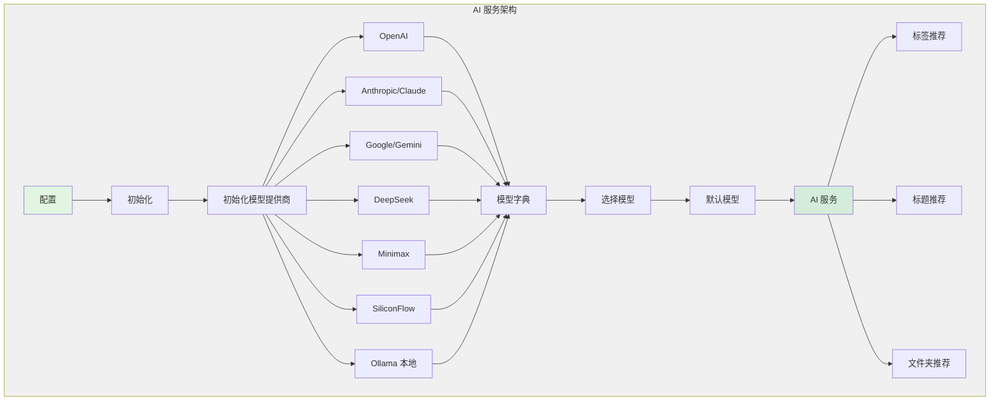

## AI 提供商配置

### 支持的提供商

| 提供商 | 配置项 | 默认模型 | 说明 |
|--------|--------|---------|------|
| OpenAI | `OPENAI_API_KEY`, `OPENAI_MODEL` | `gpt-4o` | OpenAI 官方 API |
| Anthropic | `ANTHROPIC_API_KEY`, `ANTHROPIC_MODEL` | `claude-3-5-sonnet-20240620` | Claude 系列模型 |
| Google | `GOOGLE_API_KEY`, `GOOGLE_MODEL` | `gemini-2.0-flash` | Gemini 系列模型 |
| DeepSeek | `DEEPSEEK_API_KEY`, `DEEPSEEK_MODEL`, `DEEPSEEK_BASE_URL` | `deepseek-chat` | DeepSeek API |
| Minimax | `MINIMAX_API_KEY`, `MINIMAX_MODEL`, `MINIMAX_BASE_URL` | `minimax` | Minimax API |
| SiliconFlow | `SILICONFLOW_API_KEY`, `SILICONFLOW_MODEL`, `SILICONFLOW_BASE_URL` | `siliconflow` | SiliconFlow API |
| Ollama | `OLLAMA_MODEL`, `OLLAMA_BASE_URL` | `phi4` | 本地 Ollama 服务 |

### 模型初始化流程

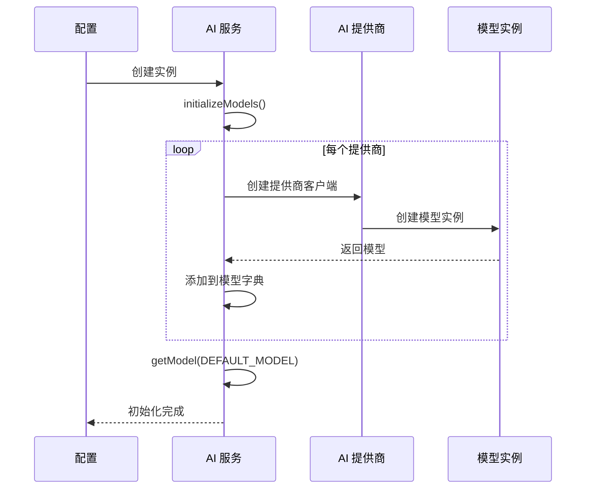

### 特殊配置 - SiliconFlow

SiliconFlow 提供商包含自定义的响应处理逻辑：

```typescript
// 特殊处理：从响应中提取 JSON
fetch: (url, options) => {
  return fetch(url, options)
    .then(response => {
      return response.json().then(data => {
        // 提取嵌入在 markdown 代码块中的 JSON
        let rawArguments = data.choices[0].message.tool_calls[0].function.arguments;
        const match = rawArguments.match(/```json(.*)```/);
        if (match && match[1]) {
          rawArguments = match[1];
        }
        // 修改响应数据
        data.choices[0].message.tool_calls[0].function.arguments = rawArguments;
        // 返回修改后的响应
        return new Response(JSON.stringify(data), {
          status: response.status,
          statusText: response.statusText,
          headers: response.headers
        });
      });
    });
}
```

## 标签推荐流程

### 流程图

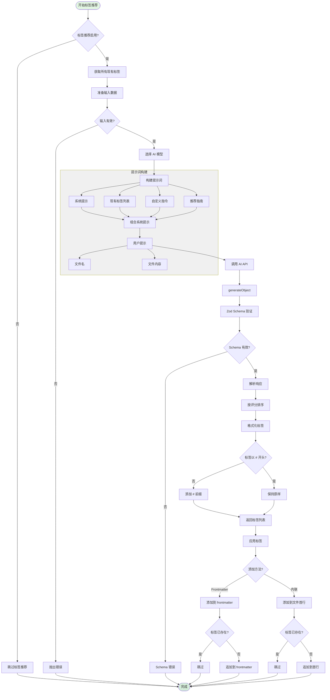

### 标签推荐 Schema

```typescript
const tagsSchema = z.object({
  suggestedTags: z.array(z.object({
    score: z.number().min(0).max(100),  // 相关性评分 0-100
    isNew: z.boolean(),                  // 是否为新标签
    tag: z.string(),                     // 标签名称
    reason: z.string(),                  // 推荐理由
  }))
});
```

### 系统提示词

```
You are a precise tag generator. Analyze content and suggest {count} relevant tags.
Consider existing tags: {existingTags}
Create new tags if needed.
Follow these custom instructions: {customInstructions}

Guidelines:
- Prefer existing tags when appropriate (score them higher)
- Create specific, meaningful new tags when needed
- Score based on relevance (0-100)
- Include brief reasoning for each tag
- Focus on key themes, topics, and document type
```

### 标签应用逻辑

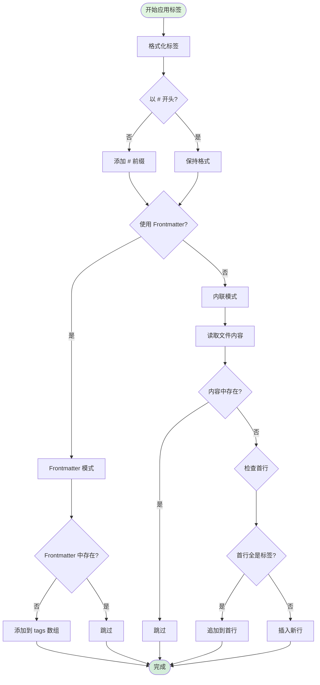

## 标题推荐流程

### 流程图

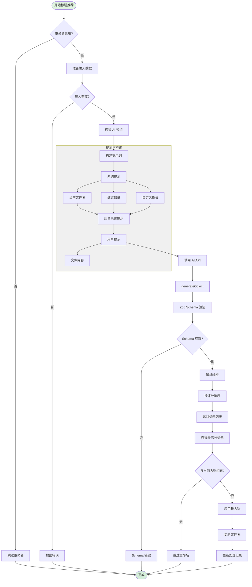

### 标题推荐 Schema

```typescript
const titleSchema = z.object({
  suggestedTitles: z.array(
    z.object({
      score: z.number().min(0).max(100),  // 适合度评分 0-100
      title: z.string(),                   // 建议的标题
      reason: z.string(),                  // 推荐理由
    })
  ).min(1),  // 至少返回 1 个建议
});
```

### 系统提示词

```
Given the content and file name: "{fileName}", suggest exactly {count} clear titles.
Avoid special characters.
Instructions: "{customInstructions}"
```

## 文件夹推荐流程

### 流程图

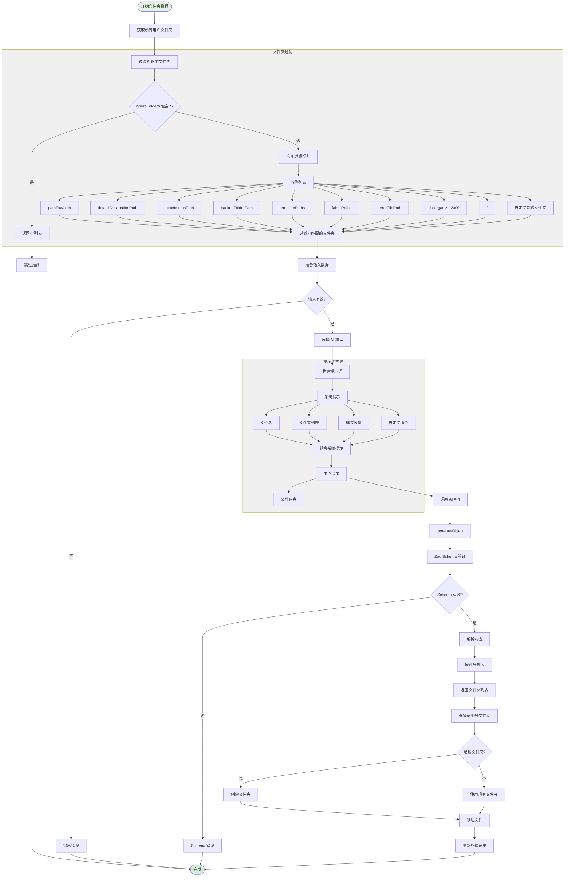

### 文件夹推荐 Schema

```typescript
const folderSchema = z.object({
  suggestedFolders: z.array(
    z.object({
      score: z.number().min(0).max(100),  // 适合度评分 0-100
      isNewFolder: z.boolean(),            // 是否为新文件夹
      folder: z.string(),                  // 文件夹路径
      reason: z.string(),                  // 推荐理由
    })
  ).min(1),  // 至少返回 1 个建议
});
```

### 系统提示词

```
Given the content and file name: "{fileName}", suggest exactly {count} folders.
You can use: {folders}.
If none are relevant, suggest new folders.
Instructions: "{customInstructions}"
```

## 文档分类流程

### 流程图

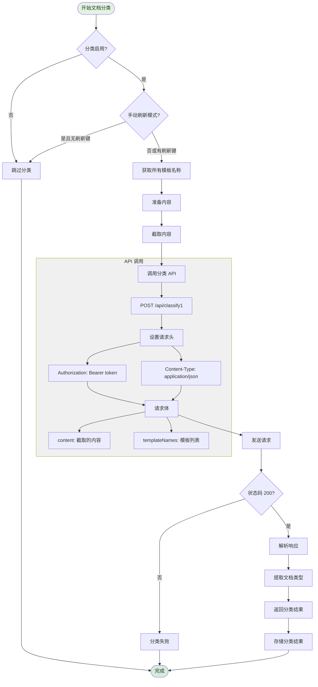

### 分类请求格式

```typescript
// 请求
POST /api/classify1
{
  "content": "截取的文件内容 (前 N 个字符)",
  "templateNames": ["模板1", "模板2", "模板3", ...]
}

// 响应
{
  "documentType": "匹配的模板名称"
}
```

### 内容截取逻辑

```typescript
const cutoff = settings.contentCutoffChars;
const trimmedContent = content.slice(0, cutoff);
```

## 通用错误处理

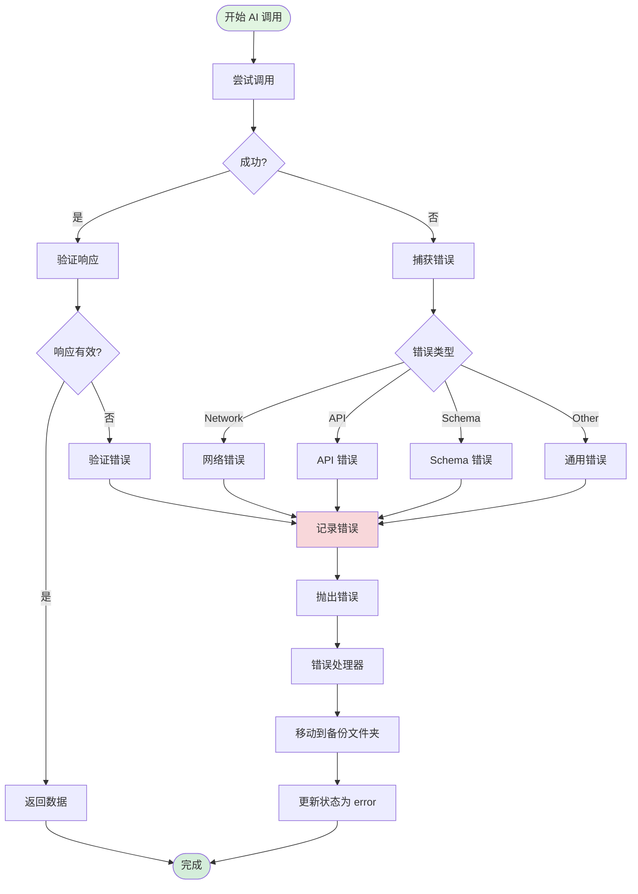

## AI 调用序列图

### 标签推荐序列

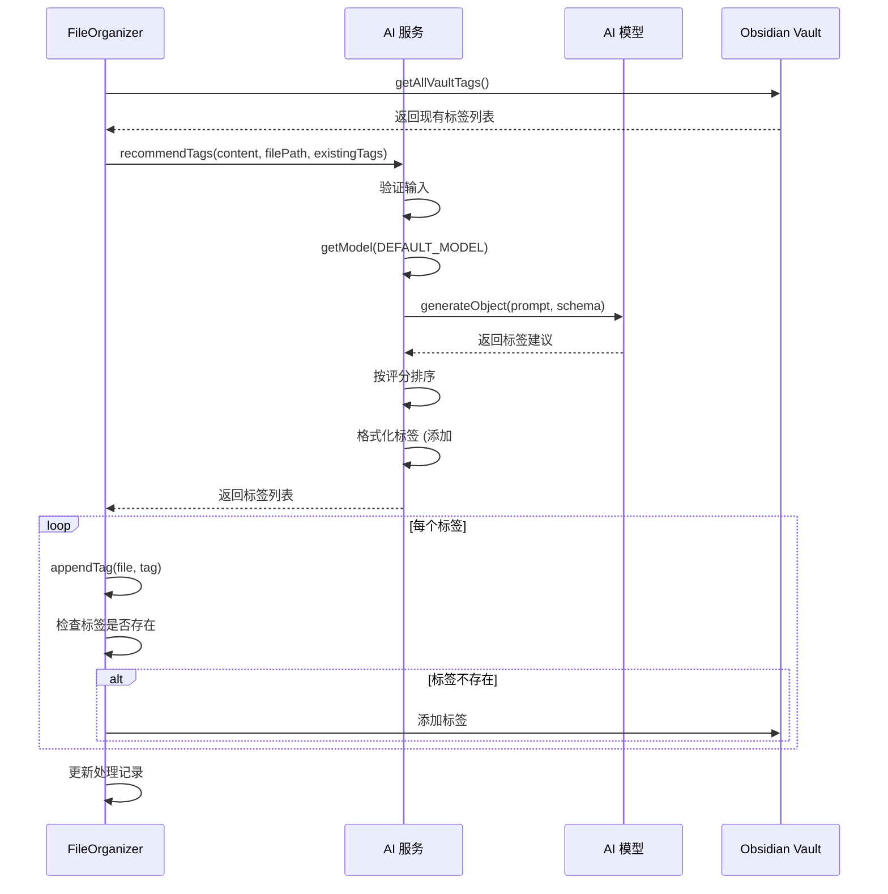

### 标题推荐序列

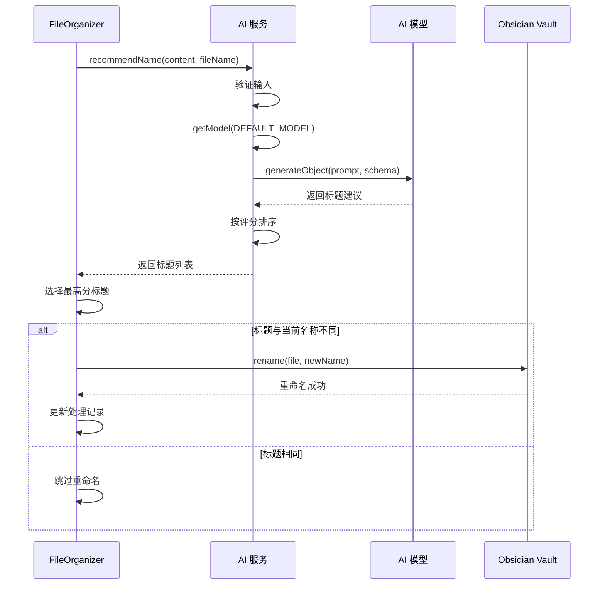

### 文件夹推荐序列

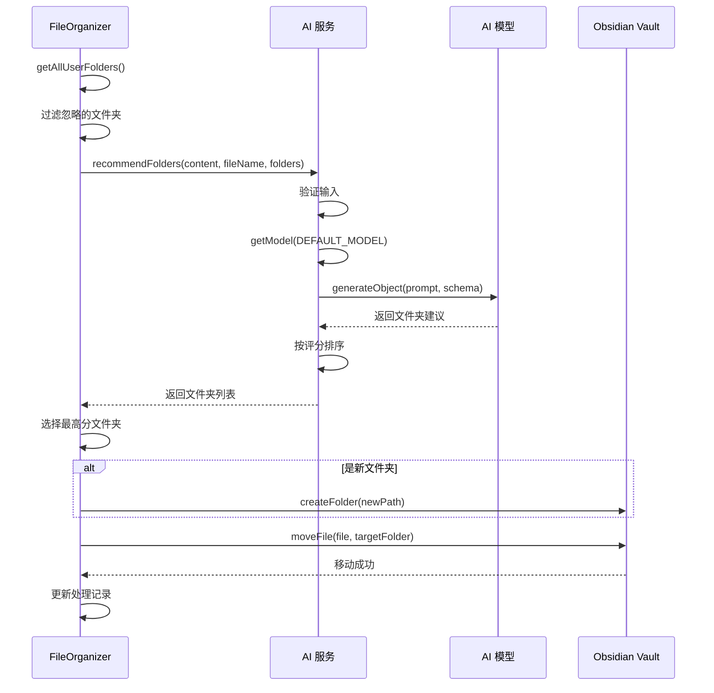

## 性能优化策略

### 1. 内容截取
```typescript
// 减少 API 调用成本
const cutoff = settings.contentCutoffChars;
const trimmedContent = content.slice(0, cutoff);
```

### 2. 批量处理
- 使用队列管理 AI 调用
- 避免并发过多导致 API 限流

### 3. 缓存策略
- 可以缓存相似内容的分类结果
- 减少重复 API 调用

### 4. Schema 验证
- 使用 Zod 确保响应格式正确
- 早期发现并处理格式错误

## 配置建议

### 内容截取字符数
| 文档类型 | 建议值 | 说明 |
|---------|--------|------|
| 短文本 | 500-1000 | 快速处理，成本低 |
| 中等文本 | 2000-3000 | 平衡准确性和成本 |
| 长文本 | 5000-8000 | 更准确，成本较高 |

### 模型选择
| 任务 | 推荐模型 | 原因 |
|------|---------|------|
| 标签推荐 | GPT-4o, Claude | 需要理解语义 |
| 标题生成 | GPT-4o, Gemini | 创造性命名 |
| 文件夹推荐 | DeepSeek, GPT-3.5 | 分类任务 |
| 文档分类 | DeepSeek, GPT-3.5 | 简单分类 |

## 总结

AI 服务采用了：
- ✅ 多提供商支持 - 灵活选择 AI 服务
- ✅ Schema 验证 - 确保响应格式正确
- ✅ 错误处理 - 完善的错误恢复机制
- ✅ 内容优化 - 智能截取减少成本
- ✅ 可配置性 - 灵活的提示词和参数
- ✅ 评分排序 - 选择最佳建议
