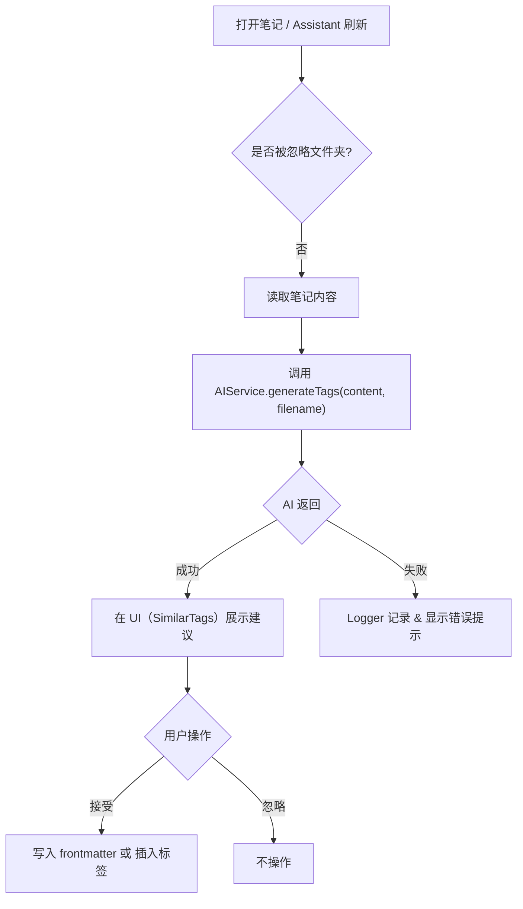
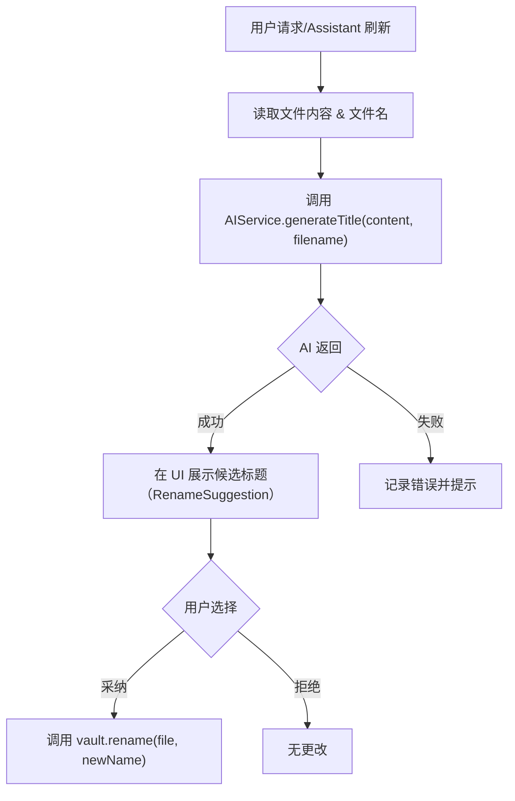
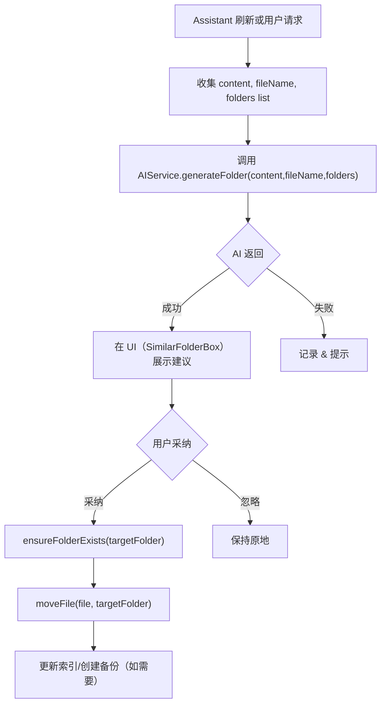
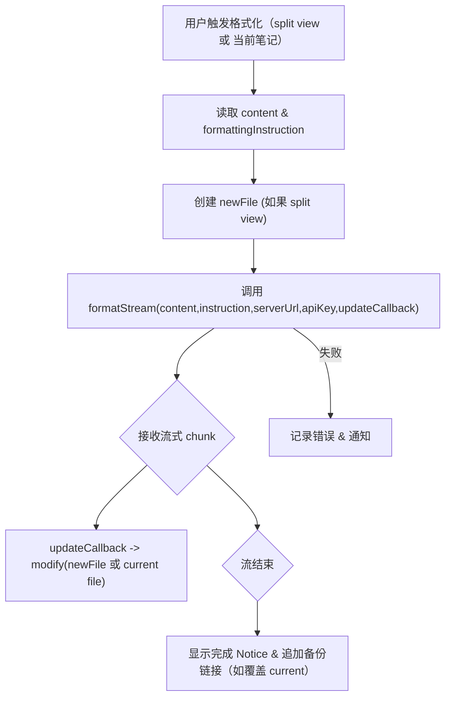
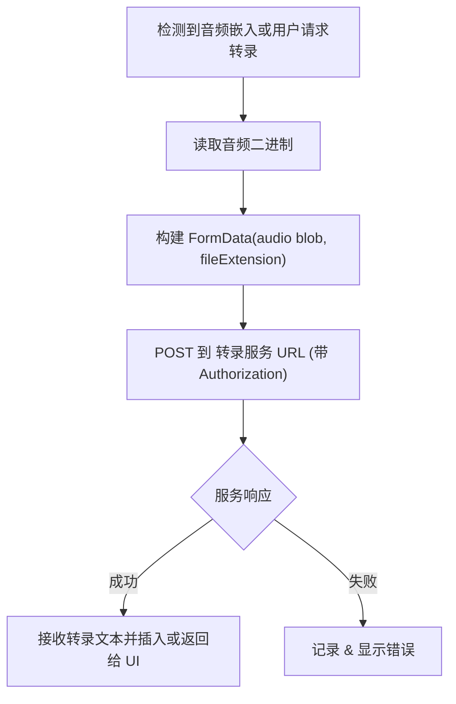
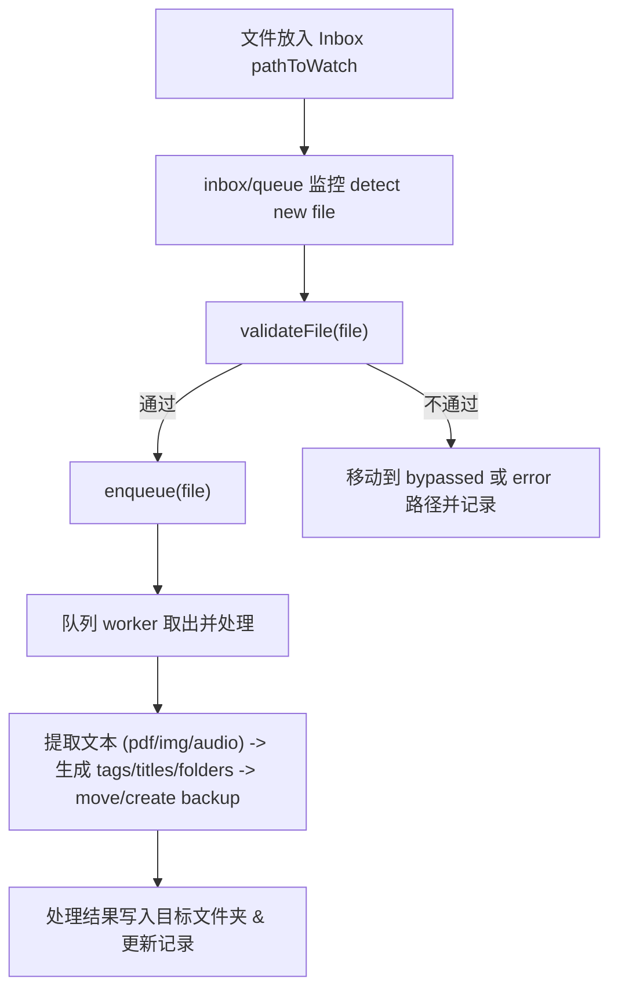
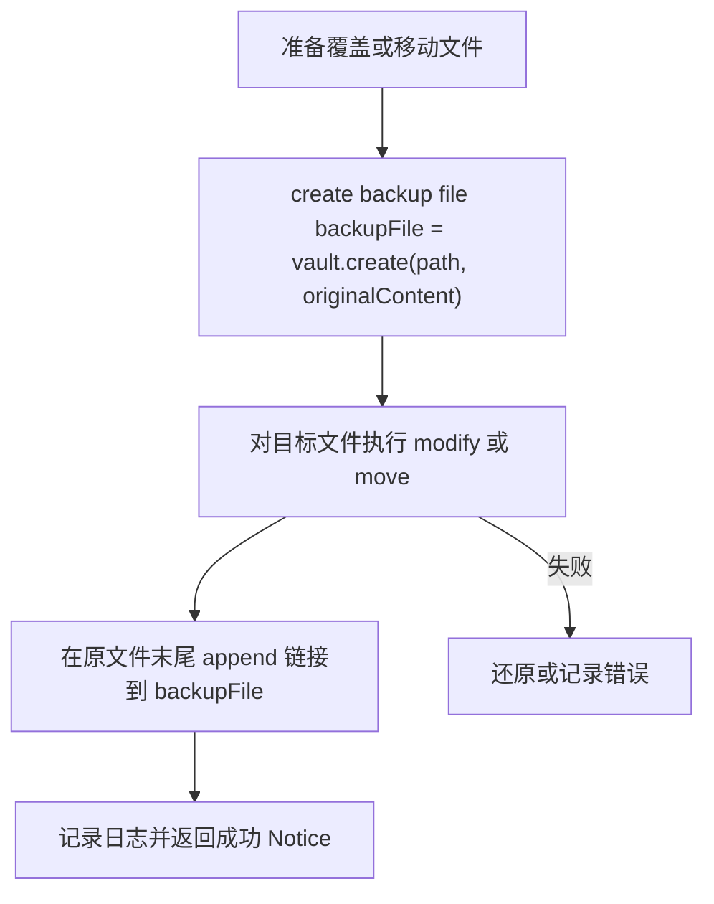

# File Organizer 2000 — 执行流程文档

本文档列出了插件主要功能的执行流程，并使用 Mermaid 图展示每个流程的关键步骤，便于阅读与维护。

---

## 目录

- Tags 生成流程
- Title（标题/重命名）生成流程
- Folder（文件夹）建议与移动流程
- 内容格式化（流式 & 覆盖/新文件）流程
- PDF 文本提取流程
- 音频转录流程
- Inbox（收件箱）入站处理流程
- 备份与移动文件流程

---

## Tags 生成流程

流程说明：当用户在 Assistant 侧边打开或刷新笔记时，插件会读取笔记内容并调用 AIService.generateTags。AI 返回带分数和理由的标签，UI 将其展示给用户，用户可以选择将标签写入 frontmatter 或插入文中。



---

## Title（标题/重命名）生成流程

流程说明：用户启用标题建议后或在重命名场景，插件会调用 AI 生成候选标题，展示给用户并可选择重命名。



---

## Folder（文件夹）建议与移动流程

流程说明：AI 基于内容与仓库可用文件夹建议目标文件夹。用户可以接受建议，插件会创建文件夹（如需要）并移动文件。



---

## 内容格式化（流式 & 覆盖/新文件）流程

流程说明：用户触发格式化（split view 或 current note），插件向后端发起流式请求，边接收流边写入文件（或新文件），最后完成并展示结果。



---

## PDF 文本提取流程

流程说明：当文件是 PDF 且需要提取时，插件使用 pdf.js 读取二进制并提取（默认最多前 10 页以节省时间）。

```mermaid
flowchart TD
  A["检测到 PDF 文件"] --> B["调用 loadPdfJs()"]
  B --> C["读取文件二进制 app.vault.readBinary(file)"]
  C --> D["pdfjsLib.getDocument({"data: bytes"}).promise"]
  D --> E["循环页 (1..min(numPages,10)) 获取 page.getTextContent()"]
  E --> F["拼接文本并返回"]
  D -->|"失败"| G["记录错误 & 返回空字符串"]
```

---

## 音频转录流程

流程说明：当用户对文中嵌入的音频请求转录或将音频放入 Inbox，插件会把音频二进制发送到转录服务（FormData），并接收文本结果。



---

## Inbox（收件箱）入站处理流程

流程说明：文件放入 `pathToWatch`（Inbox），插件/队列会监控并把文件放入处理队列，按策略执行解析/AI 建议/移动/备份等步骤。



---

## 备份与移动文件流程

流程说明：在覆盖当前笔记格式化或移动文件时，会先创建备份文件并在原文件末尾追加指向备份的链接。



---

# 结束语

该文档旨在为开发者与维护者快速了解每个关键功能的执行路径与边界。若希望我把更多 UI 组件（例如 `views/assistant/organizer/components/*` 下的每个子组件）也绘制更细粒度的流程图，我可以继续扩展。
