# 多媒体处理流程

## 概述

File Organizer 2000 支持多种媒体文件类型的处理，包括 PDF、图像和音频文件。本文档详细说明各种媒体文件的处理流程。

## 支持的媒体类型

### 文件扩展名

| 类型 | 扩展名 | 处理方式 |
|------|--------|---------|
| 图像 | `.jpg`, `.jpeg`, `.png`, `.gif`, `.webp`, `.svg` | 视觉识别/OCR |
| 音频 | `.mp3`, `.wav`, `.m4a`, `.ogg`, `.3gp`, `.flac` | 语音转文本 |
| PDF | `.pdf` | 文本提取 |

### 媒体文件标识

```typescript
const VALID_IMAGE_EXTENSIONS = ["jpg", "jpeg", "png", "gif", "webp", "svg"];
const VALID_AUDIO_EXTENSIONS = ["mp3", "wav", "m4a", "ogg", "3gp", "flac"];
const VALID_MEDIA_EXTENSIONS = [...VALID_IMAGE_EXTENSIONS, ...VALID_AUDIO_EXTENSIONS];

function shouldCreateMarkdownContainer(file: TFile): boolean {
  return VALID_MEDIA_EXTENSIONS.includes(file.extension) || file.extension === "pdf";
}
```

## 媒体文件处理架构

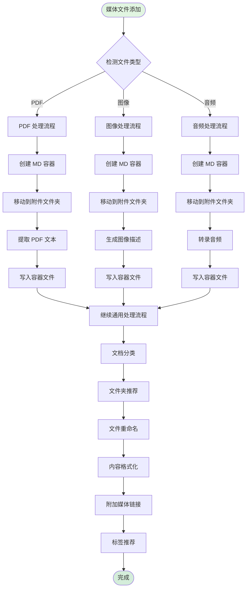

## PDF 处理流程

### 流程图

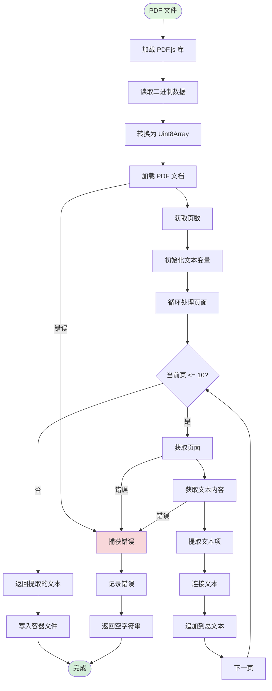

### 详细步骤

#### 1. 加载 PDF.js

```typescript
const pdfjsLib = await loadPdfJs();
```

**说明：**
- 使用 Obsidian 内置的 PDF.js 库
- 异步加载确保库可用

#### 2. 读取 PDF 文件

```typescript
const arrayBuffer = await this.app.vault.readBinary(file);
const bytes = new Uint8Array(arrayBuffer);
```

**说明：**
- 使用 `readBinary` 读取二进制数据
- 转换为 Uint8Array 供 PDF.js 使用

#### 3. 加载文档

```typescript
const doc = await pdfjsLib.getDocument({ data: bytes }).promise;
```

**说明：**
- 创建 PDF 文档对象
- 异步加载文档结构

#### 4. 提取文本

```typescript
let text = "";
for (let pageNum = 1; pageNum <= Math.min(doc.numPages, 10); pageNum++) {
  const page = await doc.getPage(pageNum);
  const textContent = await page.getTextContent();
  text += textContent.items.map(item => item.str).join(" ");
}
```

**说明：**
- 只处理前 10 页（性能优化）
- 逐页提取文本内容
- 使用空格连接文本项

#### 5. 错误处理

```typescript
try {
  // PDF 处理逻辑
} catch (error) {
  logger.error(`Error extracting text from PDF: ${error}`);
  return "";
}
```

### PDF 处理示例

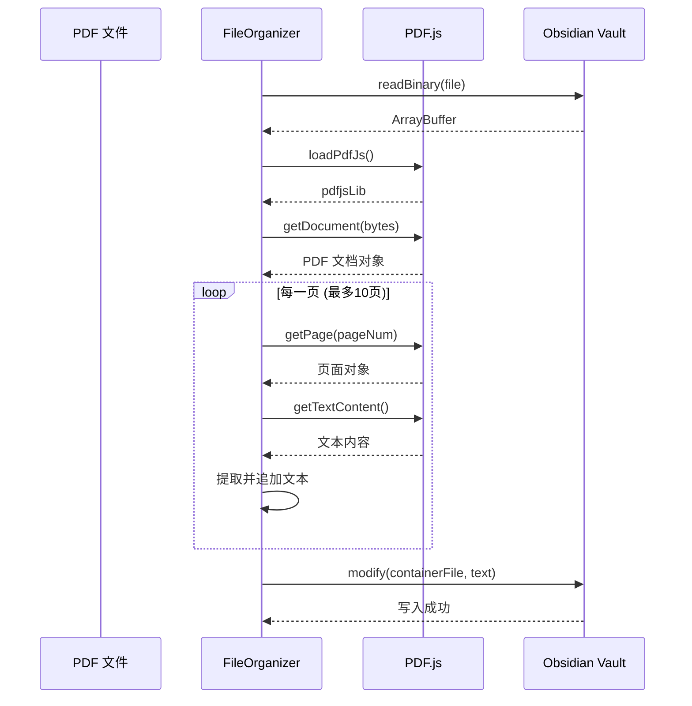

## 图像处理流程

### 流程图

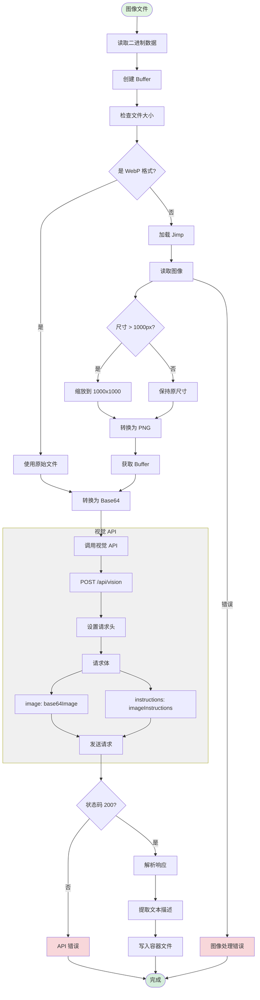

### 详细步骤

#### 1. 读取图像

```typescript
const arrayBuffer = await this.app.vault.readBinary(file);
const fileContent = Buffer.from(arrayBuffer);
```

#### 2. 检查 WebP 格式

```typescript
function isWebP(fileContent: Buffer): boolean {
  return (
    fileContent.slice(0, 4).toString("hex") === "52494646" &&
    fileContent.slice(8, 12).toString("hex") === "57454250"
  );
}
```

**说明：**
- WebP 文件签名：`RIFF....WEBP`
- 检查文件头的十六进制值

#### 3. 压缩图像

```typescript
async function compressImage(fileContent: Buffer): Promise<Buffer> {
  const image = await Jimp.read(fileContent);
  
  if (image.getWidth() > 1000 || image.getHeight() > 1000) {
    image.scaleToFit(1000, 1000);  // 保持宽高比
  }
  
  const resizedImage = await image.getBufferAsync(Jimp.MIME_PNG);
  return resizedImage;
}
```

**优化策略：**
- 最大尺寸：1000x1000 像素
- 保持宽高比
- 转换为 PNG 格式

#### 4. 转换为 Base64

```typescript
const base64Image = arrayBufferToBase64(processedArrayBuffer);
```

#### 5. 调用视觉 API

```typescript
const response = await fetch(`${this.getServerUrl()}/api/vision`, {
  method: "POST",
  headers: {
    "Content-Type": "application/json",
    Authorization: `Bearer ${this.settings.API_KEY}`,
  },
  body: JSON.stringify({
    image: base64Image,
    instructions: this.settings.imageInstructions,
  }),
});

const { text } = await response.json();
```

### 图像处理示例

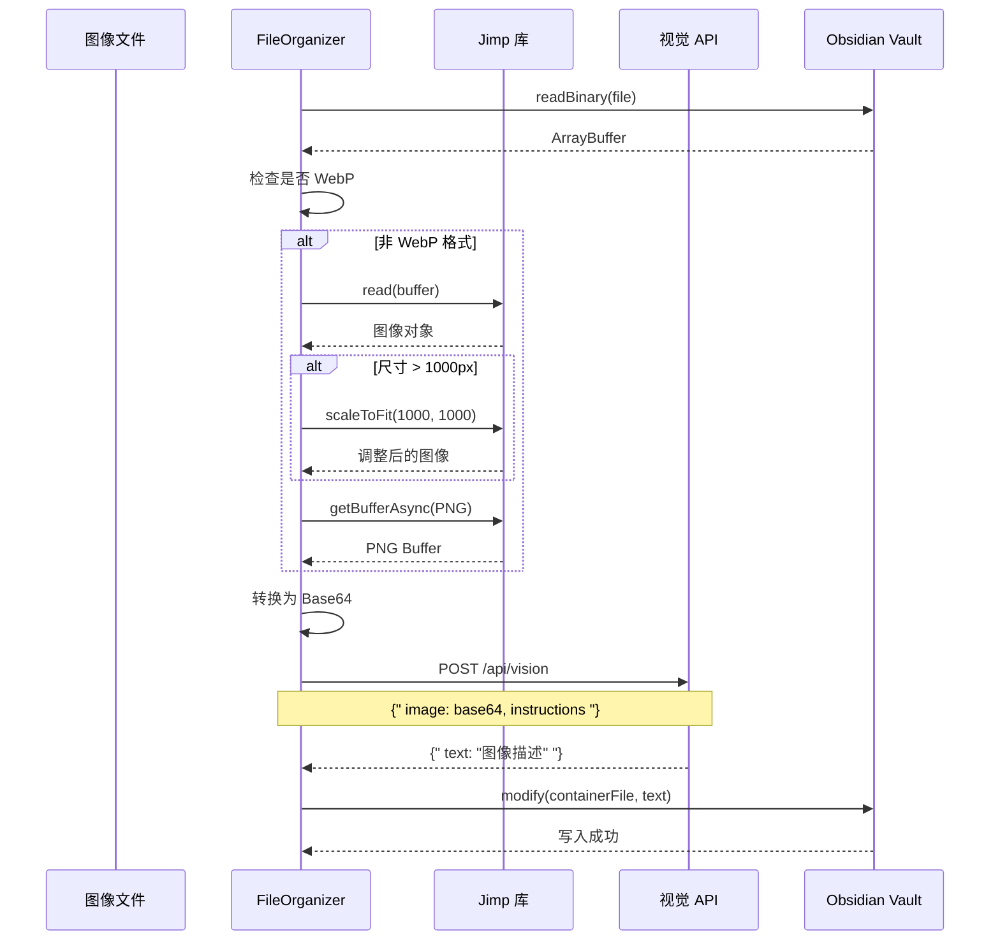

## 音频处理流程

### 流程图

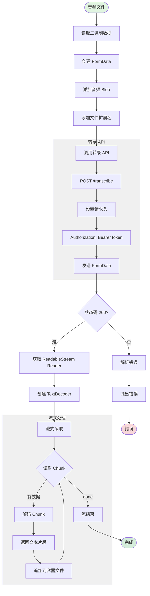

### 详细步骤

#### 1. 读取音频文件

```typescript
const audioBuffer = await this.app.vault.readBinary(file);
```

#### 2. 创建 FormData

```typescript
const formData = new FormData();
const blob = new Blob([audioBuffer], { type: `audio/${fileExtension}` });
formData.append("audio", blob, `audio.${fileExtension}`);
formData.append("fileExtension", fileExtension);
```

#### 3. 调用转录 API

```typescript
const transcribeUrl = "https://file-organizer-2000-audio-transcription.onrender.com/transcribe";

const response = await fetch(transcribeUrl, {
  method: "POST",
  body: formData,
  headers: {
    Authorization: `Bearer ${this.settings.API_KEY}`,
  },
});
```

**转录服务器：**
- 生产环境：`https://file-organizer-2000-audio-transcription.onrender.com/transcribe`
- 本地开发：`http://localhost:3001/transcribe`

#### 4. 流式接收转录结果

```typescript
const reader = response.body.getReader();
const decoder = new TextDecoder();

async function* generateTranscript() {
  while (true) {
    const { done, value } = await reader.read();
    if (done) break;
    yield decoder.decode(value);
  }
}

return generateTranscript();
```

#### 5. 追加到容器文件

```typescript
async function appendTranscriptToActiveFile(
  parentFile: TFile,
  audioFileName: string,
  transcriptIterator: AsyncIterableIterator<string>
) {
  const transcriptHeader = `\n\n## Transcript for ${audioFileName}\n\n`;
  await this.app.vault.append(parentFile, transcriptHeader);
  
  for await (const chunk of transcriptIterator) {
    await this.app.vault.append(parentFile, chunk);
  }
  
  new Notice(`Transcription completed for ${audioFileName}`, 5000);
}
```

### 音频处理示例

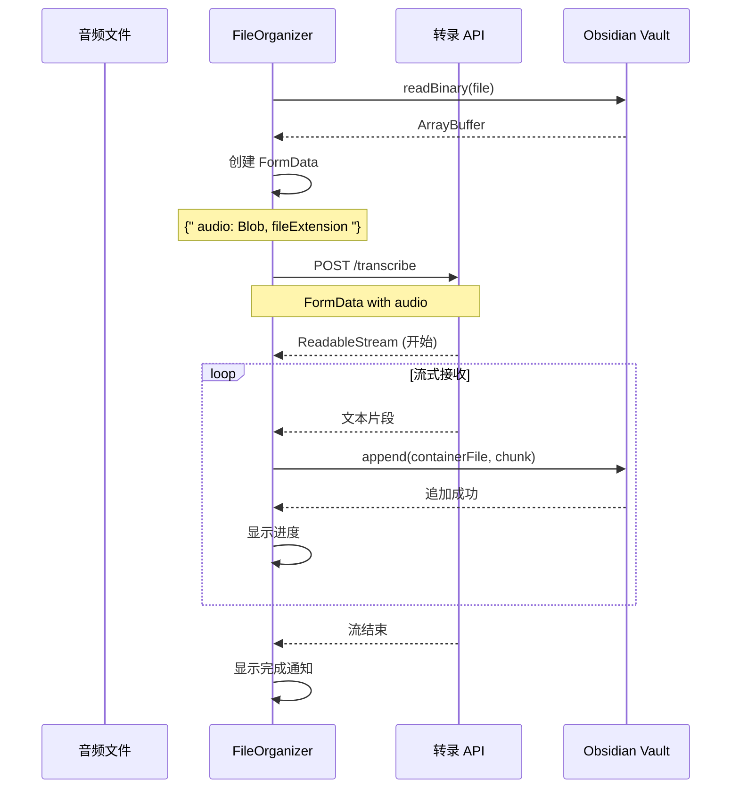

## 容器文件管理

### 容器创建流程

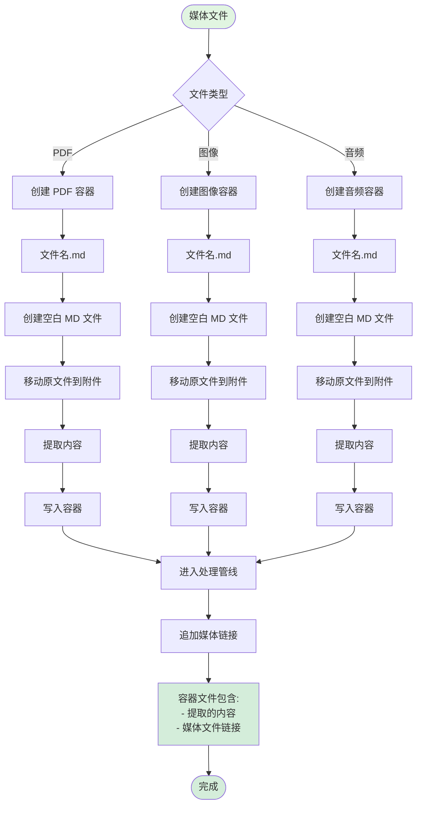

### 容器文件结构

#### PDF 容器示例

```markdown
[提取的 PDF 文本内容]

---
分类：报告
标签：#finance #quarterly
---

![[report.pdf]]
```

#### 图像容器示例

```markdown
[AI 生成的图像描述]

这张图片显示了一个美丽的日落场景，天空呈现出橙色和粉色的渐变...

---
分类：照片
标签：#landscape #sunset
---

![[sunset.jpg]]
```

#### 音频容器示例

```markdown
## Transcript for interview.mp3

[流式转录的文本内容]

Speaker: Hello, welcome to today's podcast...
[更多转录内容...]

---
分类：采访
标签：#podcast #interview
---

![[interview.mp3]]
```

## 媒体文件并发控制

### 并发限制

```typescript
const MAX_CONCURRENT_MEDIA_TASKS = 2;
```

**原因：**
- 媒体文件处理消耗大量资源
- API 调用可能较慢（尤其是音频转录）
- 避免占用过多系统资源

### 媒体队列管理

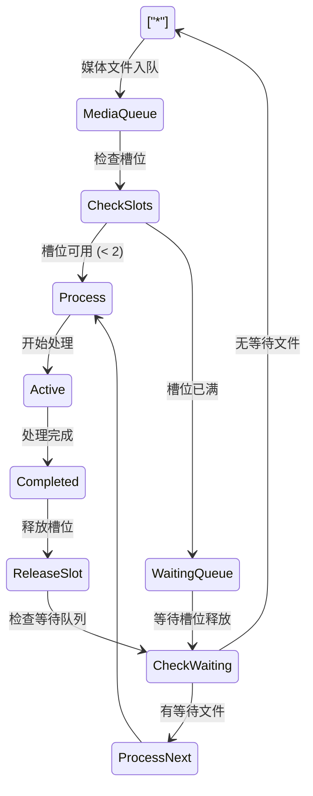

### 队列处理逻辑

```typescript
private async processNextMediaFile(): Promise<void> {
  // 检查是否有等待的媒体文件和可用槽位
  if (
    this.mediaQueue.length === 0 ||
    this.activeMediaTasks >= MAX_CONCURRENT_MEDIA_TASKS
  ) {
    return;
  }
  
  // 从队列中取出下一个文件
  const nextFile = this.mediaQueue.shift();
  if (nextFile) {
    const hash = this.idService.generateFileHash(nextFile);
    this.queue.add(nextFile, { metadata: { hash } });
  }
}
```

## 错误处理

### PDF 错误处理

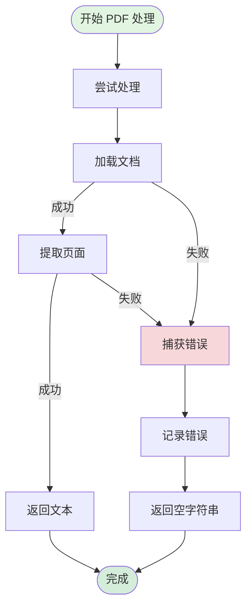

### 图像错误处理

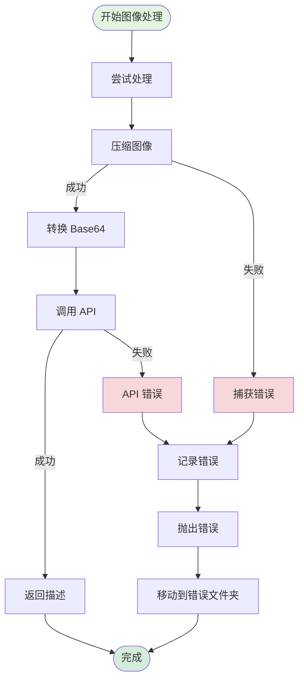

### 音频错误处理

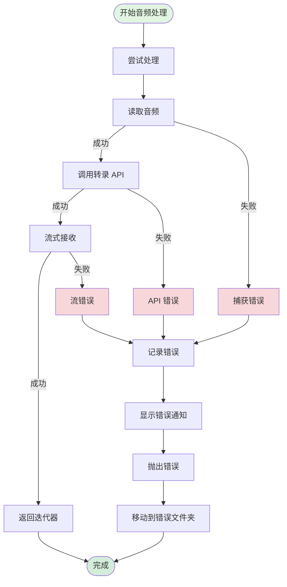

## 性能优化

### PDF 优化

| 优化项 | 策略 | 效果 |
|--------|------|------|
| 页数限制 | 只处理前 10 页 | 减少处理时间 |
| 异步加载 | 使用 Promise | 避免阻塞 |
| 错误恢复 | 单页失败不影响其他页 | 提高鲁棒性 |

### 图像优化

| 优化项 | 策略 | 效果 |
|--------|------|------|
| 尺寸压缩 | 最大 1000x1000 | 减少 API 成本 |
| WebP 检测 | 直接使用 WebP | 避免不必要的转换 |
| 格式标准化 | 统一转换为 PNG | 兼容性更好 |

### 音频优化

| 优化项 | 策略 | 效果 |
|--------|------|------|
| 流式处理 | 实时接收和显示 | 改善用户体验 |
| 并发限制 | 最多 2 个音频任务 | 避免资源耗尽 |
| 进度反馈 | 逐步追加文本 | 用户可见进度 |

## 配置选项

### 图像处理配置

```typescript
interface ImageSettings {
  imageInstructions: string;  // 图像描述指令
  // 例如："Describe this image in detail, focusing on key elements and text."
}
```

### API 端点配置

```typescript
// 视觉 API
const visionEndpoint = `${serverUrl}/api/vision`;

// 音频转录 API
const transcribeEndpoint = "https://file-organizer-2000-audio-transcription.onrender.com/transcribe";
```

## 总结

多媒体处理采用了：
- ✅ 统一的容器文件机制 - 所有媒体文件都创建 Markdown 容器
- ✅ 类型特定的处理流程 - PDF、图像、音频各有专门的处理逻辑
- ✅ 流式处理 - 音频转录支持实时显示
- ✅ 智能优化 - 图像压缩、PDF 页数限制
- ✅ 并发控制 - 限制媒体文件同时处理数量
- ✅ 错误恢复 - 完善的错误处理和回退机制
- ✅ 用户体验 - 实时反馈和进度显示
