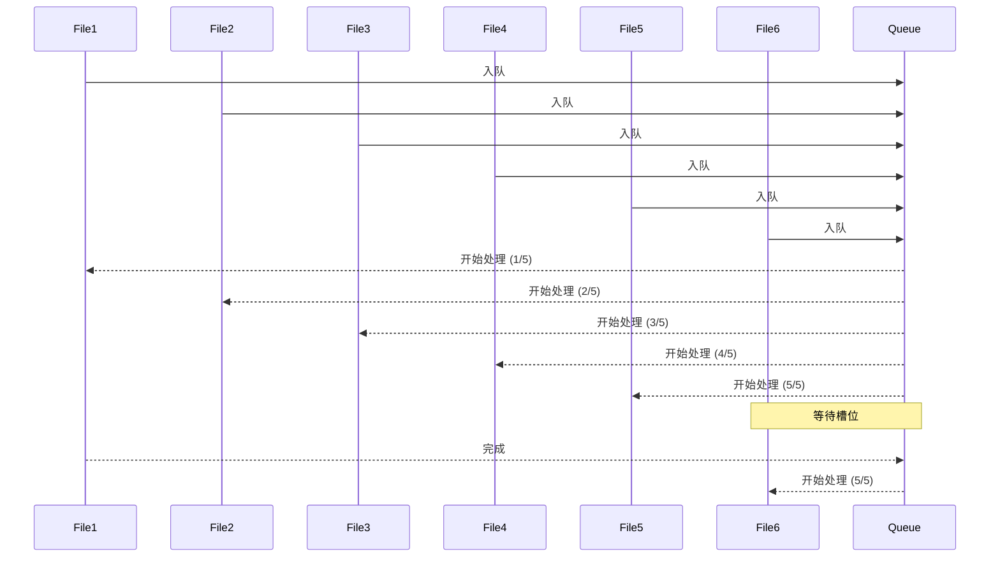
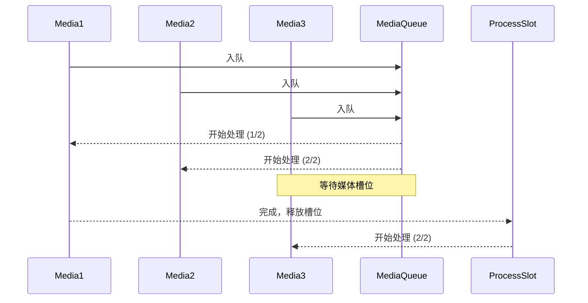

# 文件处理流程

## 概述

File Organizer 2000 使用管线式架构处理文件，每个文件经过一系列步骤进行处理。本文档详细说明完整的文件处理流程。

## 流程图

```mermaid
flowchart TD
    Start(["文件添加到收件箱"]) --> EventTrigger{"触发事件"}
    EventTrigger -->|"文件创建"| OnCreate["onCreate 事件"]
    EventTrigger -->|"文件重命名"| OnRename["onRename 事件"]
  
    OnCreate --> CheckAutoProcess{"自动处理启用?"}
    OnRename --> CheckAutoProcess
  
    CheckAutoProcess -->|"否"| ShowNotice["显示通知: 自动处理已禁用"]
    CheckAutoProcess -->|"是"| EnqueueFile["添加到处理队列"]
  
    ShowNotice --> End(["结束"])
  
    EnqueueFile --> QueueManager{"队列管理器"}
    QueueManager --> CheckMediaType{"是媒体文件?"}
  
    CheckMediaType -->|"是"| CheckMediaSlots{"媒体槽位可用?"}
    CheckMediaType -->|"否"| RegularQueue["添加到常规队列"]
  
    CheckMediaSlots -->|"是"| MediaQueue["添加到媒体队列"]
    CheckMediaSlots -->|"否"| WaitQueue["等待媒体槽位"]
  
    WaitQueue -.延迟.-> MediaQueue
  
    RegularQueue --> ProcessFile["开始处理文件"]
    MediaQueue --> ProcessFile
  
    ProcessFile --> Pipeline["进入处理管线"]
  
    Pipeline --> Step1
  
    subgraph Pipeline ["处理管线"]
        Step1["1. 启动处理"] --> Step2["2. 文件验证"]
        Step2 --> ValidCheck{"文件类型支持?"}
        ValidCheck -->|"否"| Bypass["移动到旁路文件夹"]
        ValidCheck -->|"是"| Step3["3. 容器创建"]
  
        Step3 --> MediaCheck{"是媒体文件?"}
        MediaCheck -->|"是"| CreateContainer["创建 Markdown 容器"]
        MediaCheck -->|"否"| UseOriginal["使用原始文件"]
  
        CreateContainer --> Step4["4. 移动附件"]
        UseOriginal --> Step5["5. 内容提取"]
        Step4 --> Step5
  
        Step5 --> ExtractContent{"提取内容"}
        ExtractContent -->|"PDF"| ExtractPDF["提取 PDF 文本"]
        ExtractContent -->|"图像"| ExtractImage["生成图像描述"]
        ExtractContent -->|"音频"| ExtractAudio["转录音频"]
        ExtractContent -->|"Markdown"| ReadMD["读取文本"]
  
        ExtractPDF --> Step6["6. 内容清理"]
        ExtractImage --> Step6
        ExtractAudio --> Step6
        ReadMD --> Step6
  
        Step6 --> CleanCheck{"内容有效?"}
        CleanCheck -->|"太短"| Bypass
        CleanCheck -->|"有效"| Step7["7. 文档分类"]
  
        Step7 --> ClassifyCheck{"分类启用?"}
        ClassifyCheck -->|"否"| Skip7["跳过分类"]
        ClassifyCheck -->|"是"| ClassifyAI["AI 分类文档"]
  
        ClassifyAI --> Step8["8. 文件夹推荐"]
        Skip7 --> Step8
  
        Step8 --> FolderAI["AI 推荐文件夹"]
        FolderAI --> MoveFile["移动文件到目标文件夹"]
  
        MoveFile --> Step9["9. 文件重命名"]
        Step9 --> RenameCheck{"重命名启用?"}
        RenameCheck -->|"否"| Skip9["跳过重命名"]
        RenameCheck -->|"是"| RenameAI["AI 推荐文件名"]
  
        RenameAI --> ApplyRename["应用新文件名"]
        ApplyRename --> Step10["10. 内容格式化"]
        Skip9 --> Step10
  
        Step10 --> FormatCheck{"格式化条件满足?"}
        FormatCheck -->|"否"| Skip10["跳过格式化"]
        FormatCheck -->|"是"| CheckConfidence{"分类置信度 >= 80?"}
  
        CheckConfidence -->|"否"| Skip10
        CheckConfidence -->|"是"| CheckTokens{"Token 数 <= 最大值?"}
  
        CheckTokens -->|"否"| Skip10
        CheckTokens -->|"是"| FormatAI["AI 格式化内容"]
  
        FormatAI --> BackupFile["备份原文件"]
        BackupFile --> ApplyFormat["应用格式化内容"]
        ApplyFormat --> AddReference["添加原文件引用"]
  
        AddReference --> Step11["11. 附加附件"]
        Skip10 --> Step11
  
        Step11 --> AttachmentCheck{"有附件文件?"}
        AttachmentCheck -->|"是"| AppendAttachment["附加媒体文件链接"]
        AttachmentCheck -->|"否"| Step12["12. 标签推荐"]
  
        AppendAttachment --> Step12
  
        Step12 --> TagCheck{"标签推荐启用?"}
        TagCheck -->|"否"| Skip12["跳过标签"]
        TagCheck -->|"是"| TagAI["AI 推荐标签"]
  
        TagAI --> ApplyTags["应用标签"]
        ApplyTags --> Step13["13. 完成处理"]
        Skip12 --> Step13
  
        Step13 --> MarkComplete["标记为已完成"]
    end
  
    MarkComplete --> UpdateRecord["更新处理记录"]
    Bypass --> UpdateBypass["标记为已旁路"]
  
    UpdateRecord --> ReleaseSlot{"释放处理槽位"}
    UpdateBypass --> ReleaseSlot
  
    ReleaseSlot -->|"媒体文件"| ReleaseMedia["释放媒体槽位"]
    ReleaseSlot -->|"常规文件"| ReleaseRegular["释放常规槽位"]
  
    ReleaseMedia --> CheckNextMedia{"有等待的媒体文件?"}
    CheckNextMedia -->|"是"| ProcessNextMedia["处理下一个媒体文件"]
    CheckNextMedia -->|"否"| Done
  
    ReleaseRegular --> Done
    ProcessNextMedia --> Done("[处理完成]") 

```



## 详细步骤说明

### 1. 事件触发

**触发条件：**

- 文件被创建在收件箱文件夹（`pathToWatch`）
- 文件被移动到收件箱文件夹

**事件处理器：**

- `onCreate` - 文件创建事件（延迟 1 秒）
- `onRename` - 文件重命名事件（延迟 1 秒）

**检查项：**

- 检查自动处理是否启用（`enableAutoProcessing`）
- 如果禁用，显示通知并退出

### 2. 队列管理

**文件分类：**

- **媒体文件**：PDF、图像、音频
- **常规文件**：Markdown 文件

**并发限制：**

- 常规文件：最多 5 个并发任务
- 媒体文件：最多 2 个并发任务

**队列逻辑：**

```typescript
// 媒体文件需要等待可用槽位
if (isMediaFile) {
  if (activeMediaTasks >= MAX_CONCURRENT_MEDIA_TASKS) {
    // 添加到等待队列
    mediaQueue.push(file);
  } else {
    // 直接处理
    activeMediaTasks++;
    processFile(file);
  }
}
```

### 3. 处理管线

#### Step 1: 启动处理

- 初始化处理上下文
- 设置状态为 "processing"

#### Step 2: 文件验证

- 检查文件扩展名是否支持
- 不支持的文件类型移动到旁路文件夹（`bypassedFilePath`）

**支持的文件类型：**

- Markdown: `.md`
- PDF: `.pdf`
- 图像: `.jpg`, `.jpeg`, `.png`, `.gif`, `.webp`, `.svg`
- 音频: `.mp3`, `.wav`, `.m4a`, `.ogg`, `.3gp`, `.flac`

#### Step 3: 容器创建

- 如果是媒体文件，创建对应的 Markdown 容器文件
- 如果是 Markdown 文件，使用原始文件作为容器

**容器文件命名：**

```typescript
const containerFileName = `${mediaFile.basename}.md`;
```

#### Step 4: 移动附件

- 将媒体文件移动到附件文件夹（`attachmentsPath`）
- 保存附件文件引用

#### Step 5: 内容提取

根据文件类型提取内容：

**PDF：**

- 使用 PDF.js 加载文件
- 提取前 10 页的文本内容

**图像：**

- 压缩图像（如果 > 1000px）
- 转换为 base64
- 调用视觉 API 生成描述

**音频：**

- 调用转录 API
- 流式接收转录文本

**Markdown：**

- 直接读取文件内容

#### Step 6: 内容清理

- 移除 frontmatter
- 去除前后空格
- 检查内容长度（< 5 字符则旁路）

**清理逻辑：**

```typescript
const cleanContent = content
  .replace(/^---\n[\s\S]*?\n---\n/, '')
  .trim();

if (cleanContent.length < 5) {
  // 移动到旁路文件夹
  moveToBypass();
}
```

#### Step 7: 文档分类

- 检查是否启用分类（`enableDocumentClassification`）
- 获取所有模板名称
- 调用 AI API 进行分类
- 返回文档类型、置信度、理由

**API 调用：**

```typescript
POST /api/classify1
{
  "content": trimmedContent,
  "templateNames": ["模板1", "模板2", ...]
}
```

#### Step 8: 文件夹推荐

- 获取所有用户文件夹
- 调用 AI 推荐文件夹
- 移动文件到推荐的文件夹

**推荐数量：** 3 个建议

#### Step 9: 文件重命名

- 检查是否启用重命名（`enableFileRenaming`）
- 调用 AI 推荐文件名
- 应用最高分的文件名（如果与当前名称不同）

**推荐数量：** 3 个建议

#### Step 10: 内容格式化

**前置条件：**

- 已完成文档分类
- 分类置信度 >= 80%
- Token 数 <= `maxFormattingTokens`

**格式化流程：**

1. 获取分类对应的模板
2. 备份原始文件到引用文件夹（`referencePath`）
3. 调用 AI 格式化内容
4. 应用格式化后的内容
5. 添加原始文件的引用链接

#### Step 11: 附加附件

- 如果有附件文件，在容器文件末尾添加嵌入链接
- 格式：`![[文件名]]`

#### Step 12: 标签推荐

- 检查是否启用标签推荐（`useSimilarTags`）
- 获取 vault 中所有现有标签
- 调用 AI 推荐标签
- 应用推荐的标签

**标签添加方式：**

- Frontmatter：`tags: [tag1, tag2]`（如果 `useSimilarTagsInFrontmatter` 启用）
- 内联：在文件首行添加 `#tag1 #tag2`

#### Step 13: 完成处理

- 标记文件状态为 "completed"
- 更新处理记录
- 释放处理槽位

### 4. 错误处理

**错误类型和处理策略：**

| 错误步骤     | 处理策略         |
| ------------ | ---------------- |
| 文件验证失败 | 移动到旁路文件夹 |
| 内容提取失败 | 移动到错误文件夹 |
| AI 调用失败  | 移动到备份文件夹 |
| 文件操作失败 | 移动到错误文件夹 |

**错误记录：**

```typescript
recordManager.addError(hash, {
  action: errorAction,
  message: error.message,
  stack: error.stack,
});
```

### 5. 状态跟踪

**文件状态：**

- `queued` - 已入队
- `processing` - 处理中
- `completed` - 已完成
- `error` - 错误
- `bypassed` - 已旁路

**记录管理器：**

- `RecordManager` 跟踪每个文件的处理状态
- 记录每个步骤的执行结果
- 记录所有错误信息

### 6. 跳过逻辑

**跳过条件：**

| 步骤     | 跳过条件                                                                |
| -------- | ----------------------------------------------------------------------- |
| 分类     | `enableDocumentClassification = false`                                |
| 格式化   | `enableDocumentClassification = false` 或置信度 < 80% 或 Token 数过大 |
| 重命名   | `enableFileRenaming = false`                                          |
| 标签推荐 | `useSimilarTags = false`                                              |

**跳过操作：**

```typescript
if (shouldSkipAction(context, action)) {
  recordManager.skipAction(hash, action);
  return context;
}
```

## 并发控制

### 常规文件处理



### 媒体文件处理



## 性能优化

### 1. 内容截取

- 使用 `contentCutoffChars` 限制发送给 AI 的内容长度
- 减少 API 调用成本和响应时间

### 2. Token 计数

- 在格式化前检查 Token 数量
- 避免处理过大的文件

### 3. 媒体文件限流

- 限制同时处理的媒体文件数量（2 个）
- 避免占用过多系统资源

### 4. 流式处理

- 音频转录使用流式 API
- 内容格式化支持流式更新

## 文件路径说明

| 配置项               | 用途             | 示例                             |
| -------------------- | ---------------- | -------------------------------- |
| `pathToWatch`      | 收件箱文件夹     | `inbox`                        |
| `attachmentsPath`  | 媒体文件存储     | `attachments`                  |
| `bypassedFilePath` | 旁路文件存储     | `.fileorganizer2000/bypassed`  |
| `errorFilePath`    | 错误文件存储     | `.fileorganizer2000/errors`    |
| `backupFolderPath` | 备份文件存储     | `.fileorganizer2000/backup`    |
| `referencePath`    | 格式化前的原文件 | `.fileorganizer2000/reference` |
| `templatePaths`    | 模板文件夹       | `templates`                    |

## 总结

文件处理流程采用了：

- ✅ 管线式架构 - 每个步骤独立且可配置
- ✅ 错误恢复 - 完善的错误处理和状态跟踪
- ✅ 并发控制 - 智能的队列管理和槽位控制
- ✅ 性能优化 - 内容截取、Token 计数、流式处理
- ✅ 灵活配置 - 可选择启用/禁用各个功能
- ✅ 状态跟踪 - 完整的处理记录和日志
