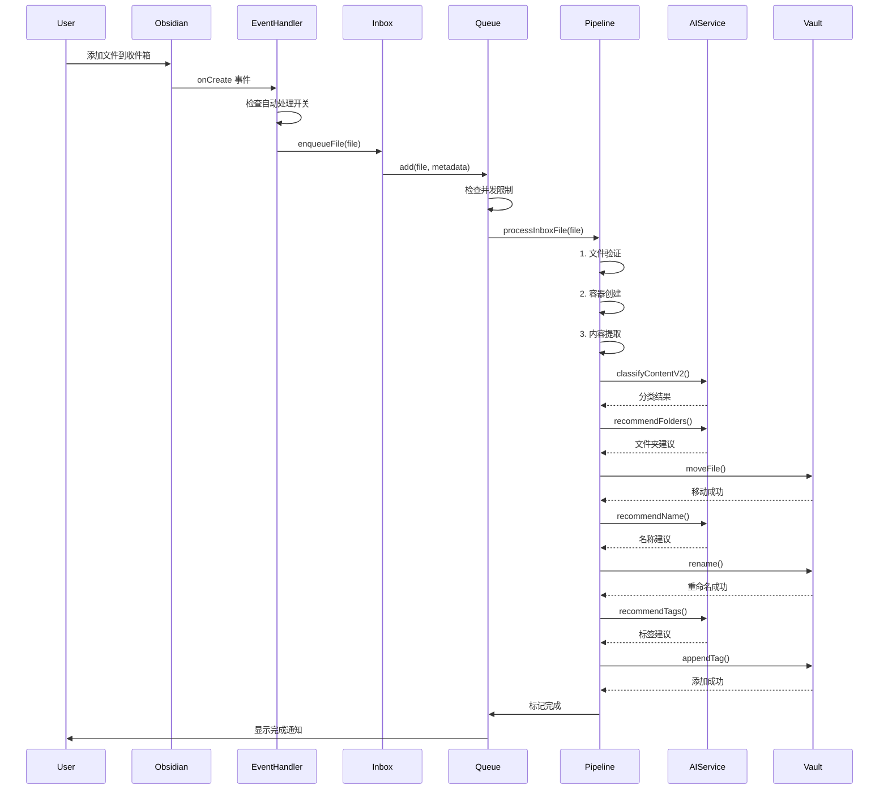
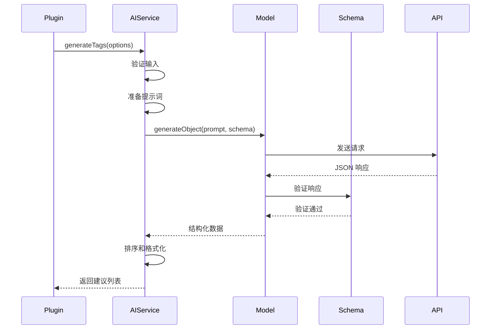
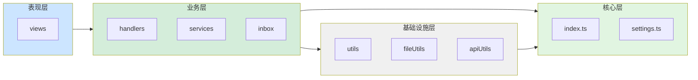
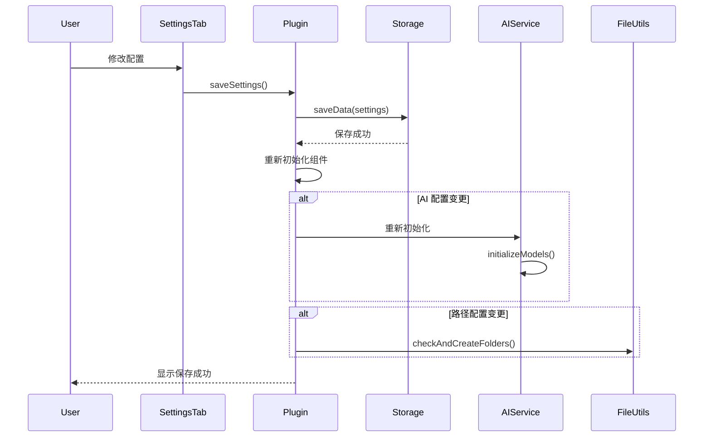
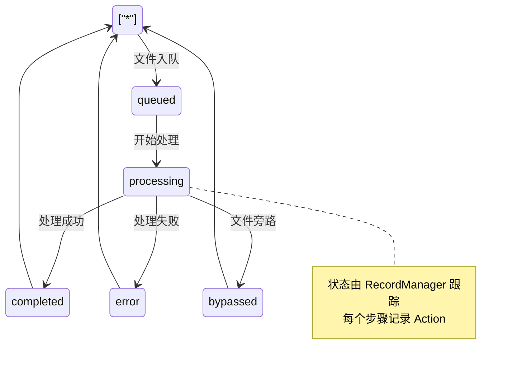
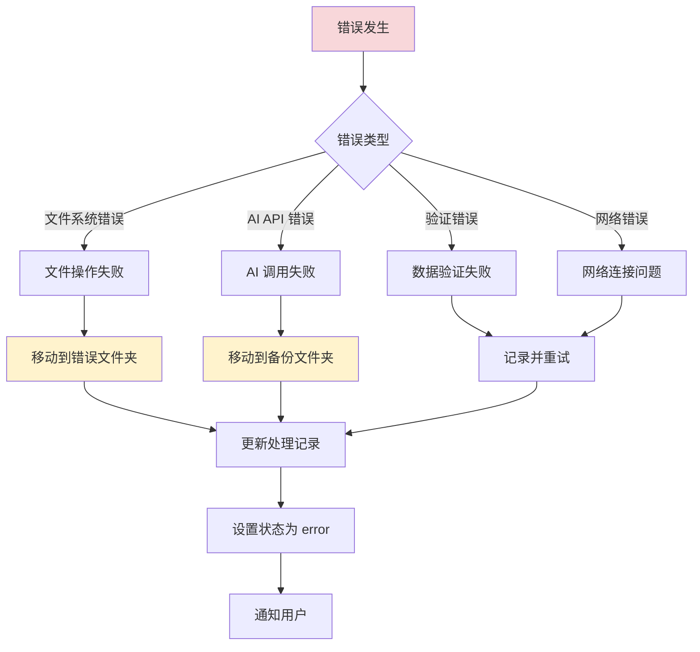
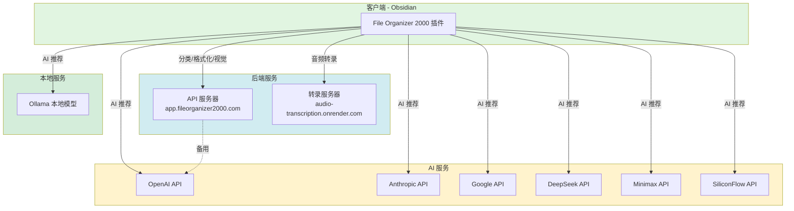

# File Organizer 2000 - 系统架构

## 概述

本文档描述 File Organizer 2000 的整体系统架构，包括核心组件、数据流、模块关系和技术栈。

## 系统架构图

```mermaid
graph TB
    subgraph Obsidian ["Obsidian 环境"]
        subgraph Plugin ["FileOrganizer Plugin"]
            Index["index.ts - 主插件类"]
            Settings["settings.ts - 配置管理"]
          
            Index --> EventHandlers["handlers/事件处理"]
            Index --> CommandHandlers["handlers/命令处理"]
            Index --> AIService["services/AI 服务"]
            Index --> Inbox["inbox/收件箱系统"]
            Index --> Views["views/UI 视图"]
          
            subgraph Handlers ["处理器层"]
                EventHandlers["eventHandlers.ts<br/>文件创建/重命名事件"]
                CommandHandlers["commandHandlers.ts<br/>命令注册"]
            end
          
            subgraph Services ["服务层"]
                AIService["ai_service.ts<br/>AI 推荐服务"]
                Logger["logger.ts<br/>日志服务"]
            end
          
            subgraph InboxSystem ["收件箱系统"]
                InboxCore["inbox/index.ts<br/>核心处理逻辑"]
                Queue["services/queue.ts<br/>队列管理"]
                RecordManager["services/record-manager.ts<br/>状态跟踪"]
                IdService["services/id-service.ts<br/>ID 生成"]
            end
          
            subgraph ViewLayer ["视图层"]
                AssistantView["assistant/view.tsx<br/>助手视图"]
                SettingsView["settings/view.tsx<br/>设置界面"]
                InboxLogs["assistant/inbox-logs.tsx<br/>收件箱日志"]
            end
          
            subgraph Utils ["工具层"]
                FileUtils["fileUtils.ts<br/>文件操作"]
                ApiUtils["apiUtils.ts<br/>API 工具"]
                SomeUtils["someUtils.ts<br/>通用工具"]
                TokenCounter["utils/token-counter.ts<br/>Token 计数"]
            end
        end
      
        VaultAPI["Obsidian Vault API"]
        WorkspaceAPI["Obsidian Workspace API"]
        MetadataAPI["Obsidian Metadata API"]
    end
  
    subgraph External ["外部服务"]
        subgraph AIProviders ["AI 提供商"]
            OpenAI["OpenAI"]
            Anthropic["Anthropic/Claude"]
            Google["Google/Gemini"]
            DeepSeek["DeepSeek"]
            Minimax["Minimax"]
            SiliconFlow["SiliconFlow"]
            Ollama["Ollama 本地"]
        end
      
        subgraph APIs ["后端 API"]
            ClassifyAPI["分类 API<br/>/api/classify1"]
            FormatAPI["格式化 API<br/>/api/format"]
            VisionAPI["视觉 API<br/>/api/vision"]
            TranscribeAPI["转录 API<br/>/transcribe"]
        end
    end
  
    subgraph FileSystem ["文件系统"]
        Inbox["收件箱文件夹"]
        AttachmentsFolder["附件文件夹"]
        BackupFolder["备份文件夹"]
        ErrorFolder["错误文件夹"]
        BypassedFolder["旁路文件夹"]
        ReferenceFolder["引用文件夹"]
        TemplatesFolder["模板文件夹"]
    end
  
    Index --> Settings
    Index --> VaultAPI
    Index --> WorkspaceAPI
    Index --> MetadataAPI
  
    AIService --> OpenAI
    AIService --> Anthropic
    AIService --> Google
    AIService --> DeepSeek
    AIService --> Minimax
    AIService --> SiliconFlow
    AIService --> Ollama
  
    InboxCore --> Queue
    InboxCore --> RecordManager
    InboxCore --> IdService
    InboxCore --> FileUtils
    InboxCore --> AIService
  
    FileUtils --> VaultAPI
    ApiUtils --> ClassifyAPI
    ApiUtils --> FormatAPI
    ApiUtils --> VisionAPI
    ApiUtils --> TranscribeAPI
  
    EventHandlers --> Inbox
    CommandHandlers --> Views
  
    InboxCore --> AttachmentsFolder
    InboxCore --> BackupFolder
    InboxCore --> ErrorFolder
    InboxCore --> BypassedFolder
    InboxCore --> ReferenceFolder
  
    Settings --> TemplatesFolder
  
    style Plugin fill:#e1f5e1
    style External fill:#fff3cd
    style FileSystem fill:#d1ecf1
    style Handlers fill:#f0f0f0
    style Services fill:#f0f0f0
    style InboxSystem fill:#f0f0f0
    style ViewLayer fill:#f0f0f0
    style Utils fill:#f0f0f0
```



## 核心组件

### 1. 主插件类 (index.ts)

**职责：**

- 插件生命周期管理
- 初始化各个子系统
- 提供核心 API 方法

**关键方法：**

```typescript
class FileOrganizer extends Plugin {
  // 生命周期
  async onload()
  async onunload()
  
  // 初始化
  async loadSettings()
  async saveSettings()
  async initializePlugin()
  
  // AI 功能
  async recommendTags(content, filePath, existingTags)
  async recommendName(content, fileName)
  async recommendFolders(content, fileName)
  async classifyContentV2(content, classifications)
  
  // 文件处理
  async getTextFromFile(file)
  async formatContentV2(content, formattingInstruction)
  async moveFile(file, newName, destinationFolder)
  
  // 媒体处理
  async extractTextFromPDF(file)
  async generateImageAnnotation(file)
  async generateTranscriptFromAudio(file)
}
```

### 2. 收件箱系统 (Inbox)

**架构模式：** 单例模式

```mermaid
classDiagram
    class Inbox {"
        -static instance: Inbox
        -plugin: FileOrganizer
        -queue: Queue
        -recordManager: RecordManager
        -idService: IdService
        -activeMediaTasks: number
        -mediaQueue: TFile[]
      
        +static initialize(plugin): Inbox
        +static getInstance(): Inbox
        +static cleanup(): void
        +enqueueFile(file): void
        +enqueueFiles(files): void
        -processInboxFile(file, hash): Promise
        -processNextMediaFile(): Promise
    "}
  
    class Queue {"
        -concurrency: number
        -timeout: number
        -items: Map
      
        +add(item, metadata): void
        +remove(id): void
        +getStats(): QueueStatus
    "}
  
    class RecordManager {"
        -static instance: RecordManager
        -records: Map
      
        +static getInstance(app): RecordManager
        +startTracking(hash, fileName): void
        +setStatus(hash, status): void
        +addAction(hash, action): void
        +addError(hash, error): void
    "}
  
    class IdService {"
        -static instance: IdService
      
        +static getInstance(): IdService
        +generateFileHash(file): string
    "}
  
    Inbox --> Queue
    Inbox --> RecordManager
    Inbox --> IdService
```

### 3. AI 服务 (AIService)

**架构模式：** 策略模式

```mermaid
classDiagram
    class AIService {
        -config: FileOrganizerSettings
        -model: LanguageModel
        -models: Record~string, LanguageModel~
  
        +generateTags(options): Promise~TagSuggestion[]~
        +generateTitle(options): Promise~TitleSuggestion[]~
        +generateFolder(options): Promise~FolderSuggestion[]~
        -initializeModels(): void
        -getModel(name): LanguageModel
    }
  
    class LanguageModel {
        <<interface>>
        +generate(prompt): Promise
    }
  
    class OpenAIModel {
        +generate(prompt): Promise
    }
  
    class AnthropicModel {
        +generate(prompt): Promise
    }
  
    class GoogleModel {
        +generate(prompt): Promise
    }
  
    class DeepSeekModel {
        +generate(prompt): Promise
    }
  
    AIService --> LanguageModel
    LanguageModel <|".. OpenAIModel
    LanguageModel <"|.. AnthropicModel
    LanguageModel <|".. GoogleModel
    LanguageModel <"|.. DeepSeekModel
```

### 4. 视图层 (Views)

```mermaid
classDiagram
    class AssistantViewWrapper {"
        -plugin: FileOrganizer
        -root: Root
      
        +onOpen(): Promise
        +onClose(): Promise
        +activateTab(tabName): void
    "}
  
    class FileOrganizerSettingTab {"
        -plugin: FileOrganizer
      
        +display(): void
        -addGeneralSettings(): void
        -addAISettings(): void
        -addPathSettings(): void
    "}
  
    class InboxLogsView {"
        +render(): JSX.Element
        +displayLogs(logs): void
    "}
  
    AssistantViewWrapper --> InboxLogsView
```

## 数据流

### 文件处理数据流



### AI 推荐数据流



## 模块依赖关系



## 技术栈

### 前端框架

| 技术          | 版本    | 用途     |
| ------------- | ------- | -------- |
| React         | 18.3.1  | UI 框架  |
| React DOM     | 18.3.1  | DOM 渲染 |
| Framer Motion | 11.5.4  | 动画     |
| TailwindCSS   | 3.4.14  | 样式     |
| Lucide React  | 0.441.0 | 图标     |

### AI SDK

| 技术                      | 版本   | 用途            |
| ------------------------- | ------ | --------------- |
| ai                        | 4.0.0  | AI SDK 核心     |
| @ai-sdk/openai            | 1.0.6  | OpenAI 集成     |
| @ai-sdk/anthropic         | 1.0.6  | Anthropic 集成  |
| @ai-sdk/openai-compatible | 0.0.13 | 兼容 API 集成   |
| ollama-ai-provider        | 0.15.2 | Ollama 集成     |
| openai                    | 4.19.0 | OpenAI 官方 SDK |

### 文本处理

| 技术       | 版本    | 用途         |
| ---------- | ------- | ------------ |
| compromise | 14.14.2 | 自然语言处理 |
| natural    | 8.0.1   | NLP 工具     |
| tiktoken   | 1.0.15  | Token 计数   |
| fuse.js    | 7.0.0   | 模糊搜索     |

### 媒体处理

| 技术   | 版本          | 用途     |
| ------ | ------------- | -------- |
| jimp   | 0.22.12       | 图像处理 |
| PDF.js | Obsidian 内置 | PDF 解析 |

### 工具库

| 技术    | 版本    | 用途        |
| ------- | ------- | ----------- |
| lodash  | 4.17.21 | 工具函数    |
| moment  | 2.29.4  | 日期处理    |
| axios   | 1.6.2   | HTTP 客户端 |
| zod     | 3.23.8  | Schema 验证 |
| zustand | 5.0.1   | 状态管理    |

### 开发工具

| 技术         | 版本   | 用途     |
| ------------ | ------ | -------- |
| TypeScript   | 5.2.2  | 类型系统 |
| esbuild      | 0.17.3 | 构建工具 |
| Obsidian API | 1.7.2  | 插件 API |

## 配置管理

### 配置结构

```typescript
interface FileOrganizerSettings {
  // 基础配置
  API_KEY: string;
  DEFAULT_MODEL: string;
  debugMode: boolean;
  
  // 路径配置
  pathToWatch: string;
  defaultDestinationPath: string;
  attachmentsPath: string;
  backupFolderPath: string;
  templatePaths: string;
  logFolderPath: string;
  errorFilePath: string;
  bypassedFilePath: string;
  referencePath: string;
  
  // 功能开关
  enableAutoProcessing: boolean;
  enableDocumentClassification: boolean;
  enableFileRenaming: boolean;
  useSimilarTags: boolean;
  useSimilarTagsInFrontmatter: boolean;
  
  // AI 配置
  OPENAI_API_KEY: string;
  OPENAI_MODEL: string;
  ANTHROPIC_API_KEY: string;
  ANTHROPIC_MODEL: string;
  GOOGLE_API_KEY: string;
  GOOGLE_MODEL: string;
  DEEPSEEK_API_KEY: string;
  DEEPSEEK_MODEL: string;
  DEEPSEEK_BASE_URL: string;
  // ... 更多 AI 提供商配置
  
  // 处理配置
  contentCutoffChars: number;
  maxFormattingTokens: number;
  imageInstructions: string;
  customTagInstructions: string;
  customFolderInstructions: string;
  renameInstructions: string;
}
```

### 配置流程



## 状态管理

### 文件处理状态



### 处理记录结构

```typescript
interface FileRecord {
  id: string;
  hash: string;
  originalName: string;
  currentPath?: string;
  status: FileStatus;
  actions: Action[];
  errors: ErrorRecord[];
  metadata: {
    newName?: string;
    newPath?: string;
    classification?: string;
    tags?: string[];
  };
  timestamps: {
    created: string;
    updated: string;
    completed?: string;
  };
}
```

## 错误处理策略

### 错误分类



### 错误恢复

```typescript
async function handleError(error: Error, context: ProcessingContext) {
  const lastError = recordManager.getLastError(context.hash);
  
  switch (lastError?.action) {
    case Action.ERROR_MOVING:
    case Action.ERROR_MOVING_ATTACHMENT:
      // 文件系统错误
      await moveFileToErrorFolder(context);
      break;
    
    case Action.ERROR_CLASSIFY:
    case Action.ERROR_TAGGING:
      // AI 错误
      await moveToBackupFolder(context);
      break;
    
    default:
      // 默认错误处理
      await moveFileToErrorFolder(context);
  }
  
  recordManager.setStatus(context.hash, "error");
}
```

## 性能优化

### 1. 并发控制

```typescript
const MAX_CONCURRENT_TASKS = 5;        // 常规文件
const MAX_CONCURRENT_MEDIA_TASKS = 2;  // 媒体文件
```

### 2. 内容截取

```typescript
const cutoff = settings.contentCutoffChars;
const trimmedContent = content.slice(0, cutoff);
```

### 3. 缓存策略

- Token 计数缓存
- 模板内容缓存
- 文件夹列表缓存

### 4. 异步处理

```typescript
// 使用 Promise.all 并行处理独立任务
const [tags, folders, title] = await Promise.all([
  this.recommendTags(content, filePath, existingTags),
  this.recommendFolders(content, fileName),
  this.recommendName(content, fileName)
]);
```

## 安全性

### 1. API 密钥管理

- 密钥存储在 Obsidian 的数据文件中
- 通过 Authorization Bearer 传输
- 不在日志中记录密钥

### 2. 文件操作安全

```typescript
// 安全的文件操作包装
async function safeMove(app: App, file: TFile, newPath: string) {
  try {
    await ensureFolderExists(app, newPath);
    const newFile = await app.vault.rename(file, `${newPath}/${file.name}`);
    return newFile;
  } catch (error) {
    logger.error("Failed to move file:", error);
    throw error;
  }
}
```

### 3. 输入验证

```typescript
// Zod Schema 验证
const tagsSchema = z.object({
  suggestedTags: z.array(z.object({
    score: z.number().min(0).max(100),
    isNew: z.boolean(),
    tag: z.string(),
    reason: z.string(),
  }))
});
```

## 扩展性

### 1. 插件式 AI 提供商

```typescript
// 轻松添加新的 AI 提供商
const newProvider = createOpenAICompatible({
  name: "new-provider",
  baseURL: "https://api.new-provider.com",
  headers: {
    Authorization: `Bearer ${apiKey}`,
  },
});

this.models["new-provider"] = newProvider("model-name");
```

### 2. 可配置的处理步骤

```typescript
// 通过配置启用/禁用步骤
function shouldSkipAction(context: ProcessingContext, action: Action): boolean {
  switch (action) {
    case Action.CLASSIFY:
      return !context.plugin.settings.enableDocumentClassification;
    case Action.RENAME:
      return !context.plugin.settings.enableFileRenaming;
    // ...
  }
}
```

### 3. 自定义模板

- 用户可添加自定义分类模板
- 支持自定义格式化指令
- 灵活的标签和文件夹推荐规则

## 部署架构



## 总结

File Organizer 2000 采用了：

- ✅ **模块化架构** - 清晰的分层和职责分离
- ✅ **事件驱动** - 响应式的文件处理流程
- ✅ **管线模式** - 可配置的处理步骤
- ✅ **策略模式** - 灵活的 AI 提供商选择
- ✅ **单例模式** - 全局状态管理
- ✅ **错误恢复** - 完善的错误处理机制
- ✅ **性能优化** - 并发控制、内容截取、异步处理
- ✅ **安全性** - API 密钥管理、输入验证
- ✅ **可扩展性** - 插件式架构、可配置流程
- ✅ **用户友好** - 实时反馈、状态跟踪、详细日志
