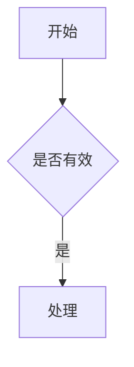
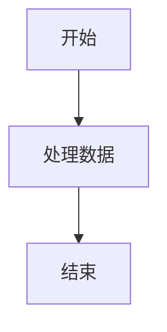
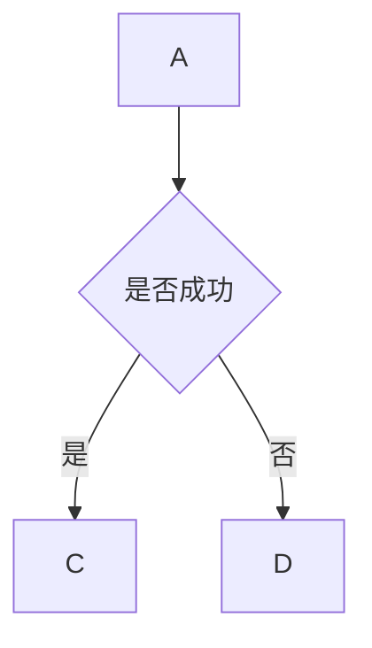
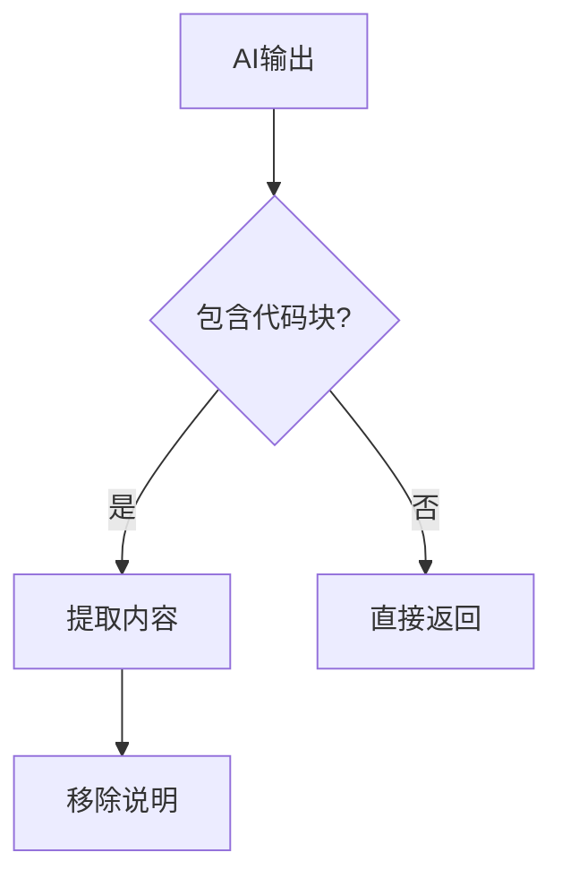

# Mermaid Markdown优化工具

一个用于优化markdown文件中mermaid代码块格式的命令行工具。

## 功能特性

- ✨ **自动格式化**：为mermaid代码中的中括号、花括号、竖线内容自动添加引号
- 📝 **批量处理**：支持单文件或整个目录的批量处理
- 👀 **预览模式**：在实际修改前预览所有更改
- 🎯 **灵活选项**：支持原地修改或输出到新文件
- 🌈 **友好输出**：彩色终端输出，清晰显示处理结果

## 原理

基于Dart版本的`AIOutputFormatter`类，实现了`extractMermaid`函数的核心逻辑：

1. **移除代码后的说明文字**（遇到连续两个换行符停止）
2. **为特殊符号内容添加引号**
   - 中括号：`[文本]` → `["文本"]`
   - 花括号：`{文本}` → `{"文本"}`
   - 竖线：`|文本|` → `|"文本"|`
3. **统一格式**（换行符、多余空行等）

## 安装

Python 3.6+，无需额外依赖。

```bash
# 克隆或下载脚本文件
git clone <repo>
cd scripts
```

## 使用方法

### 基本用法

```bash
# 处理单个文件（直接修改原文件）
python mermaid_optimizer.py file.md

# 预览将要进行的更改
python mermaid_optimizer.py file.md --preview

# 输出到新文件（不修改原文件）
python mermaid_optimizer.py file.md --no-in-place

# 批量处理目录（递归）
python mermaid_optimizer.py docs/

# 批量处理目录（非递归）
python mermaid_optimizer.py docs/ --no-recursive
```

### 命令行参数

```
positional arguments:
  path              markdown文件或目录路径

optional arguments:
  -h, --help        显示帮助信息
  --preview         预览将要进行的更改，不实际修改文件
  --no-in-place     不直接修改原文件，输出到新文件
  --no-recursive    处理目录时不递归子目录
  --version         显示版本号
```

## 示例

### 处理单个文件

```bash
python mermaid_optimizer.py example.md
```

输出：
```
✓ example.md: 优化了 3 个mermaid代码块
```

### 预览更改

```bash
python mermaid_optimizer.py example.md --preview
```

输出：
```
📄 example.md
发现 2 个需要优化的mermaid代码块

ℹ 代码块 #1

原始:


优化后:

```

### 批量处理

```bash
python mermaid_optimizer.py docs/
```

输出：
```
ℹ 找到 5 个markdown文件

✓ docs/flow1.md: 优化了 2 个mermaid代码块
✓ docs/flow2.md: 找到 1 个mermaid代码块，但无需优化
✓ docs/README.md: 未找到mermaid代码块
...

============================================================
处理完成: 5 成功, 0 失败
```

## 优化示例

### 示例1：中括号内容

**优化前：**


**优化后：**


### 示例2：花括号判断

**优化前：**


**优化后：**


### 示例3：复杂流程

**优化前：**


**优化后：**


## 文件结构

```
scripts/
├── mermaid_optimizer.py      # CLI入口
├── markdown_processor.py     # Markdown文件处理器
├── mermaid_formatter.py      # Mermaid格式化核心
├── test_example.md           # 测试示例文件
└── README_MERMAID.md         # 本文档
```

## 技术细节

### 核心模块

#### `mermaid_formatter.py`
- `MermaidFormatter`类：实现Mermaid代码格式化
- `extract_mermaid()`：主要优化逻辑
- 正则表达式处理各种格式

#### `markdown_processor.py`
- `MarkdownProcessor`类：处理Markdown文件
- 查找、替换mermaid代码块
- 支持预览和批量处理

#### `mermaid_optimizer.py`
- 命令行接口（argparse）
- 彩色终端输出
- 文件/目录处理流程

## 注意事项

1. **备份数据**：建议先使用`--preview`预览更改
2. **编码格式**：文件必须是UTF-8编码
3. **已有引号**：如果内容已经被引号包裹，不会重复处理
4. **嵌套结构**：支持复杂的嵌套mermaid语法

## 常见问题

### Q: 工具会修改代码块外的内容吗？
A: 不会，只处理````mermaid```代码块内的内容。

### Q: 如何撤销更改？
A: 使用`--no-in-place`参数可以生成新文件而不修改原文件，或者使用Git等版本控制工具。

### Q: 支持哪些mermaid语法？
A: 支持所有标准mermaid语法，主要优化中括号、花括号、竖线内的文本标签。

## 贡献

欢迎提交Issue和Pull Request！

## 许可

MIT License

## 参考

基于Dart版本的`AIOutputFormatter`类改编。
