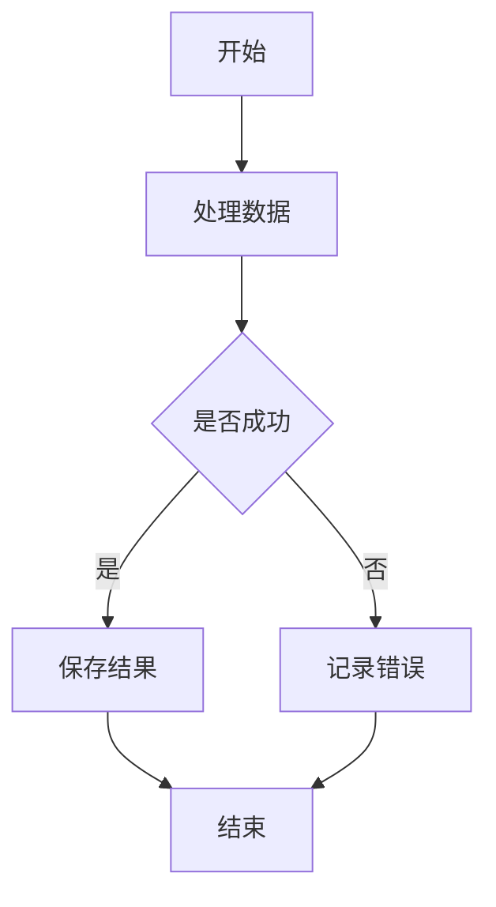
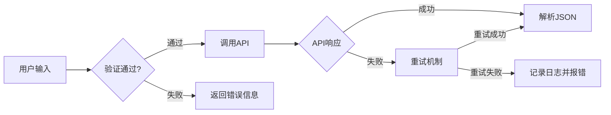
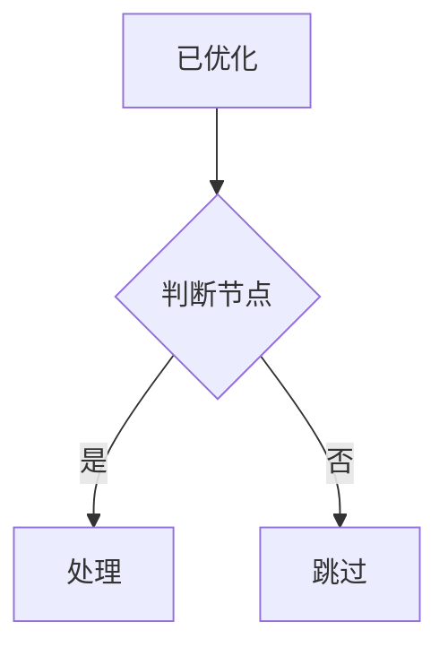
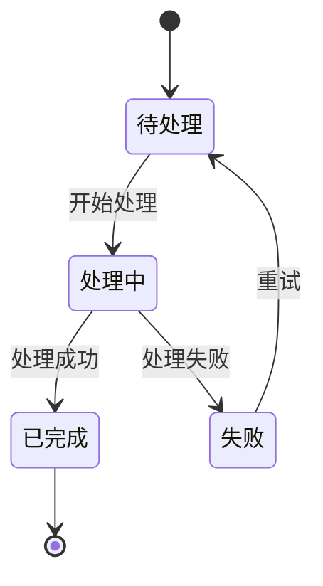

# Mermaid测试示例

这个文件包含多个mermaid代码块，用于测试优化工具。

## 示例1：简单流程图



## 示例2：复杂判断流程

```mermaid
graph TD
    Start[AI输出] --> Check{包含代码块?}
    Check -->|是| Extract[提取内容]
    Check -->|否| Return[直接返回]
    Extract --> DoubleNewline{有双换行符?}
    DoubleNewline -->|找到| Cut[截取到第一个双换行符()]
    DoubleNewline -->|未找到| Keep[保留全部内容]
    Cut --> Quote[为特殊符号添加引号]
    Keep --> Quote
    Quote --> Fix[修复格式]
    Fix --> Done[返回优化后的代码]
```

## 示例3：带中文标签



## 示例4：已经优化过的代码块（不应该被修改）



## 示例5：状态图



## 普通文本

这段文本不应该被修改。

这里没有代码块。
